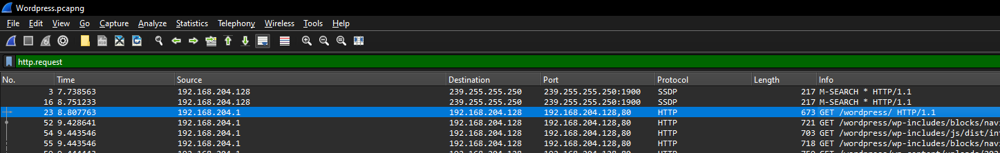

# WordPress - 1
[Easy]

Our WordPress site has experienced a security breach, and the precise method of compromise remains undetermined at present. We need you help to investigate what actually happened.

Q1. There were two attackers attempting to compromise our environment. What is the IP address of the victim, and what is the IP address of the first attacker? 
Q2. What are the versions of the Apache and PHP servers deployed in our environment?

Flag Format `0xL4ugh{A1_A2}`

Example: `0xL4ugh{IP1_IP2_apache1.2.3_php1.2.3}(no spaces)`

---

Solution:

We were given a `Wordpress.pcapng` file.

Filtering via `http.request`...we can see a suspicious requests coming from `192.168.204.132`

So that is most likely our first attacker.

Now, to answer Q2, let's scroll up a bit.

Following the HTTP stream will give the answer that we need.

Flag: `0xL4ugh{192.168.204.128_192.168.204.132_apache2.4.58_php8.2.12}`
