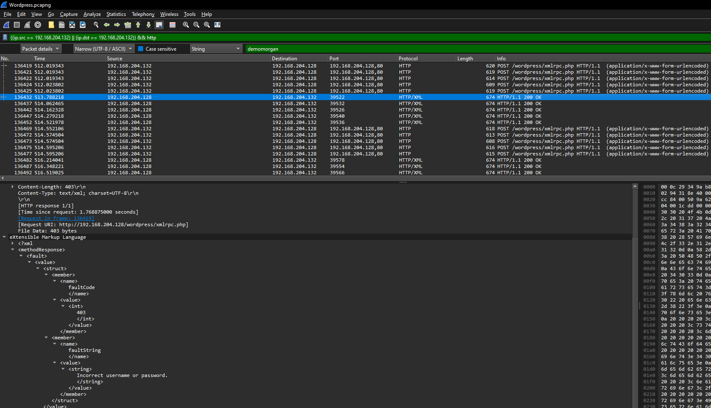

# WordPress - 2
[Medium]

Same file from WordPress - 1

Q1. During enumeration, the attacker tried to identify users on the site. List all the users that the attacker enumerated. Seperate them with `:`. Sort them by alphabetical order.

Q2. After enumeration, a brute force attack was launched against all users. The attacker successfully gained access to one of the accounts. What are the username and password for that account, and what is the name of the page used for the brute force attack?

Flag Format `0xL4ugh{A1_A2}`

Example: `0xL4ugh{username1:username2_username:password_pageName.ext}`

---

Solution:

I decided to check if the attacker tried to login via `(http.request.method == POST) && (ip.src == 192.168.204.132)`

We have three attempts!

Double-checked via `((ip.src == 192.168.204.132) || (ip.dst == 192.168.204.132)) && http` as well...

We can see that it was able to query those three authors.

So it's `a1l4m:demomorgan:not7amoksha`

For Q2, I decided to continue with `((ip.src == 192.168.204.132) || (ip.dst == 192.168.204.132)) && http`

I noticed several POST requests to `/wordpress/xmlrpc.php`

Example, packet 136419, invokes `wp.getUsersBlogs` with two parameters, the username (in this case, it's `not7amoksha`), and another text which seems to be the password.

Looking at the response...

The second parameter is indeed a password! 
Searching via the documentation also confirms it. https://developer.wordpress.org/reference/classes/wp_xmlrpc_server/wp_getusersblogs/

Now let's look for a successful request that doesn't return a 403.

Let's use `(ip.dst == 192.168.204.132) && !(xml.cdata == "403") && (_ws.col.protocol == "HTTP/XML")`

There's a hit! Let's check the HTTP stream...

So it's `demomorgan:demomorgan`

For the page that was used to bruteforce, it's `xmlrpc.php`

Now we have the flag! :D

Flag: `0xL4ugh{a1l4m:demomorgan:not7amoksha_demomorgan:demomorgan_xmlrpc.php}`

