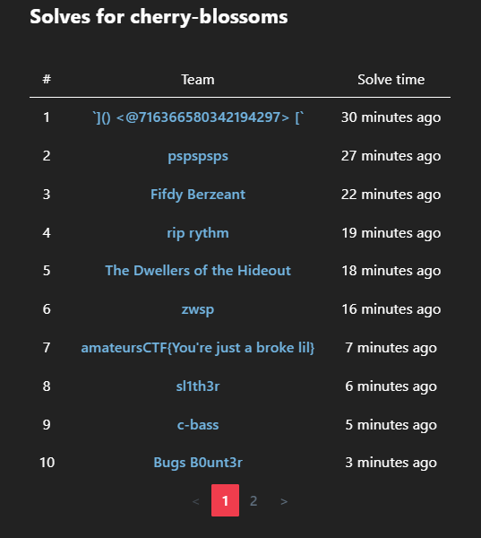
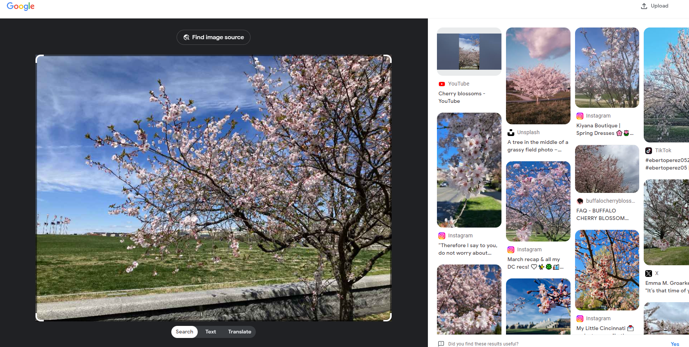
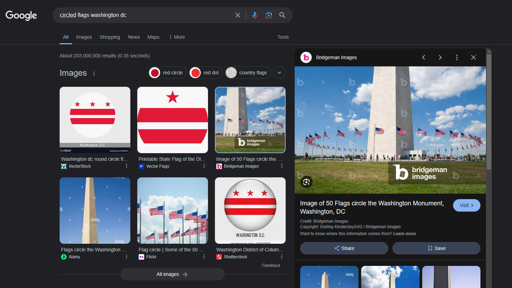
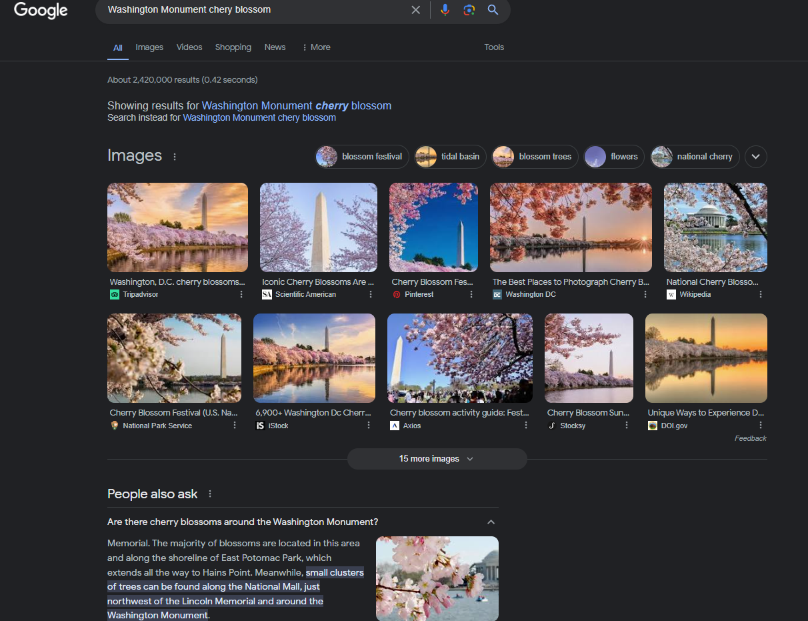
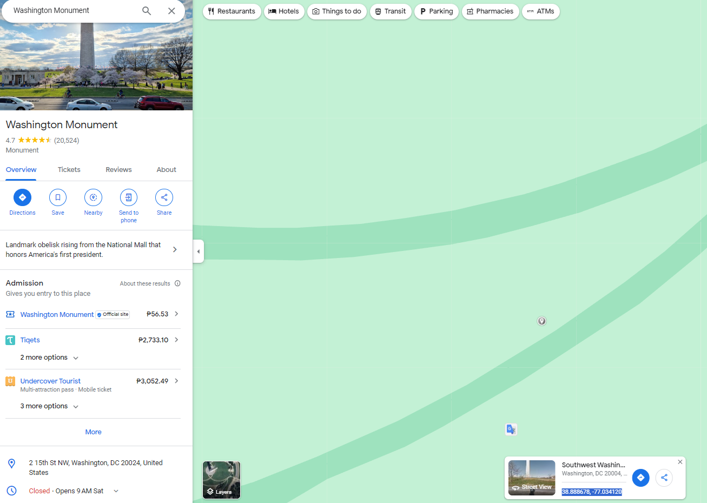
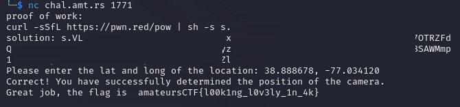

# cherry-blossoms

> average southern californian reacts to DC weather. amazing scenery though at the time.
> 
> Find the coords of this image!
> 
> `nc chal.amt.rs 1771`

Almost got first blood!!! 🐈



Solution:

We are given with the image file as a starting point and a Python script for the challenge server.


```python
#!/usr/bin/env python3
# modified from HSCTF 10 grader
import json
with open("locations.json") as f:
	locations = json.load(f)
wrong = False
for i, coords in enumerate(locations, start=1):
	x2, y2 = coords
	x, y = map(float, input(f"Please enter the lat and long of the location: ").replace(",","").split(" "))
    # increase if people have issues
	if abs(x2 - x) < 0.0010 and abs(y2 - y) < 0.0010:
		print("Correct! You have successfully determined the position of the camera.")
	else:
		print("Wrong! Try again after paying attention to the picture.")
		wrong = True

if not wrong:
	with open("flag.txt") as f:
		print("Great job, the flag is ",f.read().strip())
else:
	print("Better luck next time ʕ·ᴥ·ʔ")
```

Let's use https://images.google.com/



Hmm, nothing remarkable. I decided to searched for `circled flags washington dc` since it can be seen in the image haha



Hmm, Washington Monument...



Ohh, there are indeed Cherry Blossoms in the area. Let's check using Google Maps.


It seems it was taken near here.



So the coordinates are 38.888678, -77.034120

Let's use that in the challenge server.



Nice!

Flag: `amateursCTF{l00k1ng_l0v3ly_1n_4k}`
