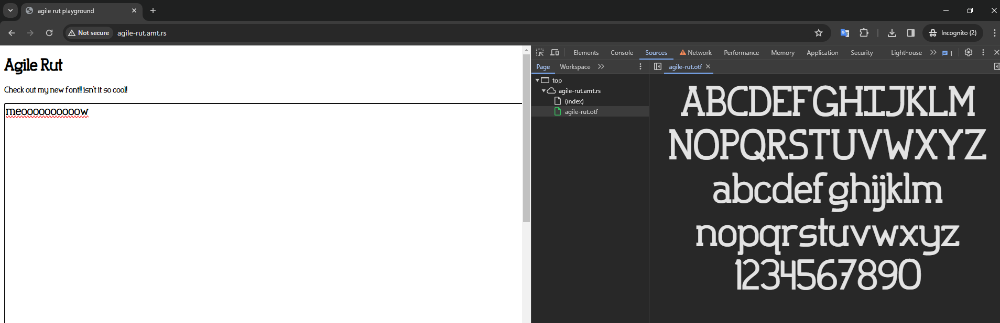
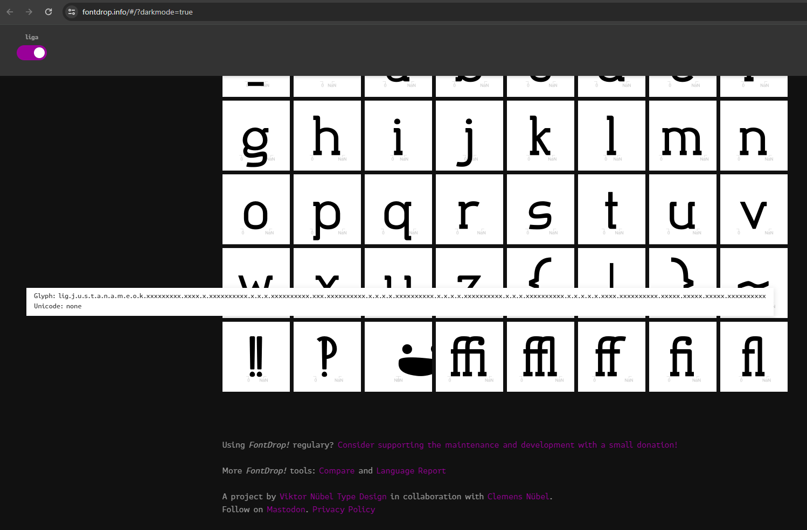
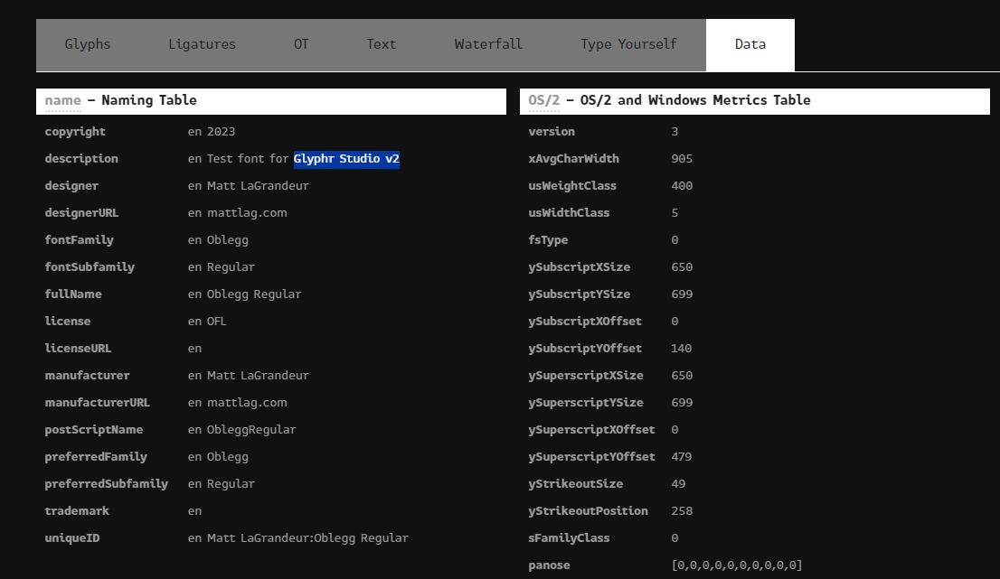
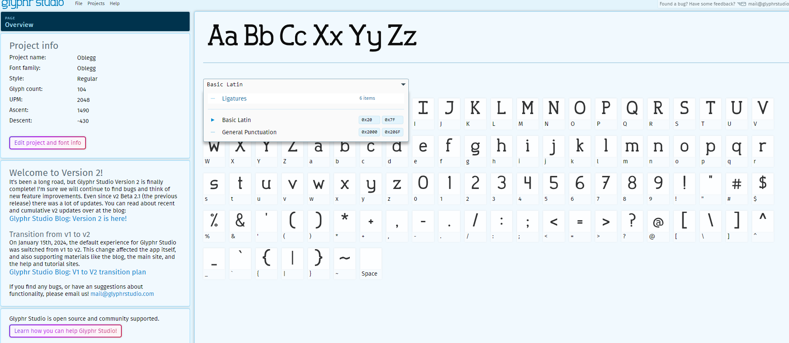
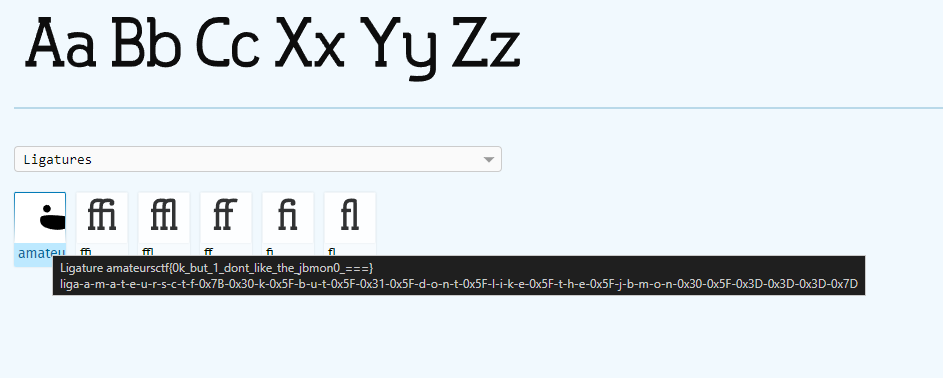
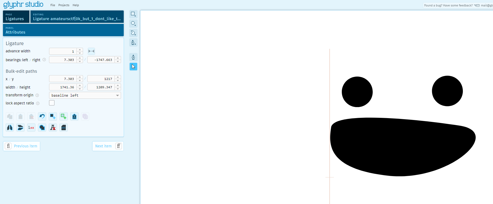

# agile-rut

> check out this cool font i made!
> 
> http://agile-rut.amt.rs
> 
> hint: putting the correct flag in the box will do something

Solution:

We are not provided with any source file, let's check the challenge website.

So it has a text input field that uses a custom font. Let's download the font a use an online viewer: https://fontdrop.info/#/?darkmode=true

While scrolling down, there's an interesting glyph.

And based on the metadata, it was created using Glyphr Studio v2

So I searched for Glyphr Studio v2 and ended up at https://www.glyphrstudio.com/app/ . Let's load the font there...

Let's choose ligatures since the interesting part was there earlier.

There's the flag!

Flag: `amateursctf{0k_but_1_dont_like_the_jbmon0_===}`