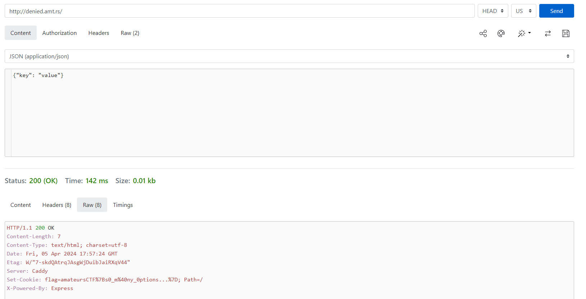
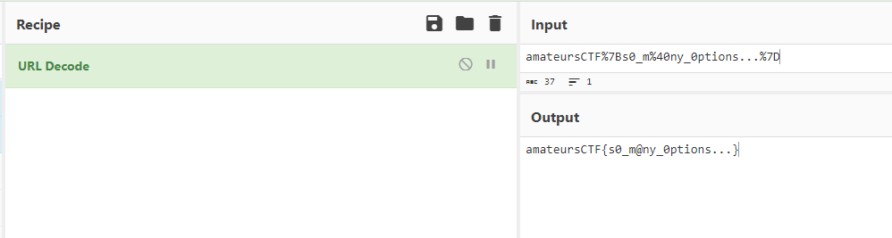

# denied

> what options do i have?
> 
> http://denied.amt.rs

Solution:

We are given with a source file and a link to the challenge website.

```js
const express = require('express')
const app = express()
const port = 3000

app.get('/', (req, res) => {
  if (req.method == "GET") return res.send("Bad!");
  res.cookie('flag', process.env.FLAG ?? "flag{fake_flag}")
  res.send('Winner!')
})

app.listen(port, () => {
  console.log(`Example app listening on port ${port}`)
})
```

So based on the source file, we shouldn't use GET. The description gave us a hint, which is to use OPTIONS.

Let's do that.


Oh, there's another request method, which is HEAD. Let's use that.



There's the flag! `amateursCTF%7Bs0_m%40ny_0ptions...%7D` is URL encoded.



Noice!

Flag: `amateursCTF{s0_m@ny_0ptions...}`