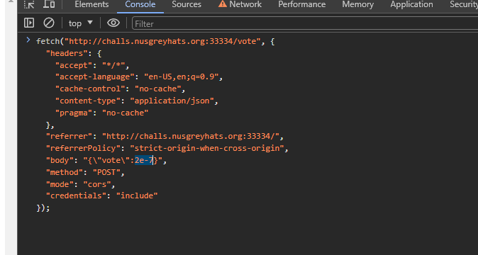

# Greyctf Survey

> Your honest feedback is appreciated :) (but if you give us a good rating we'll give you a flag)
> 
> Author: jro
> 
> http://challs.nusgreyhats.org:33334

Solution:

We are given with the source file for the challenge.

Looking at [index.js](index.js)...

```javascript
...
let score = -0.42069;
...
app.post('/vote', async (req, res) => {
    const {vote} = req.body;
    if(typeof vote != 'number') {
        return res.status(400).json({
            "error": true,
            "msg":"Vote must be a number"
        });
    }
    if(vote < 1 && vote > -1) {
        score += parseInt(vote);
        if(score > 1) {
            score = -0.42069;
            return res.status(200).json({
                "error": false,
                "msg": config.flag,
            });
        }
        return res.status(200).json({
            "error": false,
            "data": score,
            "msg": "Vote submitted successfully"
        });
    } else {
        return res.status(400).json({
            "error": true,
            "msg":"Invalid vote"
        });
    }
})
```

To get the flag:
1. The value of the `vote` from our network request should be of `number` type
2. It should be less than 1 and greater than -1
3. The value of the `vote` is then parsed via `parseInt` and added to the `score` variable
4. `score` should be greater than 1

We can pass everything by making the value of our `vote` to `0.0000002` or `2e-7`.

Why? As explained in the disucssion here, https://stackoverflow.com/questions/27650459/function-parseint-1-10000000-returns-1-why :
> `1/10000000` is so small that converting it to a string uses scientific notation `"1e-7"`, parseInt then ignores everything from `"e"` onwards, since it is for integers only, so it reads it as `1`.

Adopting that approach, changed `1` to `2` to be able to solve it. Now time to get the flag!

Let's send a normal request first...


Then copy it as fetch


Paste it in the console and modify it



Enter and boom!


Flag: `grey{50m371m35_4_l177l3_6035_4_l0n6_w4y}`