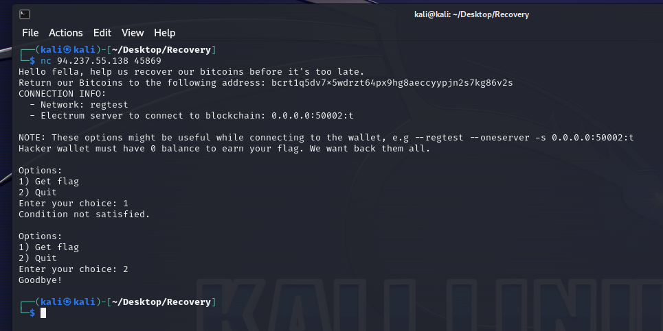
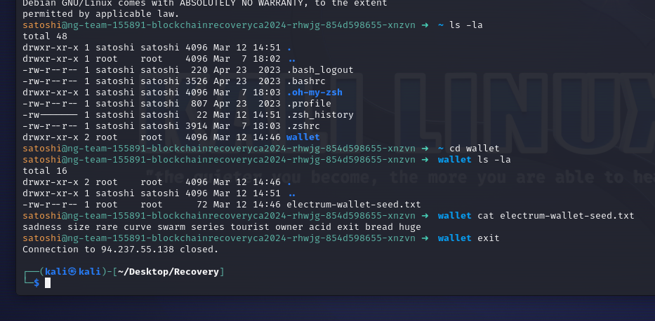
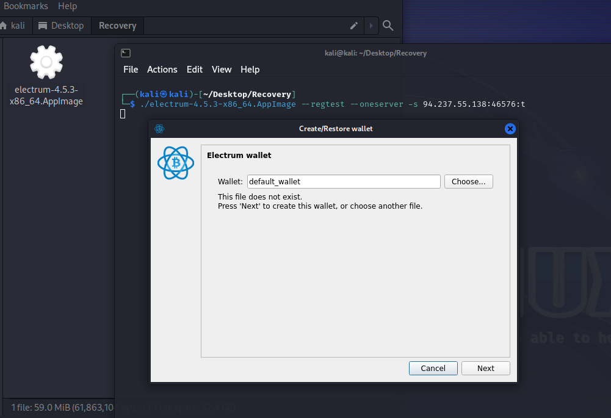
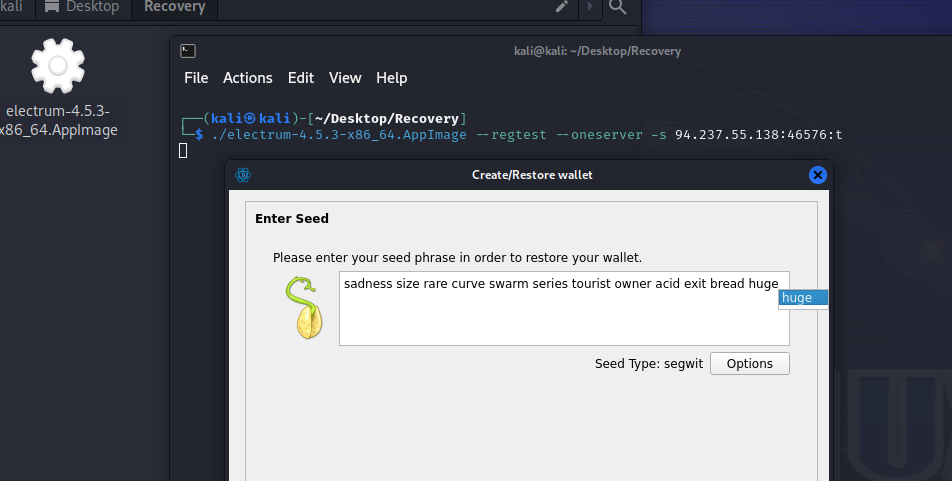
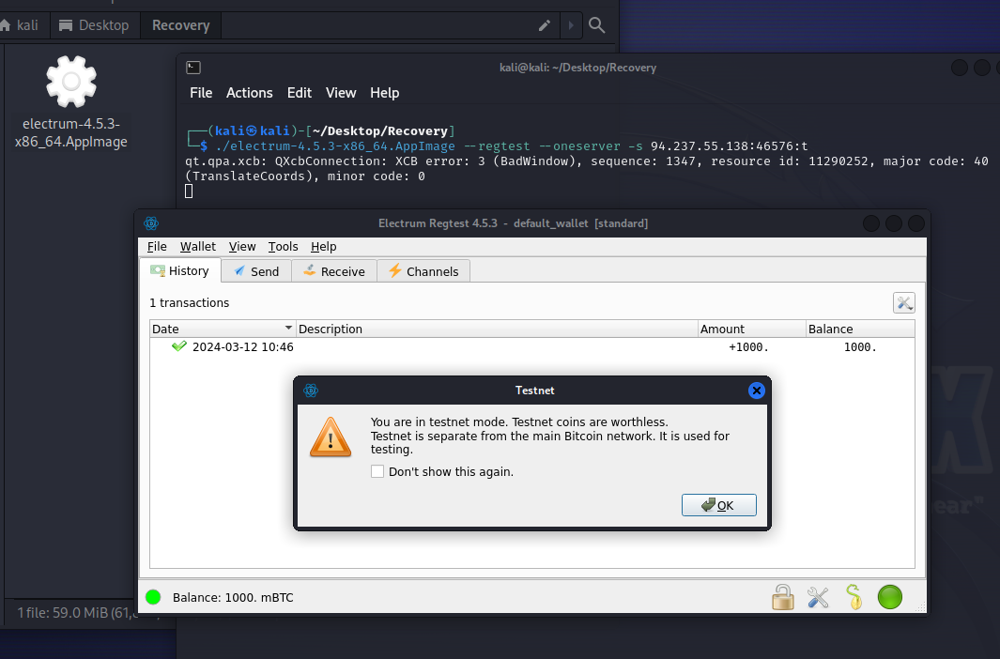
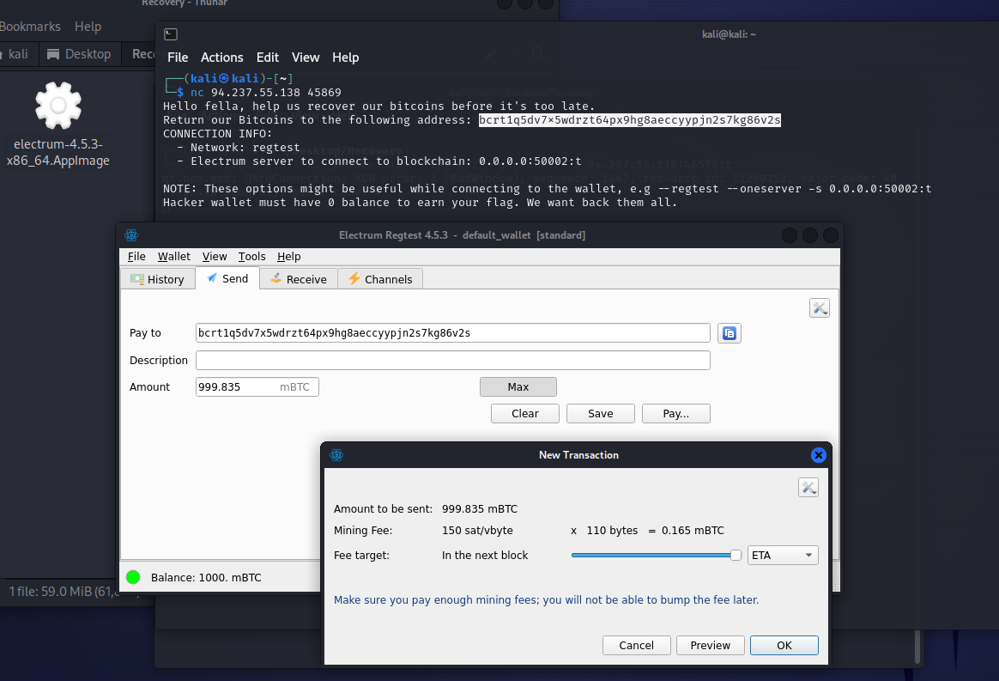
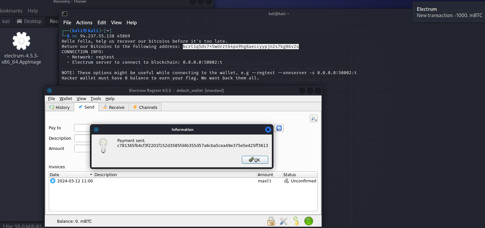
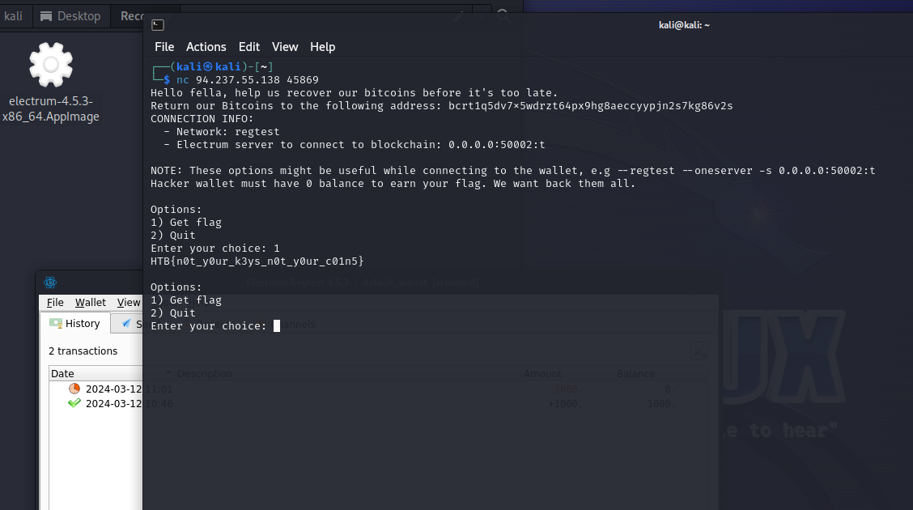

# Recovery

> Difficulty: Easy
>
> We are The Profits. During a hacking battle our infrastructure was compromised as were the private keys to our Bitcoin wallet that we kept.
> We managed to track the hacker and were able to get some SSH credentials into one of his personal cloud instances, can you try to recover my Bitcoins?
> 
> Username: satoshi
> 
> Password: L4mb0Pr0j3ct
> 
> NOTE: Network is regtest, check connection info in the handler first.

Solution:

We are given with three `IP:PORT` after we spawned the docker
1. The cloud instance whose SSH credentials are in the description
2. Network of the regtest
3. netcat to interact with the challenge

Let's take a look at the message sent via netcat first...

Alright, so we need to recover all of the testnet BTCs from the malicious actor by sending it to our address

Let's retrieve the malicious actor's wallet by logging in using the SSH credentials...

Nice, we now have the Electrum secret phrase (12 words) of the wallet.

Let's download Electrum at https://electrum.org/#download

Then run it using `./electrum-4.5.3-x86_64.AppImage --regtest --oneserver -s 94.237.55.138:46576:t`

Let's choose `I already have a seed` since we will be using the secret phrase (12 words) from earlier

And we're in! Time to transfer those testnet BTCs!!

Recovered! :D

Let's get the flag

Flag: `HTB{n0t_y0ur_k3ys_n0t_y0ur_c01n5}`
