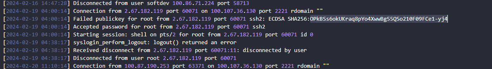

# An unusual sighting

> Difficulty: Very Easy
>
> As the preparations come to an end, and The Fray draws near each day, our newly established team has started work on refactoring the new CMS application for the competition. However, after some time we noticed that a lot of our work mysteriously has been disappearing! We managed to extract the SSH Logs and the Bash History from our dev server in question. The faction that manages to uncover the perpetrator will have a massive bonus come competition!

Solution:

We are given with two files:
1. bash_history.txt
2. sshd.log

We can also spawn our Docker instance to solve the challenge, for this case, it's `83.136.253.226:54683`

> What is the IP Address and Port of the SSH Server (IP:PORT)

Based on the logs at sshd.log, the answer is `100.107.36.130:2221`

> What time is the first successful Login

Based on the logs, it's `2024-02-13 11:29:50`

> What is the time of the unusual Login

Based on the logs, the only different IP here is `2.67.182.119` and used `root`

Also, looking at the bash_history.txt, it executed `whoami` and retrieved sensitive data

So the time of the unusual login is `2024-02-19 04:00:14`

> What is the Fingerprint of the attacker's public key

It's `OPkBSs6okUKraq8pYo4XwwBg55QSo210F09FCe1-yj4`

> What is the first command the attacker executed after logging in

It's `whoami` as seen earlier

> What is the final command the attacker executed before logging out                                                                                                                 

It's `./setup` as seen earlier

Noice!

Flag: `HTB{B3sT_0f_luck_1n_th3_Fr4y!!}`
