# Data Siege

> Difficulty: Medium
>
> "It was a tranquil night in the Phreaks headquarters, when the entire district erupted in chaos. Unknown assailants, rumored to be a rogue foreign faction, have infiltrated the city's messaging system and critical infrastructure. Garbled transmissions crackle through the airwaves, spewing misinformation and disrupting communication channels. We need to understand which data has been obtained from this attack to reclaim control of the and communication backbone. Note: flag is splitted in three parts."

Solution:

We are given with a `capture.pcap` file

Let's check the protocol hierarchy statistics...

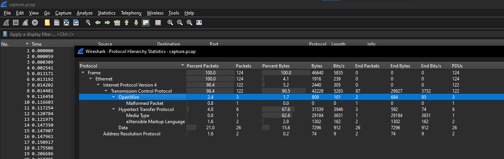

Oh, `OpenWire`, let's take a look at that

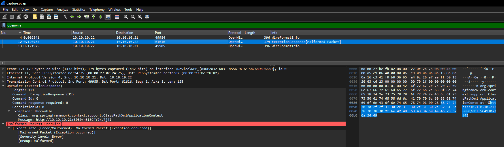

Hmm, nothing helpful, though there's an interesting URL there

Let's check the HTTP requests...

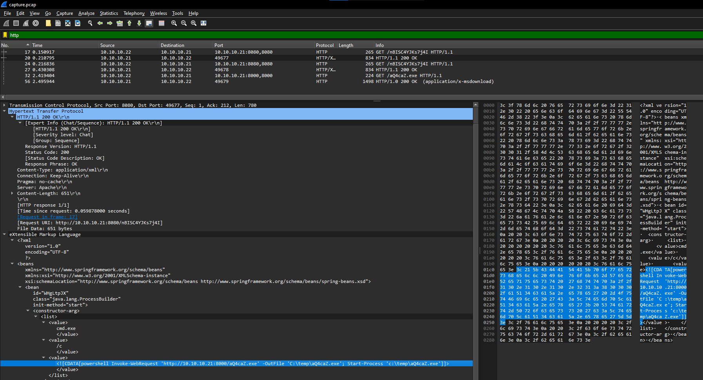

Interesting, it retrieves an executable file then runs it

Let's export that executable file

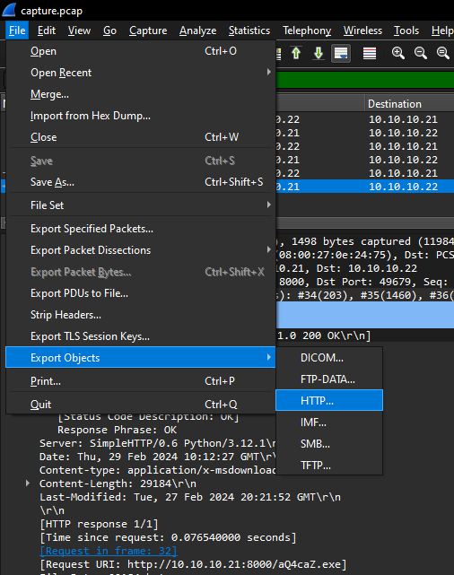

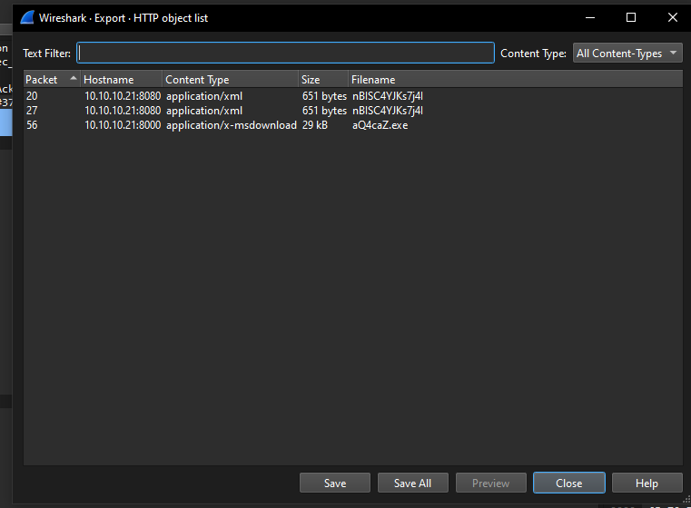

Based on DiE (Detect It Easy), it's a .NET executable file

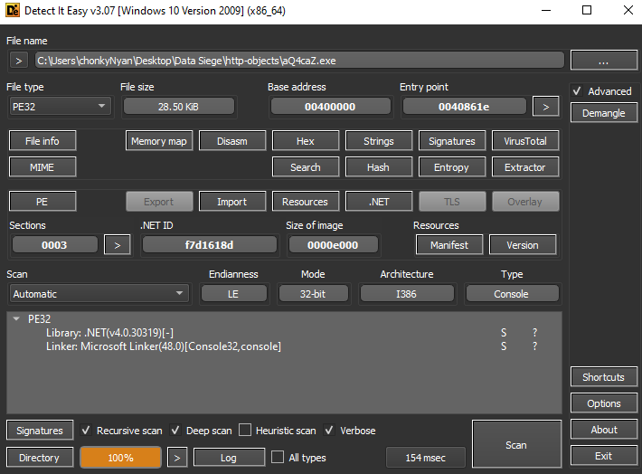

So we can use dnSpy to reverse engineer it.

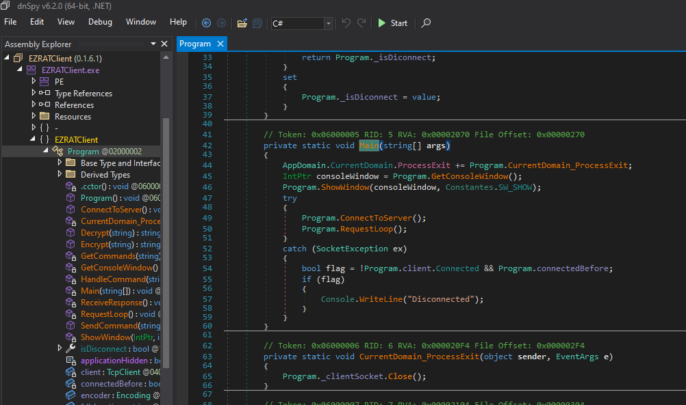

So the malware that we have is a remote access tool (RAT). It's an open source one which can be found at https://github.com/Exo-poulpe/EZRAT

Let's check the constants at `Constantes` to retrieve the malware configuration

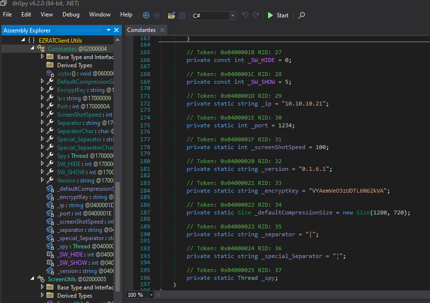

So the C&C server is at `10.10.10.21` with a port number of `1234`

We also have an encryption key, which is `VYAemVeO3zUDTL6N62kVA`

Going back to the entry point, as we scroll down, we can see the encryption and decryption process.

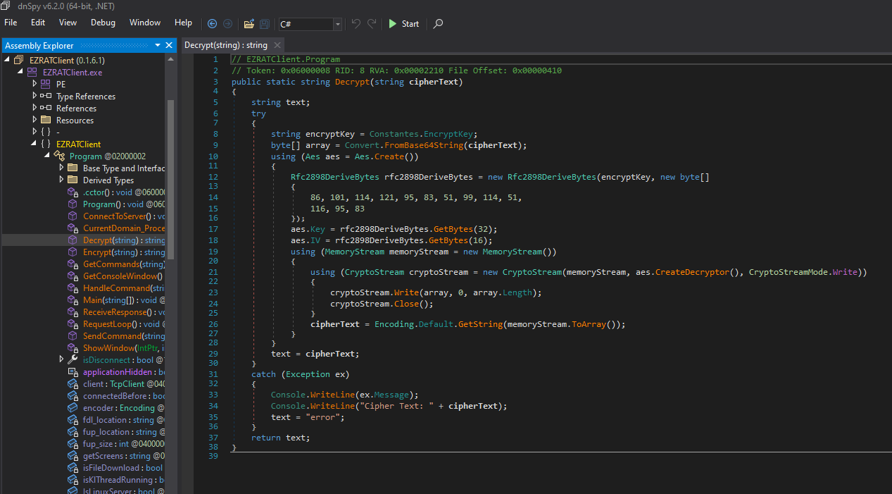

So it uses AES with PBKDF2 (`rfc2898DeriveBytes`) + salt (`86, 101, 114, 121, 95, 83, 51, 99, 114, 51, 116, 95, 83`)

We can re-create it using Python

```python
from Crypto.Cipher import AES
from Crypto.Protocol.KDF import PBKDF2
import base64

def decrypt(cipherText, encryptKey):
    try:
        salt = bytes([86, 101, 114, 121, 95, 83, 51, 99, 114, 51, 116, 95, 83])
        keyAndIV = PBKDF2(encryptKey, salt, dkLen=48)
        key = keyAndIV[:32]
        iv = keyAndIV[32:]
        cipher = AES.new(key, AES.MODE_CBC, iv)
        decrypted = cipher.decrypt(base64.b64decode(cipherText))
        pad = decrypted[-1]
        return decrypted[:-pad].decode(errors='ignore')
    except Exception as e:
        print("Decryption error:", e)
        print("Cipher Text:", cipherText)
        return "error"
```

The derived key length (`dkLen`) is set to 48 because, in the C# code, it requires a key length of 32 bytes (256 bits) and an initialization vector (IV) length of 16 bytes (128 bits). Therefore, the total length of the derived key material needed is 32 + 16 = 48 bytes. 

Then PBKDF2 is used to derive 48 bytes of key material (`keyAndIV`), which is then split into the 32-byte key (`keyAndIV[:32]`) and the 16-byte IV (`keyAndIV[32:]`).

Now we know the C&C server and the decryption process, let's take a look at the pcap file again and filter using `ip.addr==10.10.10.21 && tcp.port == 1234`

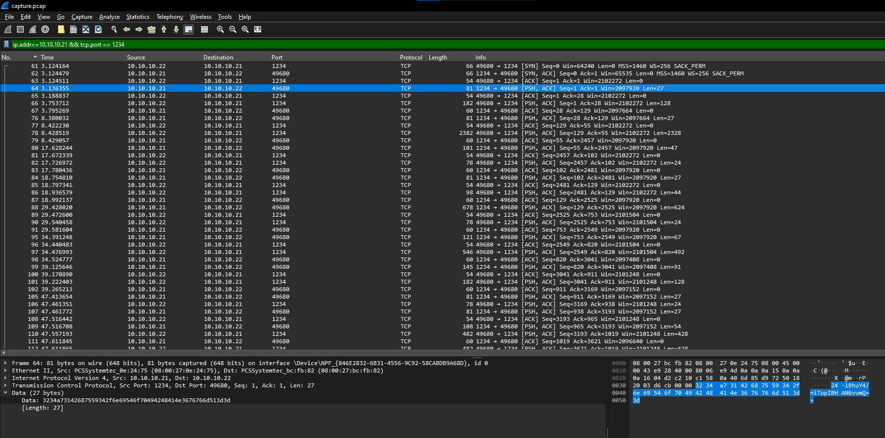

We can see the initial message sent by the C&C server to the infected machine, which is `24§1BhuY4/niTopIBHAN6vvmQ==`

Based on the C# code, messages with `§` are commands that will be executed in the infected machine. The integer and the `§` are removed before it is passed for decryption.

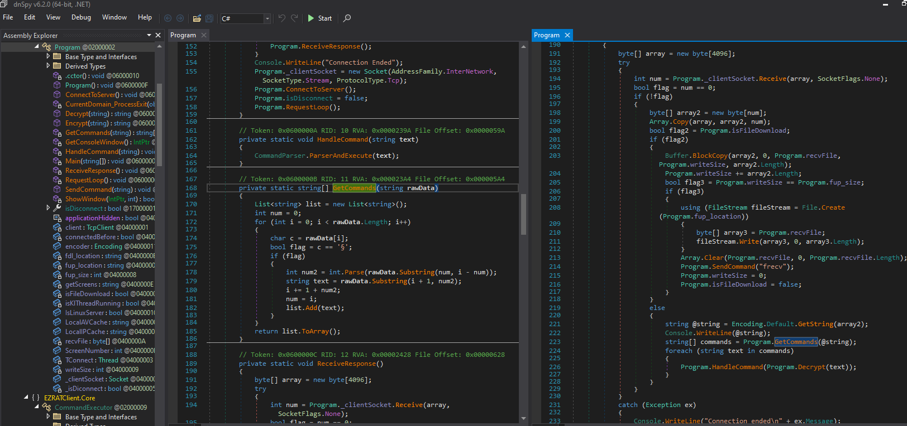

So using scapy, let's extract the commands sent by the C&C and the exfiltrated contents from the infected machine using the pcap file

```python
from scapy.all import *
from Crypto.Cipher import AES
from Crypto.Protocol.KDF import PBKDF2
import re
import base64

def decrypt(cipherText, encryptKey):
    try:
        salt = bytes([86, 101, 114, 121, 95, 83, 51, 99, 114, 51, 116, 95, 83])
        keyAndIV = PBKDF2(encryptKey, salt, dkLen=48)
        key = keyAndIV[:32]
        iv = keyAndIV[32:]
        cipher = AES.new(key, AES.MODE_CBC, iv)
        decrypted = cipher.decrypt(base64.b64decode(cipherText))
        pad = decrypted[-1]
        return decrypted[:-pad].decode(errors='ignore')
    except Exception as e:
        print("Decryption error:", e)
        print("Cipher Text:", cipherText)
        return "error"

def extractTCPpayload(pcapFile, srcIP, dstIP, dstPort):
    packets = rdpcap(pcapFile)
    payloadData = []
    for packet in packets:
        if TCP in packet and packet[IP].src == srcIP and packet[IP].dst == dstIP and packet[TCP].dport == dstPort:
            payload = bytes(packet[TCP].payload)
            if payload:
                payloadData.append(payload)
    return payloadData

def checkForSpecialCharacter(cipherText):
    match = re.match(b'^(\d+\xa7)', cipherText)
    if match:
        return cipherText[len(match.group(1)):]
    return cipherText

encryptKey = "VYAemVeO3zUDTL6N62kVA"

tcpData1 = extractTCPpayload("capture.pcap", "10.10.10.21", "10.10.10.22", 49680)
tcpData2 = extractTCPpayload("capture.pcap", "10.10.10.22", "10.10.10.21", 1234)

cipherTexts = tcpData1 + tcpData2

for cipherText in cipherTexts:
    if cipherText != b'\x00' * len(cipherText):  # Skip if the ciphertext is all null bytes
        checkedCipherText = checkForSpecialCharacter(cipherText)
        decryptedText = decrypt(checkedCipherText, encryptKey)
        print("Decrypted Text:", decryptedText)
```

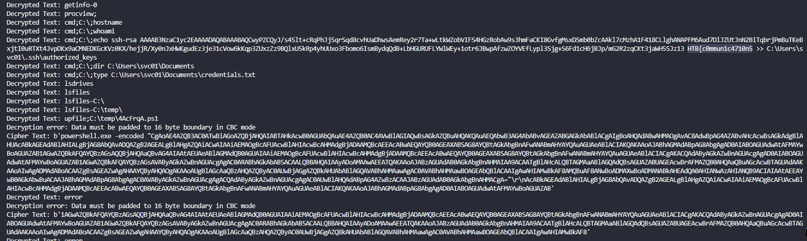

We have the first part of the flag, which is `HTB{c0mmun1c4710n5`

Let's decode that string in the PowerShell script...

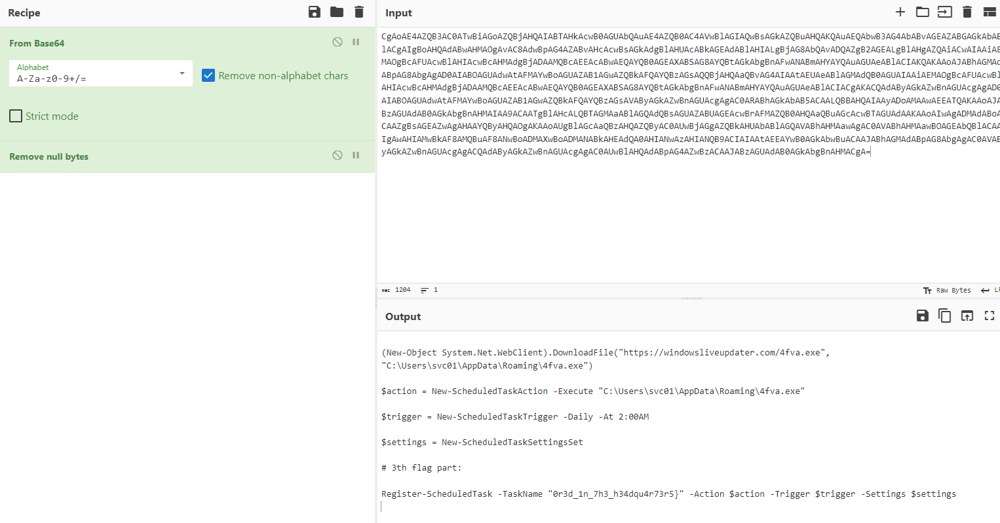

There's the 3rd part, which is `0r3d_1n_7h3_h34dqu4r73r5}`

Let's go back and scroll down to see the other decrypted texts...

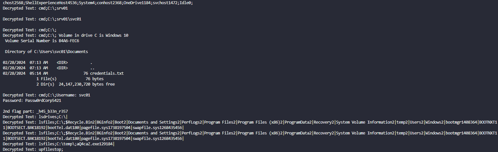

So the 2nd part is `_h45_b33n_r357`

Flag: `HTB{c0mmun1c4710n5_h45_b33n_r3570r3d_1n_7h3_h34dqu4r73r5}`
