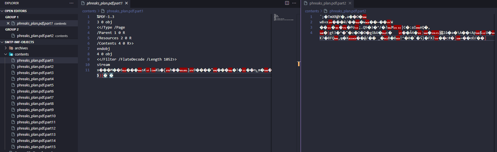

# Phreaky

> Difficulty: Medium
> 
> In the shadowed realm where the Phreaks hold sway,
> A mole lurks within, leading them astray.
> Sending keys to the Talents, so sly and so slick,
> A network packet capture must reveal the trick.
> Through data and bytes, the sleuth seeks the sign,
> Decrypting messages, crossing the line.
> The traitor unveiled, with nowhere to hide,
> Betrayal confirmed, they'd no longer abide.

Solution:

We are given with a `phreaky.pcap` file

Checking the protocol heiarchy statistics, SMTP was used, so let's filter it.


Oh, a password was sent along with a zip archive file.

Let's export the email objects by specifying IMF


Saved all to `smtp-imf-objects`


There are 15 emails and all of them follows the same format of stating the password along with the attached zip archive file.

Let's automate the extraction using Python

```python
import os
import zipfile
from email import policy
from email.parser import BytesParser

def extractZIPfromEML(emlPath, outputDir):
    archivesDir = os.path.join(outputDir, 'archives')
    contentsDir = os.path.join(outputDir, 'contents')
    os.makedirs(archivesDir, exist_ok=True)
    os.makedirs(contentsDir, exist_ok=True)

    with open(emlPath, 'rb') as file:
        msg = BytesParser(policy=policy.default).parse(file)

    password = None
    zipContent = None
    zipFilename = None

    for part in msg.iter_parts():
        contentType = part.get_content_type()
        if contentType == 'text/plain':
            content = part.get_content()
            if "Password:" in content:
                password = content.split("Password:")[1].strip()
        elif contentType == 'application/zip':
            zipContent = part.get_payload(decode=True)
            zipFilename = part.get_filename()

    if password and zipContent and zipFilename:
        zipPath = os.path.join(archivesDir, zipFilename)
        with open(zipPath, 'wb') as theZipFile:
            theZipFile.write(zipContent)

        with zipfile.ZipFile(zipPath, 'r') as zipReference:
            zipReference.extractall(contentsDir, pwd=password.encode())

        print(f"Processed {emlPath}: ZIP extracted and content saved.")
    else:
        print(f"Could not process {emlPath}: Missing password or ZIP content.")

directory = "smtp-imf-objects"

for filename in os.listdir(directory):
    if filename.endswith(".eml"):
        extractZIPfromEML(os.path.join(directory, filename), directory)
```



Based on the extracted contents, the PDF file was split into 15 parts. Let's combine them using Python again...

```python
def combineFiles(baseFilename, parts, outputFilename):
    with open(outputFilename, 'wb') as outputFile:
        for i in range(1, parts + 1):
            part = f"{baseFilename}.part{i}"
            with open(part, 'rb') as partFile:
                outputFile.write(partFile.read())

    print(f"Combined file saved as {outputFilename}")

combineFiles("smtp-imf-objects\contents\phreaks_plan.pdf", 15, "combined_phreaks_plan.pdf")
```


And boom! There's the flag :D

Flag: `HTB{Th3Phr3aksReadyT0Att4ck}`
