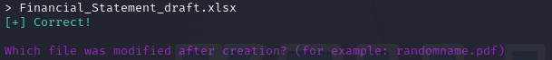
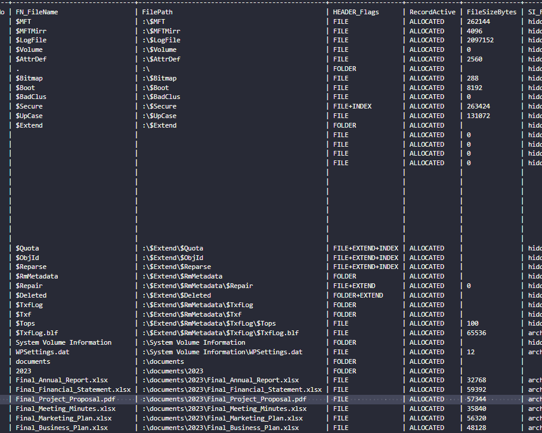

# Pursue The Tracks

> Difficulty: Easy
> 
> Luxx, leader of The Phreaks, immerses himself in the depths of his computer, tirelessly pursuing the secrets of a file he obtained accessing an opposing faction member workstation. With unwavering determination, he scours through data, putting together fragments of information trying to take some advantage on other factions. To get the flag, you need to answer the questions from the docker instance.

Solution:

We are given with a `z.mft` file

Searching for it tells us that it's a Master File Table.


While looking for an MFT parser, I stumbled on https://github.com/dkovar/analyzeMFT (`python analyzeMFT.py -f ../z.mft -o ../results.csv`)


A docker instance was spawned where we will answer the questions...


> Files are related to two years, which are those? (for example: 1993,1995)

Based on the records, there are two years, which are `2023,2024`


> There are some documents, which is the name of the first file written? (for example: randomname.pdf)

The first file that was created here is `Final_Annual_Report.xlsx`


> Which file was deleted? (for example: randomname.pdf)

I was trying to find a column related to `deleted` status, but the one that seems to be matching here is the `Active` status column. And there's only one `Inactive`, which is `Marketing_Plan.xlsx`


> How many of them have been set in Hidden mode? (for example: 43)

I was trying to find another column again related to a `hidden` status...but nothing stands out :(

At this point, I decided to find another MFT parser. I came across this forum thread, https://msfn.org/board/topic/158744-ntfs-file-lister-using-mft/ , where a user was looking for a specific tool that can match his/her needs when it comes to parsing an MFT file.

While reading the post, a tool called mft2csv struck me: https://code.google.com/archive/p/mft2csv/wikis/mft2csv.wiki -> https://github.com/jschicht/Mft2Csv

Checked the releases and downloaded the tool, then ran it

```
C:\Users\chonkyNyan\Desktop\Mft2Csv_v2.0.0.50>Mft2Csv.exe /MftFile:C:\Users\chonkyNyan\Desktop\forensics_persue_the_tracks\z.mft /OutputPath:C:\Users\chonkyNyan\Desktop\forensics_persue_the_tracks\output
Mft2Csv 2.0.0.50
Timestamps presented in UTC: 0.00
UNICODE configured
Operation started: 2024-03-09_18-52-46
Using input: C:\Users\chonkyNyan\Desktop\forensics_persue_the_tracks\z.mft
Using output format: all
Writing variables without surrounding qoutes
Timestamps presented in UTC 0.00
Timestamp Precision: 1
Using precision separator: .
Scan record slack: 0
Using separator: |
Using record size: 1024
16 The record signature is bad
0000    00 00 00 00 00 00 00 00  00 00 00 00 00 00 00 00   ................

17 The record signature is bad
0000    00 00 00 00 00 00 00 00  00 00 00 00 00 00 00 00   ................

18 The record signature is bad
0000    00 00 00 00 00 00 00 00  00 00 00 00 00 00 00 00   ................

19 The record signature is bad
0000    00 00 00 00 00 00 00 00  00 00 00 00 00 00 00 00   ................

-snip-
```

A new folder was created: `Mft2Csv_2024-03-09_18-52-46`


Checking the `Mft.csv` that it created...


I decided to "prettify" it by turning it into a table using Cyberchef's To Table operation


Now that's better, let's answer the question. There's only one `hidden` file here, which is `credentials.txt`, so the answer is 1.


> Which is the filename of the important TXT file that was created? (for example: randomname.txt)

It makes sense that it's `credentials.txt`


> A file was also copied, which is the new filename? (for example: randomname.pdf)

I'm not sure which column will tell me exactly which file it was, but my gut feeling was `Financial_Statement_draft.xlsx` since it has a `_draft` in the filename xD




> Which file was modified after creation? (for example: randomname.pdf)

Looking at the modified time column, `SI_MTime`, we can see three matching records that are different from their creation time (`SI_CTime`)


The first one is a directory, so nope


The second one is a file! So it's `Project_Proposal.pdf`


> What is the name of the file located at record number 45? (for example: randomname.pdf)

It's `Annual_Report.xlsx`


> What is the size of the file located at record number 40? (for example: 1337)

Based on record 40's `FileSizeBytes`, it's `57344`




Lezgooooo!!!

Flag: `HTB{p4rs1ng_mft_1s_v3ry_1mp0rt4nt_s0m3t1m3s}`
