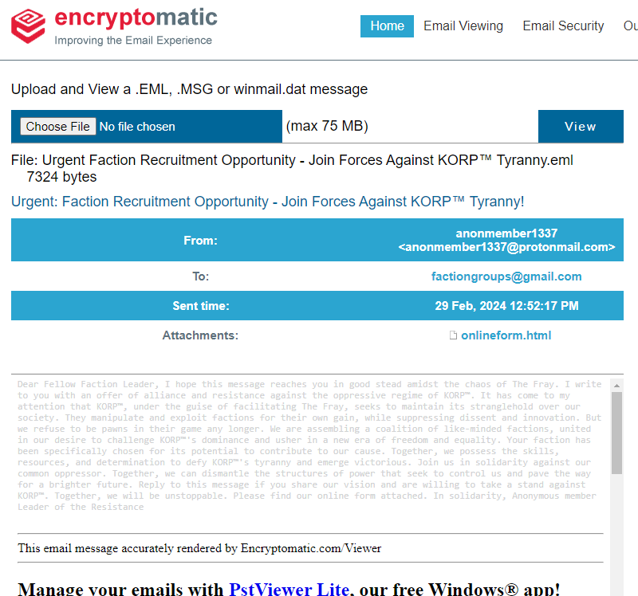
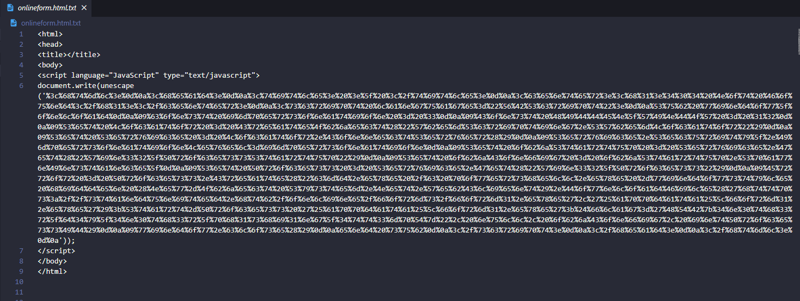
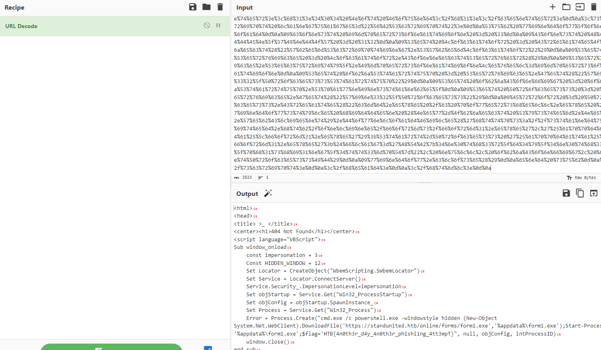

# Urgent

> Difficulty: Very Easy
> 
> In the midst of Cybercity's "Fray," a phishing attack targets its factions, sparking chaos. As they decode the email, cyber sleuths race to trace its source, under a tight deadline. Their mission: unmask the attacker and restore order to the city. In the neon-lit streets, the battle for cyber justice unfolds, determining the factions' destiny.

Solution:

We were given with a `Urgent Faction Recruitment Opportunity - Join Forces Against KORP™ Tyranny.eml` file.

Using https://www.encryptomatic.com/viewer/ , we can easily view the EML file.

The message in the email doesn't contain anything interesting. However, it has an HTML attachment. Retrieving it gives us the following.

We can decode it using Cyberchef's URL Decode recipe

And there's the flag!

Flag: `HTB{4n0th3r_d4y_4n0th3r_ph1shi1ng_4tt3mpT}`
