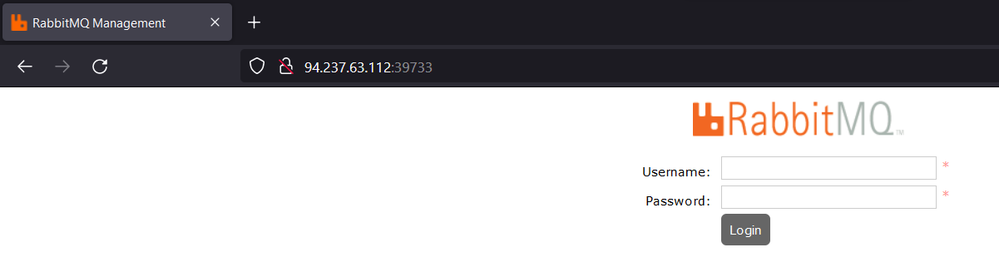
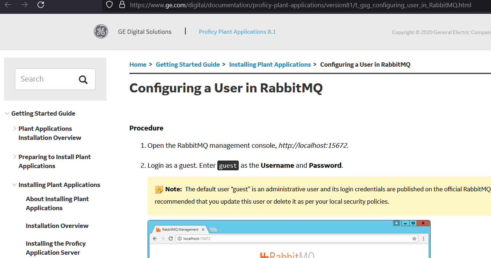
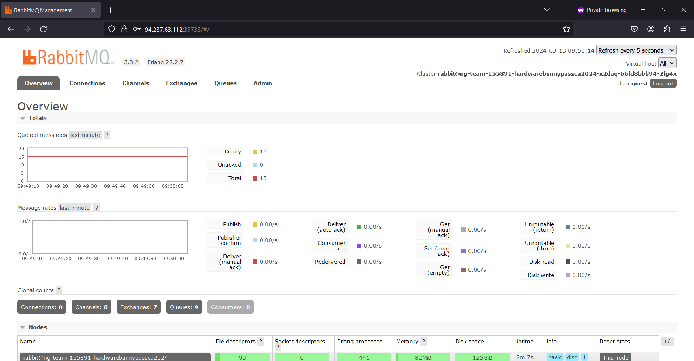
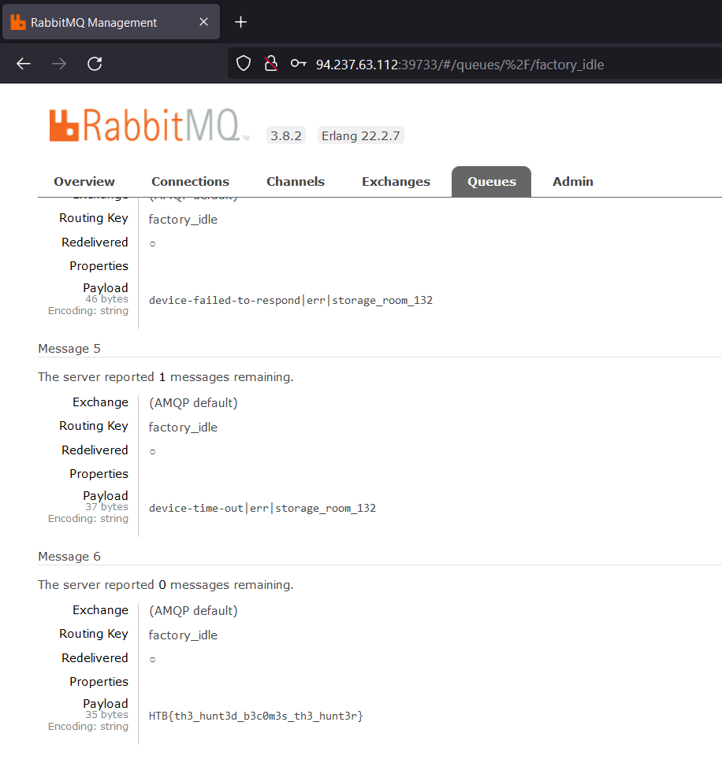

# BunnyPass

> Difficulty: Very Easy
>
> As you discovered in the PDF, the production factory of the game is revealed. This factory manufactures all the hardware devices and custom silicon chips (of common components) that The Fray uses to create sensors, drones, and various other items for the games. Upon arriving at the factory, you scan the networks and come across a RabbitMQ instance. It appears that default credentials will work.

Solution:

We can only spawn a Docker instance, in this case, it's http://94.237.63.112:39733/

The description said that defualt credentials works, so I searched for "RabbitMQ default username password" and landed on https://www.ge.com/digital/documentation/proficy-plant-applications/version81/t_gsg_configuring_user_in_RabbitMQ.html

So the username and password is `guest`

We're in! Now time to look for the flag.

After checking almost each tab in the dashboard, I eventually landed on `Queues > factory_idle > Get messages`

Flag: `HTB{th3_hunt3d_b3c0m3s_th3_hunt3r}`
