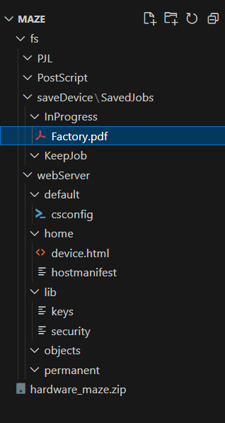
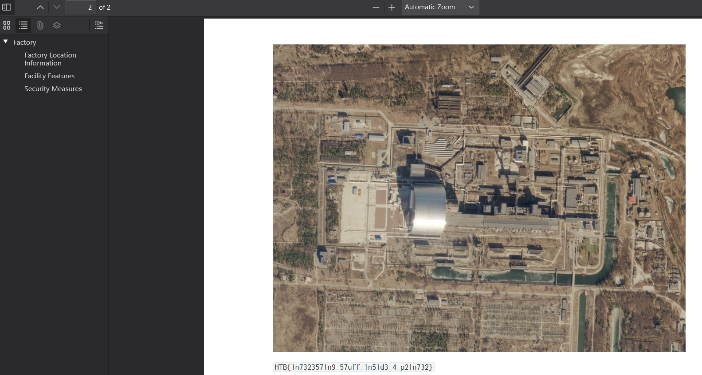

# Maze

> Difficulty: Very Easy
>
> In a world divided by factions, "AM," a young hacker from the Phreaks, found himself falling in love with "echo," a talented security researcher from the Revivalists. Despite the different backgrounds, you share a common goal: dismantling The Fray. You still remember the first interaction where you both independently hacked into The Fray's systems and stumbled upon the same vulnerability in a printer. Leaving behind your hacker handles, "AM" and "echo," you connected through IRC channels and began plotting your rebellion together. Now, it's finally time to analyze the printer's filesystem. What can you find?

Solution:

We are given with a ZIP archive file that contains the challenge files.

That `Factory.pdf` file is interesting, let's take a look at it.

There we go!

Flag: `HTB{1n7323571n9_57uff_1n51d3_4_p21n732}`
