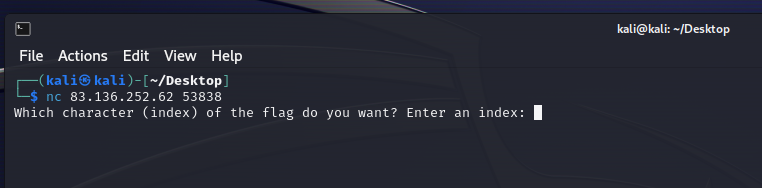
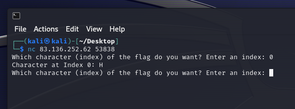
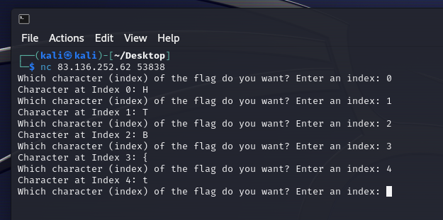
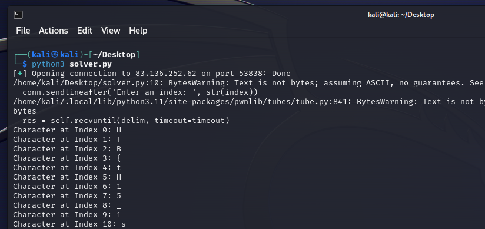
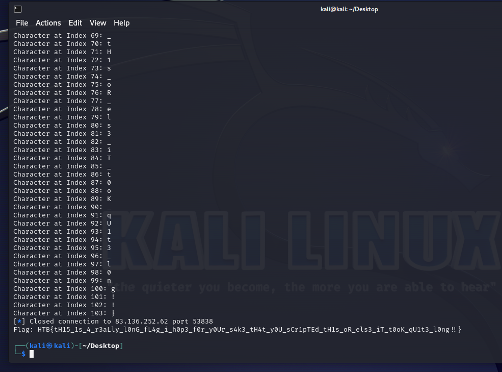

# Character

> Difficulty: Very Easy
>
> Security through Induced Boredom is a personal favourite approach of mine. Not as exciting as something like The Fray, but I love making it as tedious as possible to see my secrets, so you can only get one character at a time!

Solution:

We are given with a Docker instance that can be accessed via netcat: `nc 83.136.252.62 53838`



> Which character (index) of the flag do you want? Enter an index: 

Let's enter 0 as a test



hmm, let's continue by incrementing



lol, it is indeed sending the characters one by one

let's automate it using Python

```python
from pwn import *

conn = remote('83.136.252.62', 53838)

flag = ''

index = 0

while True:
    conn.sendlineafter('Enter an index: ', str(index))

    response = conn.recvline().decode()
    print(response.strip())
    char = response.split(': ')[1].strip()

    flag += char

    if char == '}':
        break

    index += 1

conn.close()

print(f'Flag: {flag}')
```





Whew, 103 characters. I wonder who did it manually 💀

Flag: `HTB{tH15_1s_4_r3aLly_l0nG_fL4g_i_h0p3_f0r_y0Ur_s4k3_tH4t_y0U_sCr1pTEd_tH1s_oR_els3_iT_t0oK_qU1t3_l0ng!!}`
