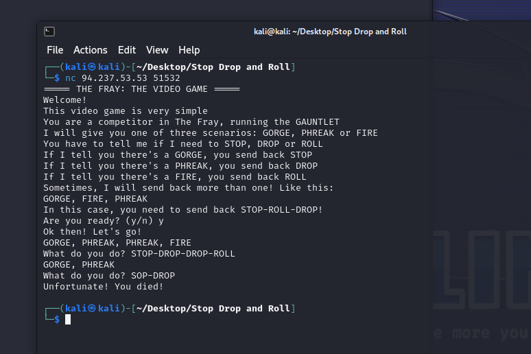
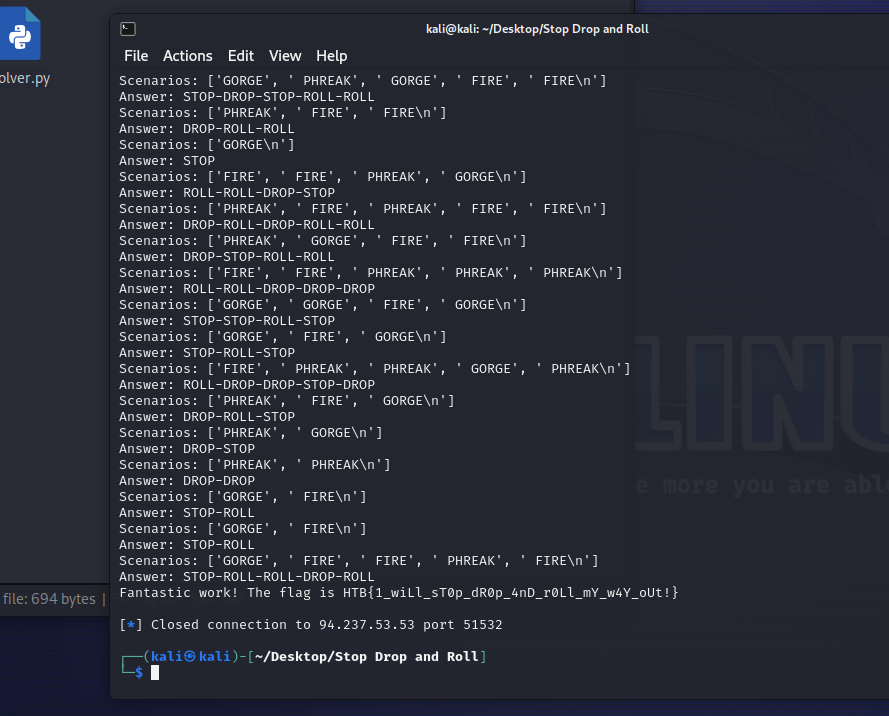

# Stop Drop and Roll

> Difficulty: Very Easy
>
> The Fray: The Video Game is one of the greatest hits of the last... well, we don't remember quite how long. Our "computers" these days can't run much more than that, and it has a tendency to get repetitive...

Solution:

The only option that we have is to spawn a Docker instance which can be accessed using netcat, in this case, it's `nc 94.237.53.53 51532`



So the goal here is to send the correct response depending on the given scenarios: GORGE, PHREAK, FIRE.

A Python script can solve this:

```python
from pwn import *

conn = remote('94.237.53.53', 51532)

scenario = {
    'GORGE': 'STOP',
    'PHREAK': 'DROP',
    'FIRE': 'ROLL'
}

conn.sendlineafter('Are you ready? (y/n) ', 'y')

conn.recvline()

while True:
    response = conn.recvline().decode()

    if "HTB" in response:
        print(response)
        break

    scenarios = response.split(',')
    print(f"Scenarios: {scenarios}")

    answer = ''
    answers = 0
    for x in scenarios:
        if answers > 0:
            answer += "-" + scenario[x.strip()]
        else:
            answer += scenario[x.strip()]
        answers+=1

    print(f"Answer: {answer}")
    conn.sendlineafter('What do you do? ', answer)

conn.close()
```

After running the script for a while, we finally have the flag.



Flag: `HTB{1_wiLl_sT0p_dR0p_4nD_r0Ll_mY_w4Y_oUt!}`
