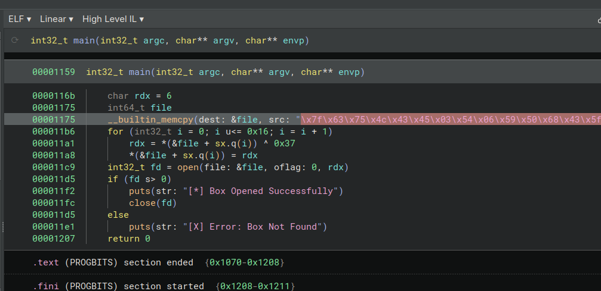
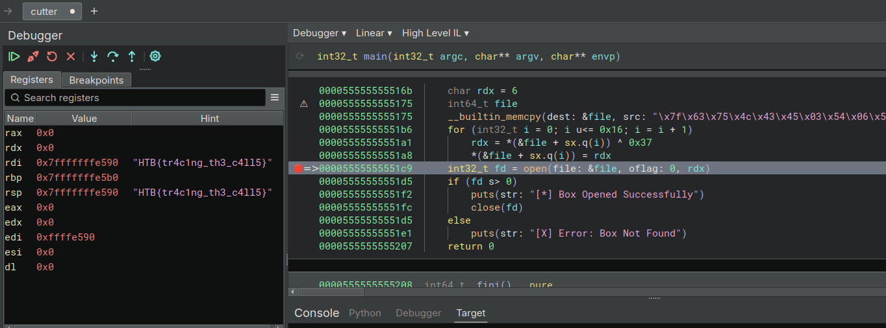

# BoxCutter

> Difficulty: Very Easy
>
> You've received a supply of valuable food and medicine from a generous sponsor. There's just one problem - the box is made of solid steel! Luckily, there's a dumb automated defense robot which you may be able to trick into opening the box for you - it's programmed to only attack things with the correct label.

Solution:

We are given with an ELF binary file named `cutter`



```c
00001159  int32_t main(int32_t argc, char** argv, char** envp)

0000116b      char rdx = 6
00001175      int64_t file
00001175      __builtin_memcpy(dest: &file, src: "\x7f\x63\x75\x4c\x43\x45\x03\x54\x06\x59\x50\x68\x43\x5f\x04\x68\x54\x03\x5b\x5b\x02\x4a\x37", n: 0x17)
000011b6      for (int32_t i = 0; i u<= 0x16; i = i + 1)
000011a1          rdx = *(&file + sx.q(i)) ^ 0x37
000011a8          *(&file + sx.q(i)) = rdx
000011c9      int32_t fd = open(file: &file, oflag: 0, rdx)
000011d5      if (fd s> 0)
000011f2          puts(str: "[*] Box Opened Successfully")
000011fc          close(fd)
000011d5      else
000011e1          puts(str: "[X] Error: Box Not Found")
00001207      return 0
```

`\x7f\x63\x75\x4c\x43\x45\x03\x54\x06\x59\x50\x68\x43\x5f\x04\x68\x54\x03\x5b\x5b\x02\x4a\x37`, a 23-byte (0x17) string, is copied to the `file` variable.

In the for loop, it iterates from 0 to 22 (0x16) and each byte of the `file` variable is XORed with the value 0x37, which seems to be the decryption process.

We can debug it and follow the decryption process to reveal the flag by setting a breakpoint.



or via Python

```Python
def decryptString(encryptedString, key):
    # Convert the encrypted string to a list of integers representing byte values
    encryptedBytes = []
    for encryptedCharacter in encryptedString:
        encryptedBytes.append(ord(encryptedCharacter))

    # Decrypt using XOR
    decryptedBytes = []
    for encryptedByte in encryptedBytes:
        decryptedBytes.append(encryptedByte ^ key)

    # Convert the decrypted bytes back to a string
    decryptedString = ''
    for decryptedByte in decryptedBytes:
        decryptedString += chr(decryptedByte)

    return decryptedString

encryptedString = "\x7f\x63\x75\x4c\x43\x45\x03\x54\x06\x59\x50\x68\x43\x5f\x04\x68\x54\x03\x5b\x5b\x02\x4a\x37"

key = 0x37

decryptionResult = decryptString(encryptedString, key)

print("Decrypted string:", decryptionResult)
```

Flag: `HTB{tr4c1ng_th3_c4ll5}`
