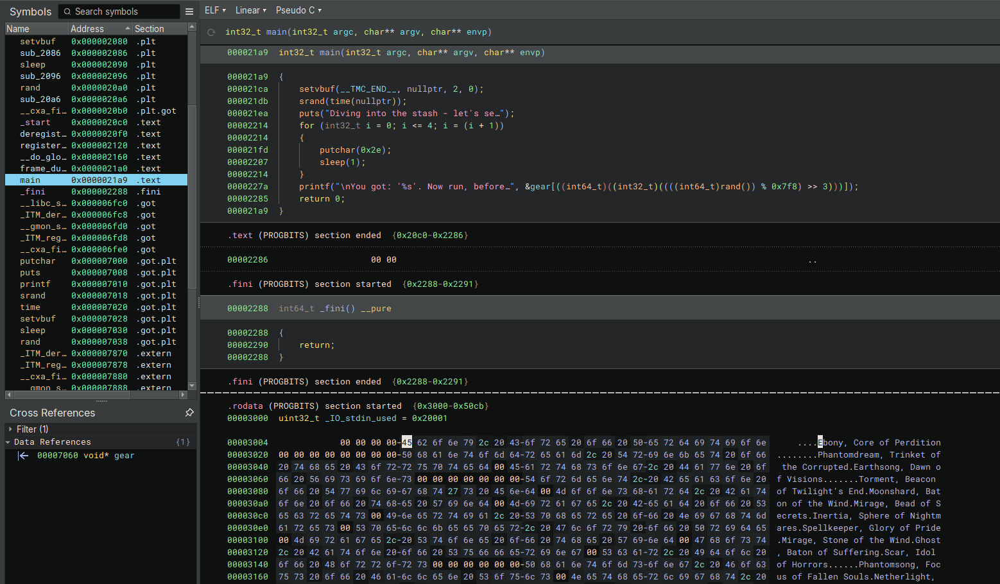
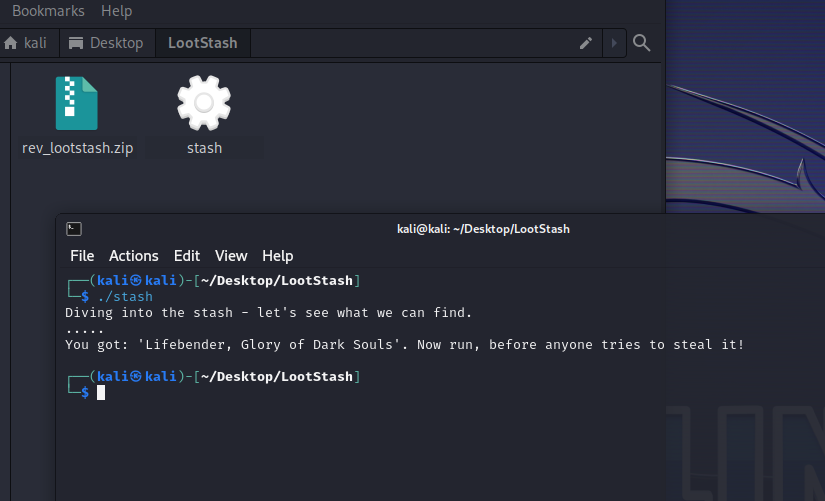
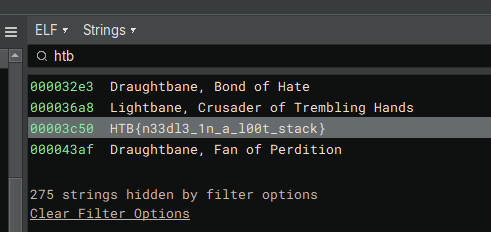

# LootStash

> Difficulty: Very Easy
>
> A giant stash of powerful weapons and gear have been dropped into the arena - but there's one item you have in mind. Can you filter through the stack to get to the one thing you really need?

Solution:

We are given with an ELF file named `stash`

It basically selects a random item from the `gear` array and display it.

Let's check the strings...maybe the flag is just there

lol, there we go!

Flag: `HTB{n33dl3_1n_a_l00t_stack}`
