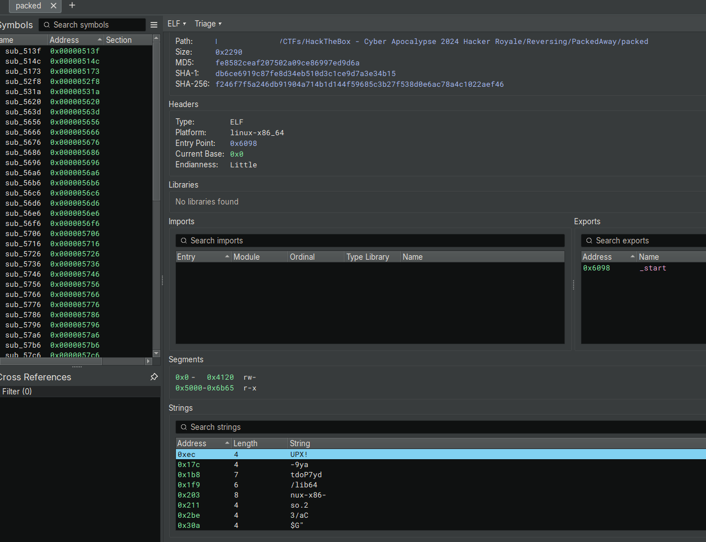
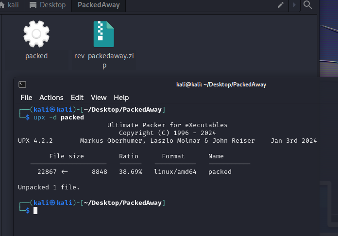
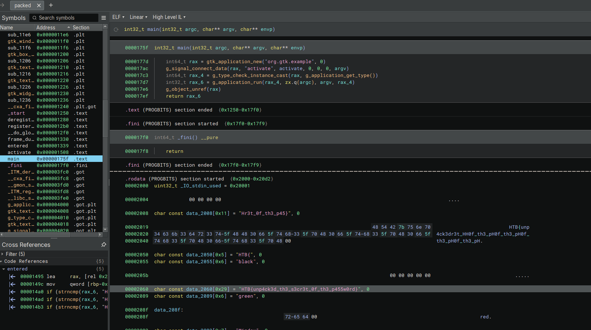

# PackedAway

> Difficulty: Very Easy
>
> To escape the arena's latest trap, you'll need to get into a secure vault - and quick! There's a password prompt waiting for you in front of the door however - can you unpack the password quick and get to safety?

Solution:

We are given with an ELF file named `packed`

Ooh, there's a UPX header right there (`UPX!`)

It makes sense that this is packed using UPX (https://upx.github.io/), considering the challenge title

Let's unpack it by doing `upx -d packed`

Cool! Let's check the unpacked version...

Oh, there's the flag!

Flag: `HTB{unp4ck3d_th3_s3cr3t_0f_th3_p455w0rd}`
