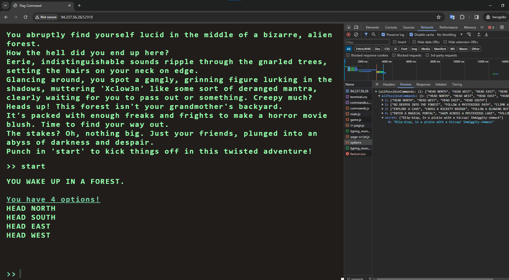
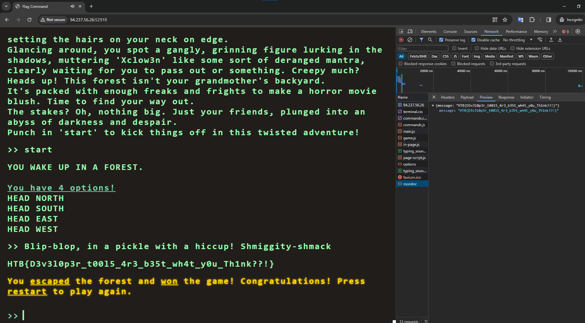

# Flag Command

> Difficulty: Very Easy
> 
> Embark on the "Dimensional Escape Quest" where you wake up in a mysterious forest maze that's not quite of this world. Navigate singing squirrels, mischievous nymphs, and grumpy wizards in a whimsical labyrinth that may lead to otherworldly surprises. Will you conquer the enchanted maze or find yourself lost in a different dimension of magical challenges? The journey unfolds in this mystical escape!

Solution:

There are no source files. We can spawn a Docker instance which is at `http://94.237.56.26:52918/`

Looking at the network request that was sent at `http://94.237.56.26:52918/api/options`, there are several commands. But, there's an interesting one, which is `Blip-blop, in a pickle with a hiccup! Shmiggity-shmack`

Let's enter that

Oh, noice!

Flag: `HTB{D3v3l0p3r_t00l5_4r3_b35t_wh4t_y0u_Th1nk??!`
