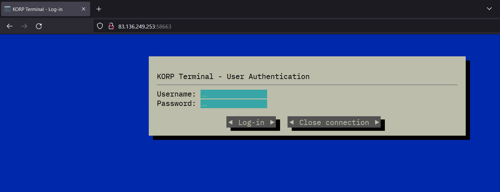
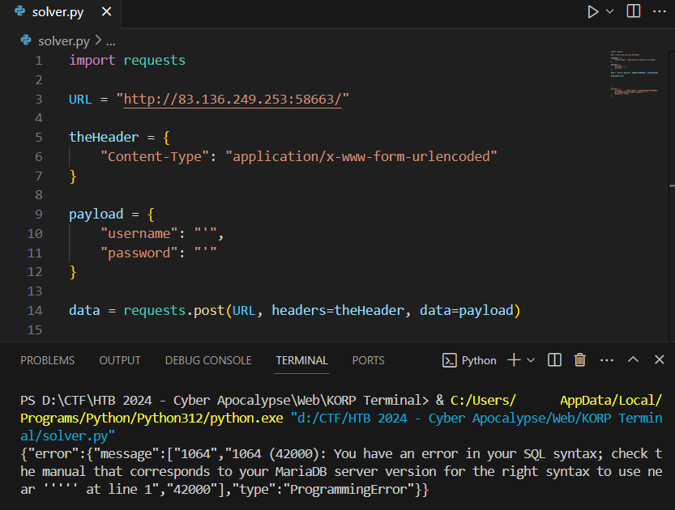
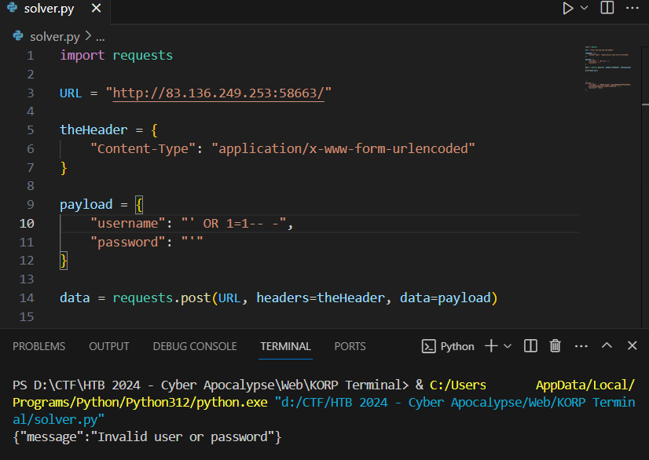
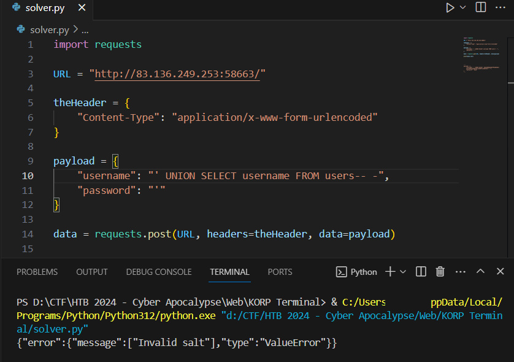
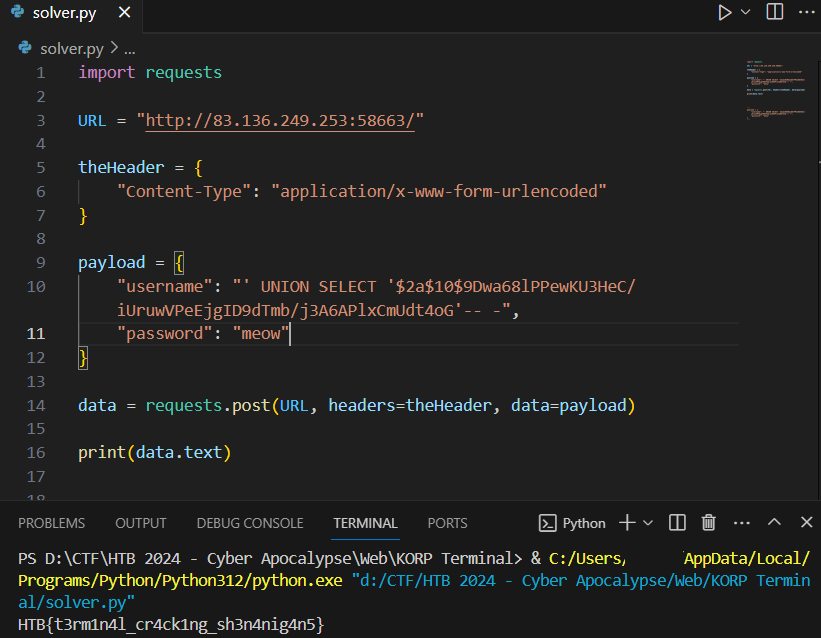

#  KORP Terminal 

> Difficulty: Very Easy
>
> Your faction must infiltrate the KORP™ terminal and gain access to the Legionaries' privileged information and find out more about the organizers of the Fray. The terminal login screen is protected by state-of-the-art encryption and security protocols.

Solution:

There are no source files. We can only spawn a Docker instance, which is `http://83.136.249.253:58663/` for this case.

So it's a simple form. Logging in seems to be the goal.

Tried using single quotes only in the username and password field to generate an error...

Oh, so the challenge web app is using MariaDB

Let's try `' OR 1=1-- -`

Hmm, it won't accept it. Let's try `' UNION SELECT username FROM users-- -`

Ugh, invalid salt? The password is salted? 🤔

Searching for "invalid salt mariadb" lead me to https://stackoverflow.com/questions/68514500/how-can-i-fix-this-error-valueerror-invalid-salt-in-flask

So perhaps, the password is hashed with bcrypt. What if we use ours? Let's generate using https://bcrypt-generator.com/

And let's do `' UNION SELECT '$2a$10$9Dwa68lPPewKU3HeC/iUruwVPeEjgID9dTmb/j3A6APlxCmUdt4oG'-- -` then enter `meow` in the password since that is the plaintext version

Boom!

Flag: `HTB{t3rm1n4l_cr4ck1ng_sh3n4nig4n5}`
