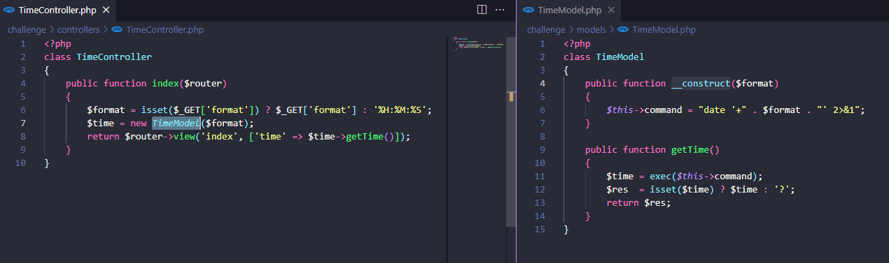

# TimeKORP

> Difficulty: Very Easy
>
> TBD

Solution: 

We are given with the source files to re-create the challenge locally. We can also spawn our Docker instance, which is `http://94.237.57.155:59233/`

Pressing either `What's the time?` or `What's the date?` will only change the URL parameter `format` to a hardcoded format

Looking at the `TimeController.php`, we can see it converts our parameter value based on the model, `TimeModel`

Based on `TimeModel.php` we can do a command injection attack since it passes the value to `exec()`

Looking at the Dockerfile, our target file, `flag`, it stored at `/flag`

So we can simply do `' ; cat '/flag` to escape the `date` command and to retrieve the contents of the `flag` file

Noice!

Flag: `HTB{t1m3_f0r_th3_ult1m4t3_pwn4g3}`
