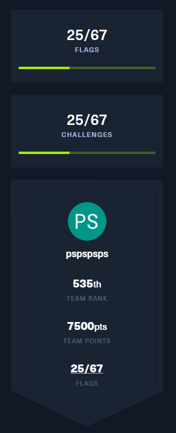

# HackTheBox - Cyber Apocalypse 2024: Hacker Royale

https://ctftime.org/event/2255

https://ctf.hackthebox.com/event/1386/scoreboard

https://github.com/hackthebox/cyber-apocalypse-2024/

# Challenges solved

## Misc
- [Character](Misc/Character/) [Very Easy]
- [Stop Drop and Roll](Misc/Stop%20Drop%20and%20Roll/) [Very Easy]

## Reversing
- [BoxCutter](Reversing/BoxCutter/) [Very Easy]
- [LootStash](Reversing/LootStash/) [Very Easy]
- [PackedAway](Reversing/PackedAway/) [Very Easy]

## Forensics
- [It Has Begun](Forensics/It%20Has%20Begun/) [Very Easy]
- [An unusual sighting](Forensics/An%20unusual%20sighting/) [Very Easy]
- [Urgent](Forensics/Urgent/) [Very Easy]
- [Pursue The Tracks](Forensics/Pursue%20The%20Tracks/) [Easy]
- [Fake Boost](Forensics/Fake%20Boost/) [Easy]
- [Data Siege](Forensics/Data%20Siege/) [Medium]
- [Phreaky](Forensics/Phreaky/) [Medium]
- [Game Invitation](Forensics/Game%20Invitation/) [Hard]

## Web
- [Flag Command](Web/Flag%20Command/) [Very Easy]
- [KORP Terminal](Web/KORP%20Terminal/) [Very Easy]
- [TimeKORP](Web/TimeKORP/) [Very Easy]
- [Labyrinth Linguist](Web/Labyrinth%20Linguist/) [Easy]

## Blockchain
- [Russin Roulette](Blockchain/Russian%20Roulette/) [Very Easy]
- [Recovery](Blockchain/Recovery/) [Easy]
- [Lucky Faucet](Blockchain/Lucky%20Faucet/) [Easy]

## Hardware
- [Maze](Hardware/Maze/) [Very Easy]
- [BunnyPass](Hardware/BunnyPass/) [Very Easy]

## Crypto
- Makeshift [Very Easy]
- Dynastic [Very Easy]

## Pwn
- Tutorial [Very Easy]

