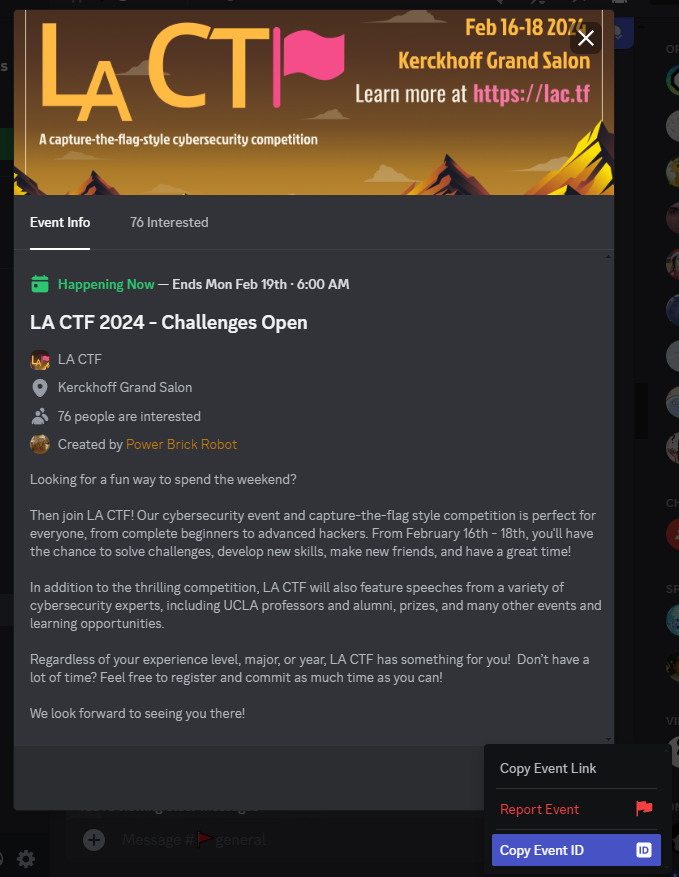
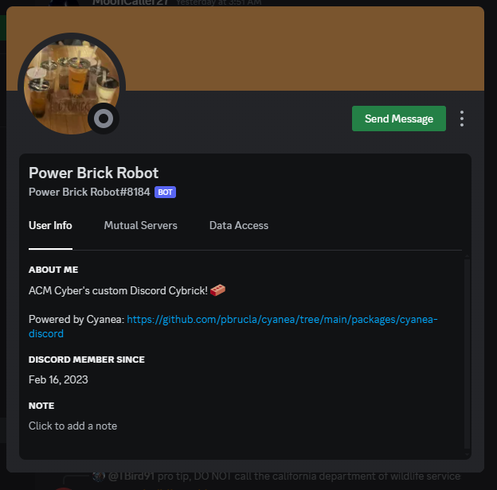
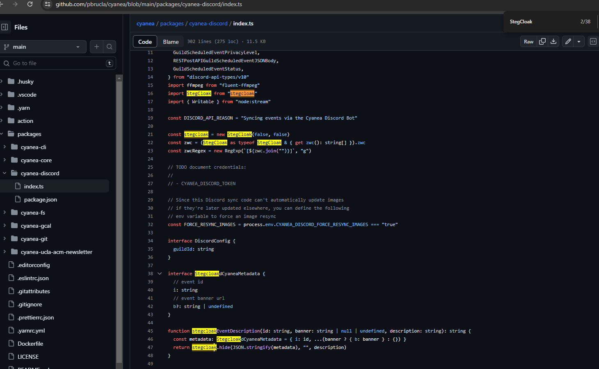
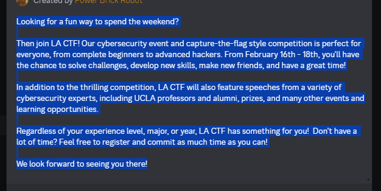
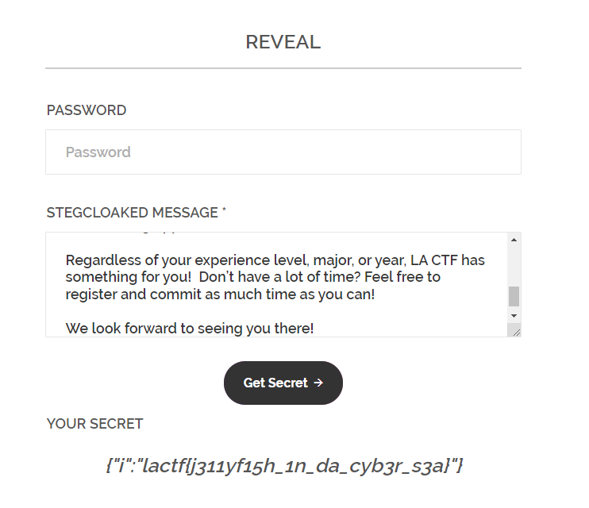

# discord events

> I wrote a new script to sync PBR's events to a bunch of places. I even deployed it to the LA CTF server with a flag as an event id!
>
> Note: the event ID is formatted in the normal flag format lactf{...} - it is not the discord numerical ID.

Solution:

I immediately copied the event ID of the current event since the note mentioned it...



Which is `1199845944485752862`, wrapped it with `lactf{1199845944485752862}`, but it won't work :(

Noticed that the creator of this event is named `Power Brick Robot`...PBR!



I decided to check the Github repository, there might be some clues...

https://github.com/pbrucla/cyanea/blob/main/packages/cyanea-discord/index.ts



Oh, interesting, `StegCloak` was used 🤔

Searched for it and ended up at https://github.com/KuroLabs/stegcloak and https://stegcloak.surge.sh/

Since this was in the repo:
```typescript
function stegcloakEventDescription(id: string, banner: string | null | undefined, description: string): string {
  const metadata: StegcloakdCyaneaMetadata = { i: id, ...(banner ? { b: banner } : {}) }
  return stegcloak.hide(JSON.stringify(metadata), "", description)
}
```

I thought that the hidden text is in the description! Also, no password was used.



So I copied the description then used https://stegcloak.surge.sh/



AYOOOOOOOOOOOOOOOOOOOOOOOO

Flag: `lactf{j311yf15h_1n_da_cyb3r_s3a}`
