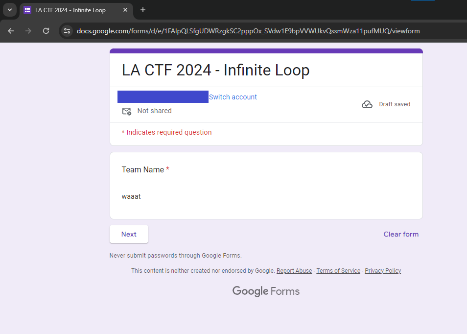

# infinite loop

> I found this google form but I keep getting stuck in a loop! Can you leak to me the contents of form and the message at the end so I can get credit in my class for submitting? Thank you!
>
> https://docs.google.com/forms/d/e/1FAIpQLSfgUDWRzgkSC2pppOx_SVdw1E9bpVVWUkvQssmWza11pufMUQ/viewform?usp=sf_link

Solution:

Visting the form will ask for your team name first.

Then you will be asked for the answer of 1+1

However, clicking next, no matter what answer, will go back to the `Recursion` question part

So I decided to look around the source via dev tools, searched for `lactf`...

Woah! It's part of `FB_PUBLIC_LOAD_DATA_`

Flag: `lactf{l34k1ng_4h3_f04mz_s3cr3tz}`

It seems to be the *sekeleton structure of the Google Form*

https://theconfuzedsourcecode.wordpress.com/2019/12/15/programmatically-access-your-complete-google-forms-skeleton/

