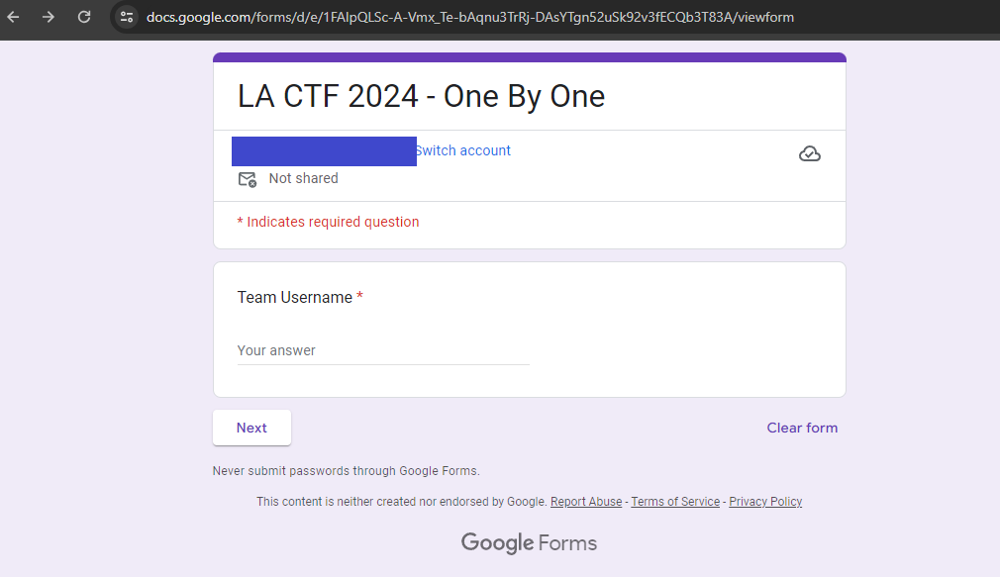
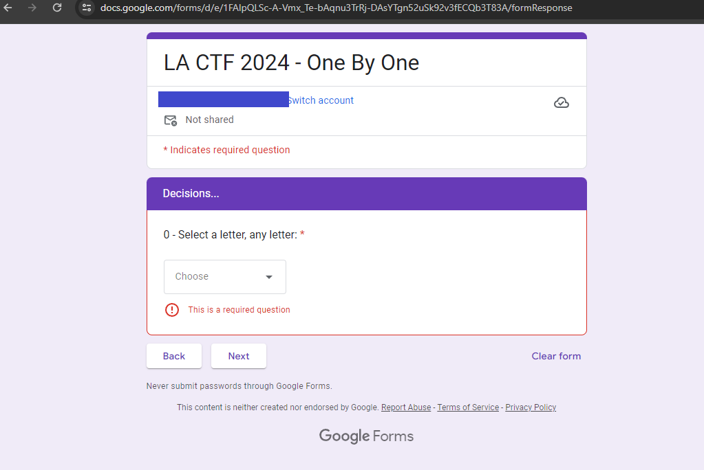
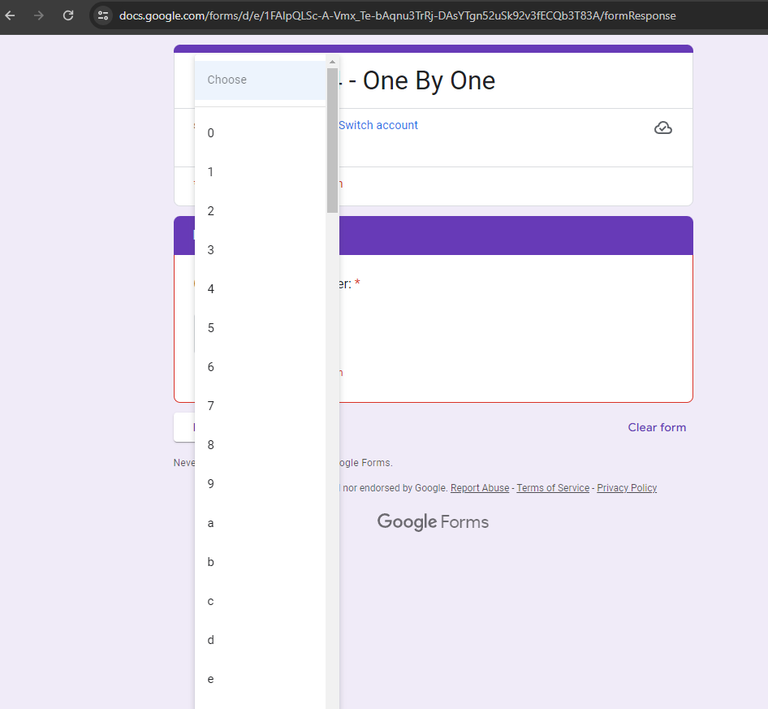
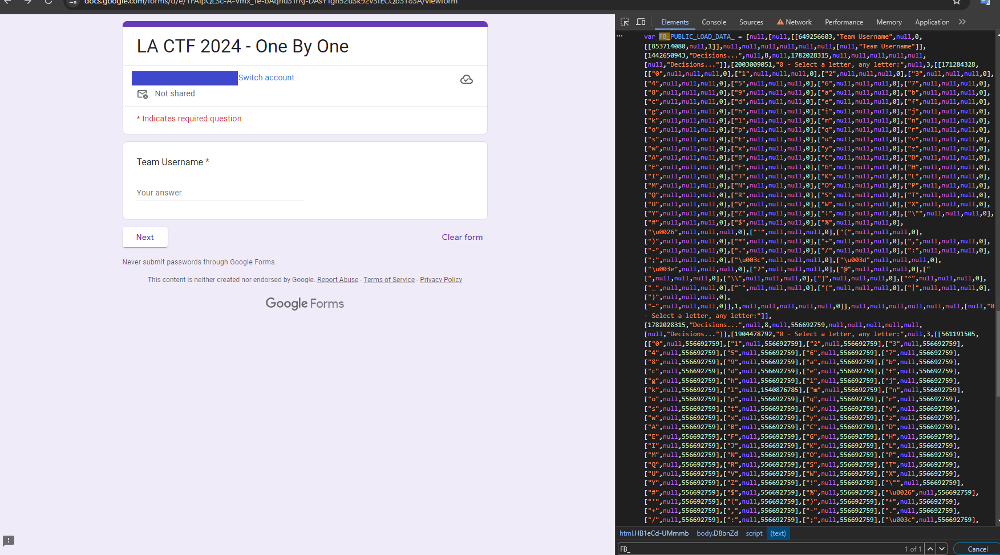
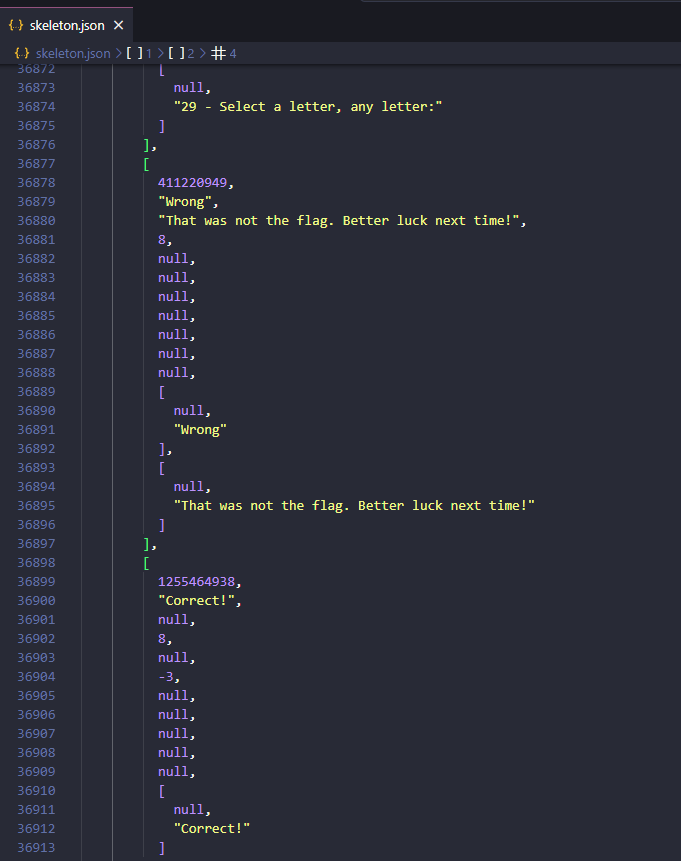
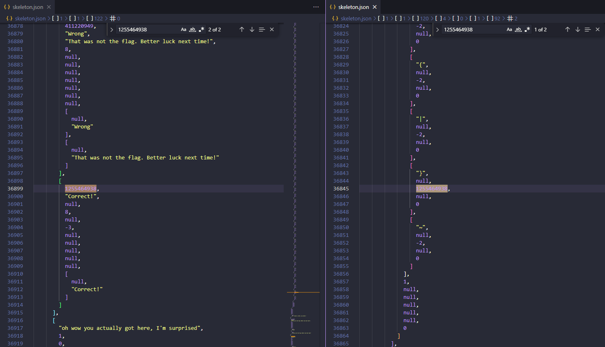
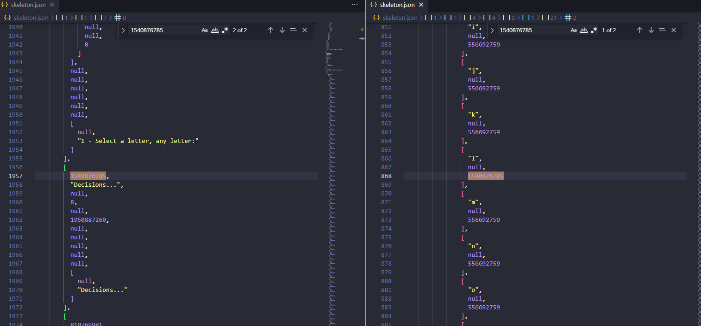

# one by one

> One..... by.......... one............... whew I'm tired, this form is waaaaaaay too long.
>
> Note: the flag does have random characters at the end - that is intentional.
>
> https://docs.google.com/forms/d/e/1FAIpQLSc-A-Vmx_Te-bAqnu3TrRj-DAsYTgn52uSk92v3fECQb3T83A/viewform

Solution:

Another Google form! 



If we try to answer it normally...





It seems we are forming the flag "one by one"

I learned earlier from the `infinite loop` challenge that the form data is at `FB_PUBLIC_LOAD_DATA_`



So I retrieved it then prettified so my eyes won't cry.

Unfortunately, the flag is not immediately pointed out :(



Though the numbers are interesting here.



The number here refers to the correct choice! And it's the end curly brace :D

So for `29 - Select a letter, any letter:`:
- the value for the correct answer is at `[1][1][122][0]`
- and the answer is at `[1][1][120][4][0][1][92][2]`



Then I decided to check `0 - Select a letter, any letter:`:
- the value for the correct answer is at `[1][1][7][0]`
- and the answer is at `[1][1][4][4][0][1][21][2]`

Also checked two more...

`1 - Select a letter, any letter:`:
- the value for the correct answer is at `[1][1][11][0]`
- and the answer is at `[1][1][8][4][0][1][10][2]`

`2 - Select a letter, any letter:`:
- the value for the correct answer is at `[1][1][15][0]`
- and the answer is at `[1][1][12][4][0][1][12][2]`

...

After doing that, I realized that the following should be done:
1. start at index 4 since it has the question `0 - Select a letter, any letter:`
2. add 3 to the index to get the value of the correct answer
3. go back to the starting index and iterate the choices until it matches the value of the correct answer
4. then add 4 to the index to answer the next question
5. Repeat from step 2

Though the only difference is that it won't work for the last character as it has the correct answer at 122, not 123

So I created a Python script to automate it.

```python
import json

with open('skeleton.json','r') as skeletonFile:
    data = json.load(skeletonFile)

index = 4
end = ""
flag = []

while end != "}":
    if index == 120:
        toCompare = data[1][1][index+2][0]
    else:
        toCompare = data[1][1][index+3][0]
    for x in data[1][1][index][4][0][1]:
        if x[2] == toCompare:
            flag.append(x[0])
            if x[0] == "}":
                end = "}"
            break
    index+=4

print("".join(flag))
```

Flag: `lactf{1_by_0n3_by3_un0_*,"g1'}`


