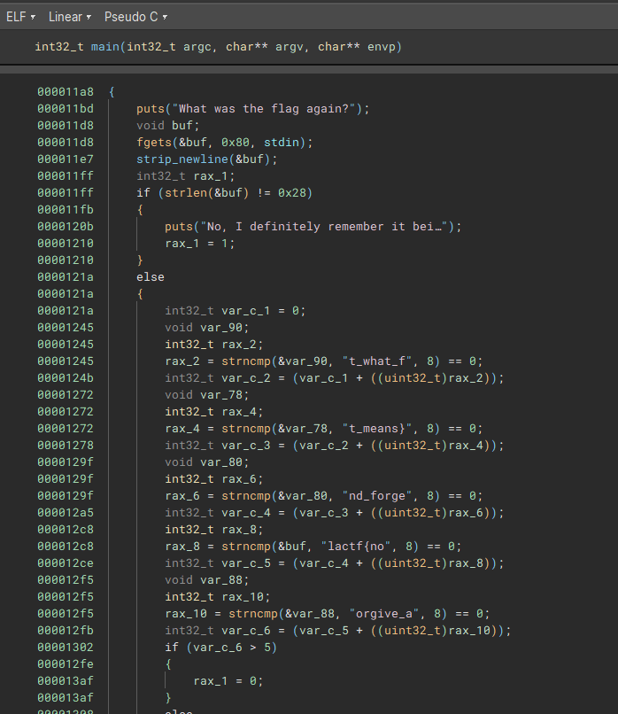
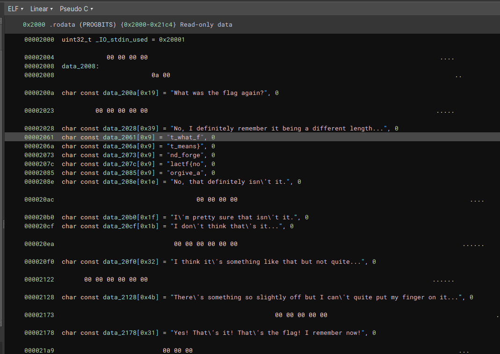

# shattered-memories

> I swear I knew what the flag was but I can't seem to remember it anymore... can you dig it out from my inner psyche?

Solution:

We were given with an ELF file

Since the parts of the flag are in plaintext, we can simply reconstruct it to `lactf{not_what_forgive_and_forget_means}`
