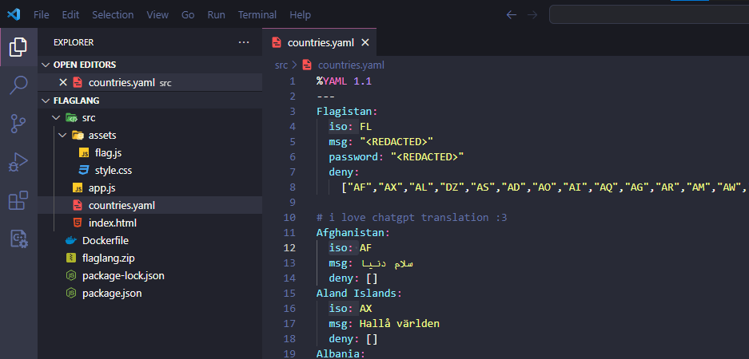
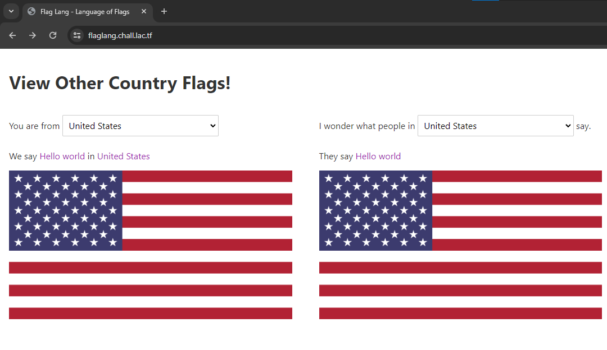
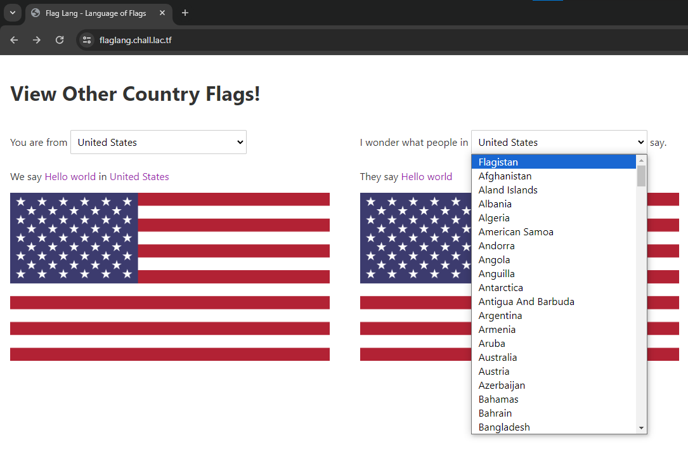
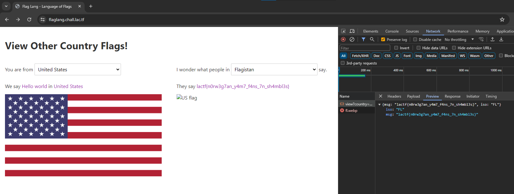

# flaglang

> Do you speak the language of the flags?
>
> https://flaglang.chall.lac.tf/

Solution:

We were given with the source files.

`src\countries.yaml` is interesting

Let's check the website

I decided to check the values for the second drop down and scroll the way up.

Clicking it will just reveal the flag lol

Flag: `lactf{n0rw3g7an_y4m7_f4ns_7n_sh4mbl3s}`
