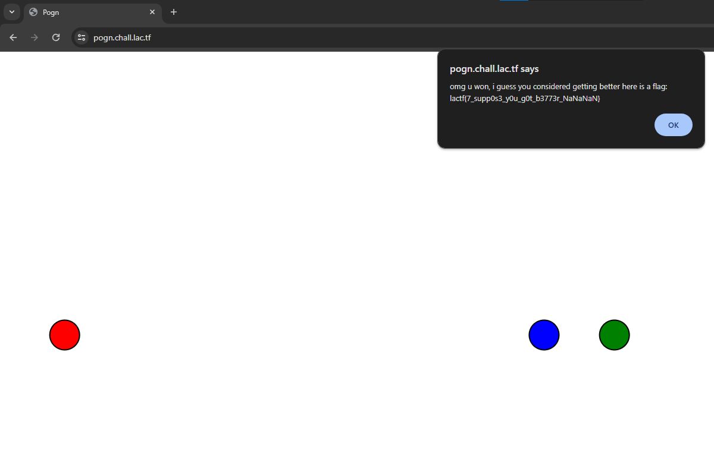
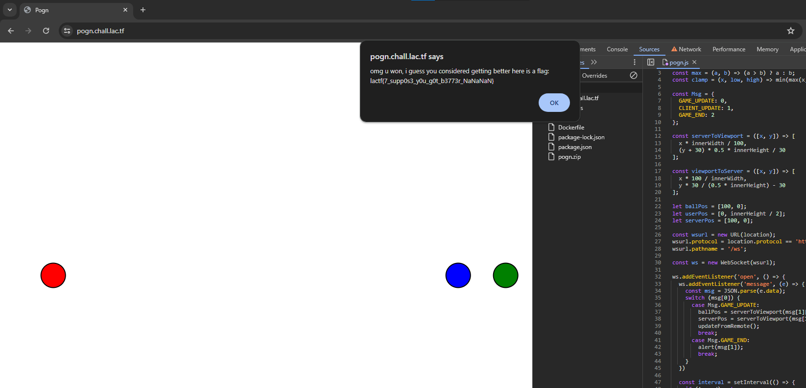
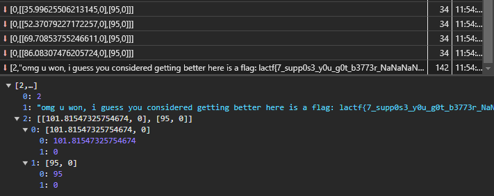

# pogn

> Pogn in mong.
>
> https://pogn.chall.lac.tf/

Solution:

I was just checking the source file via dev tools and suddenly the blue ball sped up o_o

Though when I tried to put a bit more effort...I have overridden the JS file, set the x of the `ballPos` to `100`, refresh, and just waited. It sped up again even though it's supposed to have a fixed posiiton on the server side o_o

Flag: `lactf{7_supp0s3_y0u_g0t_b3773r_NaNaNaN}`

