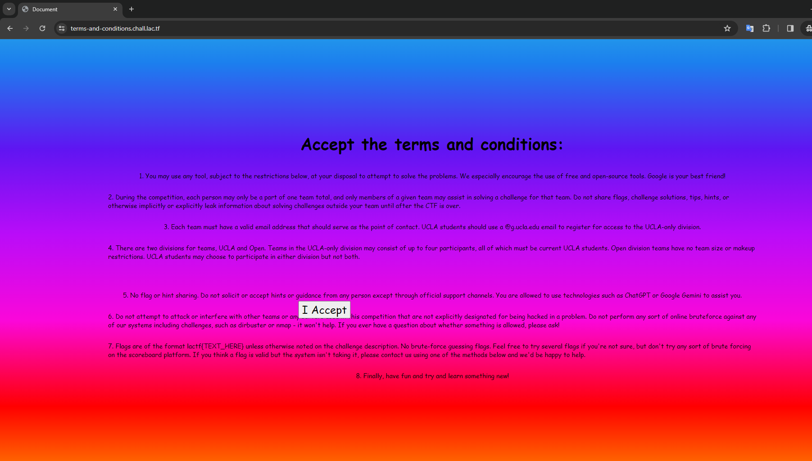
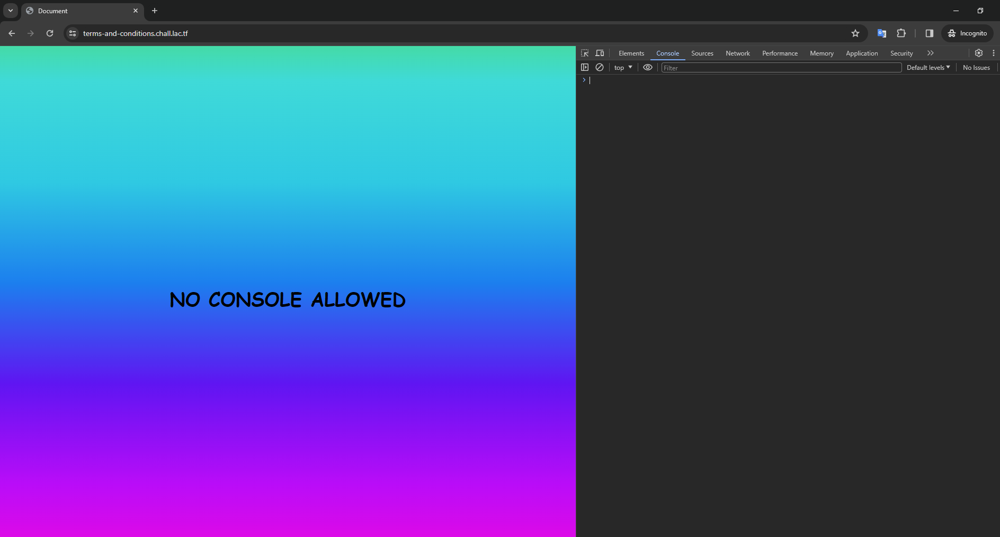
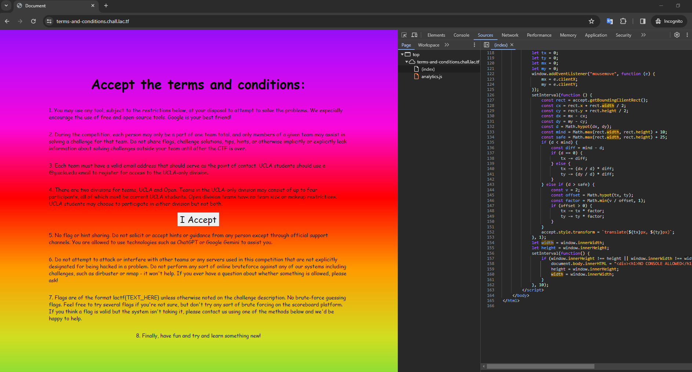
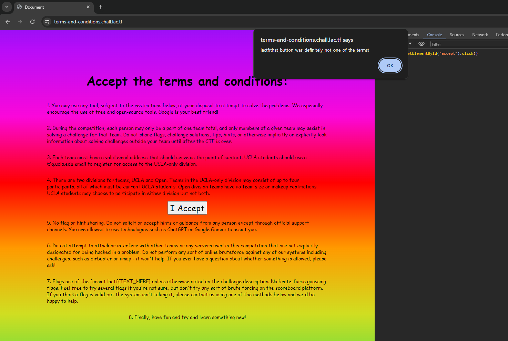

# terms-and-conditions

> Welcome to LA CTF 2024! All you have to do is accept the terms and conditions and you get a flag!
> 
> https://terms-and-conditions.chall.lac.tf/

Solution:



When you try to press the `I accept` button, it goes away from you

Pressing `F12` to acess console changed the whole page



Though looking at the source...

```javascript
setInterval(function() {
    if (window.innerHeight !== height || window.innerWidth !== width) {
        document.body.innerHTML = "<div><h1>NO CONSOLE ALLOWED</h1></div>";
        height = window.innerHeight;
        width = window.innerWidth;
    }
}, 10);
```

It only does that if the dimensions of the window changes after it loads

So let's just leave the console there and refresh.



Okay, that worked.

Now let's try to click that button using the console: `document.getElementById("accept").click()`



There we go!

Flag: `lactf{that_button_was_definitely_not_one_of_the_terms}`


