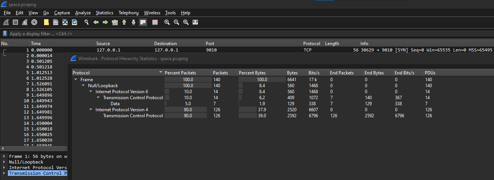
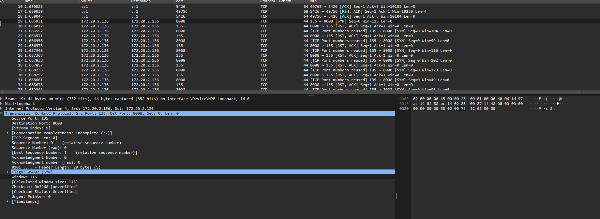
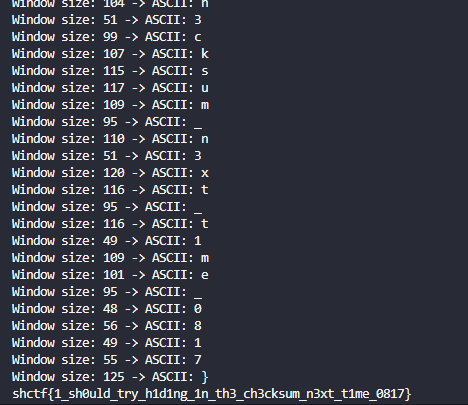

# A Window into Space

> I think aliens are testing us again and they they are poking fun at our internet protocols by using them in close proximity to earth. We were able to intercept something but I cant figure out what it is. Take a crack at it for me.
> 
> Author: Josh

Solution:

We are given with a pcapng file: `space.pcapng`

Let's check the protocol hierarchy first



Hmm, nothing noticeable immediately.

Decided to check each packet instead and noticed that it forms `shctf{` in the window.



So we can filter by `ip.dst == 172.20.2.136 && tcp.dstport == 8008`

Decided to use scapy to make things easier.

```python
from scapy.all import *

flag = []

packets = rdpcap("space.pcapng")

for pkt in packets:
    if TCP in pkt and pkt[TCP].dport == 8008 and pkt[IP].dst == '172.20.2.136':
        # Get the TCP window size
        window_size = pkt[TCP].window
        character = chr(window_size)
        flag.append(character)
        print(f'Window size: {window_size} -> ASCII: {character}')

print(''.join(flag))
```



Boom!

Flag: `shctf{1_sh0uld_try_h1d1ng_1n_th3_ch3cksum_n3xt_t1me_0817}`
