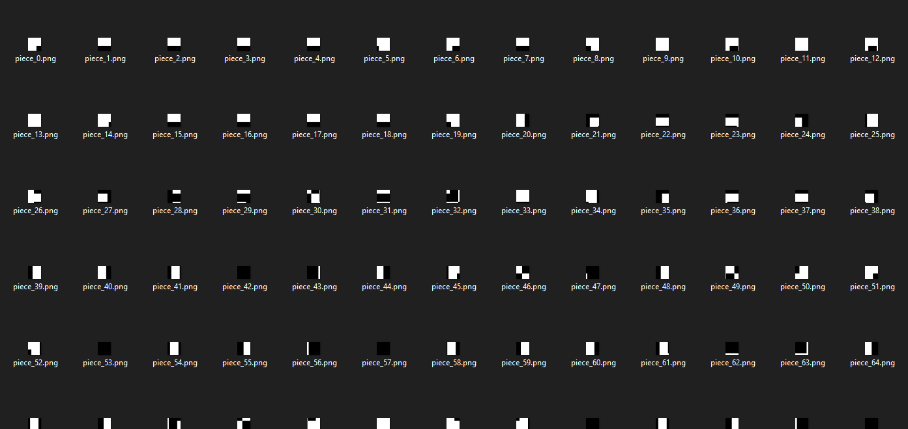

# Petey the Panther's Guide to the Galaxy

> Petey the Panther has stumbled upon the greatest treasure this side of the Milky Way: a bonafide Hitchhikers Guide to the Galaxy! What kind of secrets does this thing hold?
> 
> Author: Zero

Solution:

We are given with an image file: `A_Real_Space_Hero.jpg`


Let's check the strings...


Oh, there are hidden images inside of it. Let's extract using `binwalk --dd=".*" A_Real_Space_Hero.jpg`...


There we go!



Hmm, black pixels, this is likely a QR code.

Was trying to find tools to combine it, and landed on https://github.com/Tamcode/intigriti-ctf

Since it was created 6 years ago, time to enhance it. Also, since it uses 21x21, which is more than our 400 images, I thought of limiting it to 20x20.

```python
import numpy as np
import cv2
import os

def createImageGrid(imageFolder, rows, cols):
    files = os.listdir(imageFolder))
    files.sort(key=lambda x: int(x.split("_")[1].split(".")[0])) # Filename is like image_1.jpg, image_2.jpg, image_3.jpg
    print(files)

    if not files:
        print("No files found in the directory.")
        return

    # Read the first image to determine the size
    sampleImagePath = os.path.join(imageFolder, files[0])
    sampleImage = cv2.imread(sampleImagePath, cv2.IMREAD_COLOR)
    if sampleImage is None:
        print(f"Failed to read the first image at {sampleImagePath}")
        return

    # Initialize the finalImage array with assumed max dimensions
    if len(files) < rows * cols:
        print(f"Not enough images to fill a {rows}x{cols} grid.")
        return

    finalImage = np.zeros((sampleImage.shape[0] * rows, sampleImage.shape[1] * cols, 3), dtype=np.uint8)

    # Processing images to fit into the specified grid
    for i in range(0, len(files), cols):  # Process images in batches
        tempImage = np.zeros((sampleImage.shape[0], 0, 3), dtype=np.uint8)  # Reset tempImage for each row
        for j in range(cols):
            index = i + j
            if index >= len(files):
                break  # Break if no more images to process
            file = files[index]
            filepath = os.path.join(imageFolder, file)
            img = cv2.imread(filepath, cv2.IMREAD_COLOR)
            if img is None:
                print(f"Failed to read an image at {filepath}")
                continue
            if img.shape != sampleImage.shape:
                img = cv2.resize(img, (sampleImage.shape[1], sampleImage.shape[0]))
            tempImage = np.concatenate((tempImage, img), axis=1)

        # Concatenate the current row with the final image
        currentRow = i // cols
        if currentRow >= rows:
            break  # Prevent exceeding the specified number of rows
        finalImage[sampleImage.shape[0] * currentRow:(sampleImage.shape[0] * currentRow + sampleImage.shape[0]), :, :] = tempImage

    print(finalImage.shape)
    cv2.imwrite("qr.jpg", finalImage)
    print("Image grid saved as 'qr.jpg'.")

imageFolder = "secrets"  # Specify directory here
rows = 20  # Number of rows in the grid
cols = 20  # Number of columns in the grid
createImageGrid(imageFolder, rows, cols)
```


Let's scan using Cyberchef...


Nice!!!!!

Flag: `shctf{s0_l0ng_4nd_th4nks_f0r_4ll_th3_flags}`
