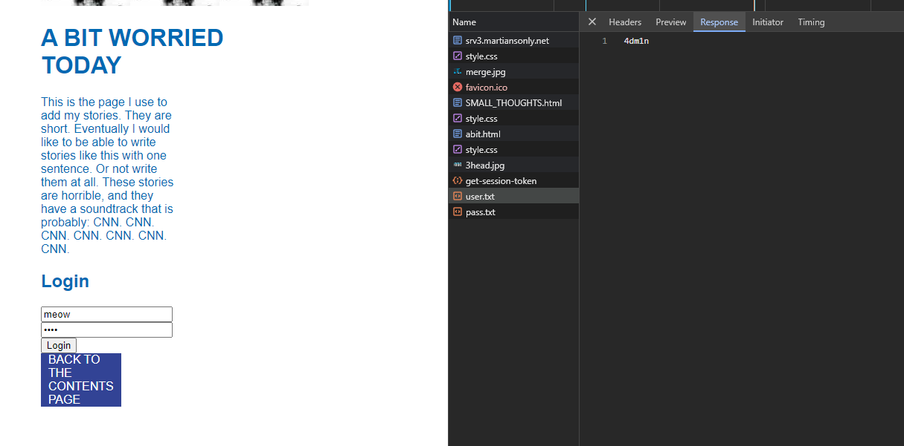

# Slowly Downward

> We've found what appears to be a schizophrenic alien's personal blog. Poke around and see if you can find anything interesting.
> 
> http://slow.martiansonly.net
> 
> Author: liabell

Solution:

No source file(s) given...let's check the challenge site.


Interesting, it loads via iframe. Let's grab the link and use that instead.


Alright, that's much better. Let's check the `SMALL THOUGHTS` first.


Hmm, nothing important, even though there are hidden items in the list. It will simply display an alert message.

Let's go back and check `A BIT WORRIED`.


Interesting, there's a login form. `flag.txt` can be seen in the source as well.

```javascript
<script>
    let sessionToken;

    // Function to fetch the session token from the server
    function fetchSessionToken() {
        fetch('/get-session-token')
            .then(response => {
                if (!response.ok) {
                    throw new Error('Failed to fetch session token.');
                }
                return response.json();
            })
            .then(data => {
                sessionToken = data.token;
                // Call the function that initiates your application after fetching the session token
                initApplication();
            })
            .catch(error => {
                console.error('Error fetching session token:', error);
            });
    }

    // Function to initiate your application after fetching the session token
    function initApplication() {
        // Function to handle form submission for login
        document.getElementById('loginForm').addEventListener('submit', function(event) {
            event.preventDefault();
            const username = this.querySelector('input[name="username"]').value.trim();
            const password = this.querySelector('input[name="password"]').value.trim();

            // Fetch user credentials using the session token
            fetch('/text/credentials/user.txt', {
                headers: {
                    'Authorization': `Bearer ${sessionToken}`
                }
            })
                .then(response => {
                    if (!response.ok) {
                        throw new Error('Failed to fetch user credentials.');
                    }
                    return response.text();
                })
                .then(userContent => {
                    // Fetch password credentials using the session token
                    fetch('/text/credentials/pass.txt', {
                        headers: {
                            'Authorization': `Bearer ${sessionToken}`
                        }
                    })
                        .then(response => {
                            if (!response.ok) {
                                throw new Error('Failed to fetch password credentials.');
                            }
                            return response.text();
                        })
                        .then(passContent => {
                            const storedUsername = userContent.trim();
                            const storedPassword = passContent.trim();

                            if (username === storedUsername && password === storedPassword) {
                                document.getElementById('uploadForm').style.display = 'block';
                                document.getElementById('loginForm').style.display = 'none';
                            } else {
                                alert('Incorrect credentials. Please try again.');
                            }
                        })
                        .catch(error => {
                            alert(error.message);
                        });
                })
                .catch(error => {
                    alert(error.message);
                });
        });

        // Function to handle file name input blur event
        document.getElementById('fileNameInput').addEventListener('blur', function() {
            const fileName = this.value.trim();
            if (fileName.includes('arbiter.txt; cat /secret/flag.txt') || fileName.includes('carts.txt; cat /secret/flag.txt') || fileName.includes('arbiter.txt; cat secret/flag.txt') || fileName.includes('carts.txt; cat secret/flag.txt') || fileName.includes('arbiter.txt;cat secret/flag.txt') || fileName.includes('carts.txt;cat secret/flag.txt')){
                // Fetch secret flag using the session token
                fetch('/text/secret/flag.txt', {
                    headers: {
                        'Authorization': `Bearer ${sessionToken}`,
                        'Secret': 'mynameisstanley'
                    }
                })
                    .then(response => {
                        if (!response.ok) {
                            throw new Error('File not found.');
                        }
                        return response.text();
                    })
                    .then(fileContent => {
                        document.getElementById('fileContent').innerText = fileContent;
                    })
                    .catch(error => {
                        alert(error.message);
                    });
            } else if (fileName.includes('carts.txt; cat arbiter.txt') || fileName.includes('carts.txt;cat arbiter.txt') || fileName.includes('arbiter.txt; cat arbiter.txt') || fileName.includes('arbiter.txt;cat arbiter.txt')) {
                fetch('/text/arbiter.txt', {
                    headers: {
                        'Authorization': `Bearer ${sessionToken}`
                    }
                })
                    .then(response => {
                        if (!response.ok) {
                            throw new Error('File not found.');
                        }
                        return response.text();
                    })
                    .then(fileContent => {
                        document.getElementById('fileContent').innerText = fileContent;
                    })
                    .catch(error => {
                        alert(error.message);
                    });
            }
            else if (fileName.includes('arbiter.txt; cat carts.txt') || fileName.includes('arbiter.txt;cat carts.txt') || fileName.includes('carts.txt; cat carts.txt') || fileName.includes('carts.txt;cat carts.txt')) {
                fetch('/text/carts.txt', {
                    headers: {
                        'Authorization': `Bearer ${sessionToken}`
                    }
                })
                    .then(response => {
                        if (!response.ok) {
                            throw new Error('File not found.');
                        }
                        return response.text();
                    })
                    .then(fileContent => {
                        document.getElementById('fileContent').innerText = fileContent;
                    })
                    .catch(error => {
                        alert(error.message);
                    });
            }
            else if (fileName.includes('flag.txt')) {
                alert('Sorry, you are not allowed to access that file.');
                this.value = '';
            } else {
                if (fileName !== '') {
                    // Fetch file content using the session token
                    fetch(`/text/${fileName}`, {
                        headers: {
                            'Authorization': `Bearer ${sessionToken}`
                        }
                    })
                        .then(response => {
                            if (!response.ok) {
                                throw new Error('File not found.');
                            }
                            return response.text();
                        })
                        .then(fileContent => {
                            document.getElementById('fileContent').innerText = fileContent;
                        })
                        .catch(error => {
                            alert(error.message);
                        });
                } else {
                    alert('Please enter a file name.');
                }
            }
        });

        // Function to handle file upload form submission
        document.getElementById('fileUploadForm').addEventListener('submit', function(event) {
            event.preventDefault();
            const fileNameInput = document.getElementById('fileNameInput');
            const fileName = fileNameInput.value.trim();

            if (fileName !== '' && !fileName.includes('flag.txt')) {
                // Fetch file content using the session token
                fetch(`/text/${fileName}`, {
                    headers: {
                        'Authorization': `Bearer ${sessionToken}`
                    }
                })
                    .then(response => {
                        if (!response.ok) {
                            throw new Error('File not found.');
                        }
                        return response.text();
                    })
                    .then(fileContent => {
                        document.getElementById('fileContent').innerText = fileContent;
                    })
                    .catch(error => {
                        alert(error.message);
                    });
            } else {
                alert('Please enter a file name.');
            }
        });
    }

    // Call the function to fetch the session token when the page loads
    window.addEventListener('load', fetchSessionToken);
</script>
```

So it calls `fetchSessionToken` then `initApplication` when the whole document was loaded.

Looking at `initApplication`, we can see it fetches the correct username and password then compares it with our input. So we can check the network requests and retrieve the correct credentials.




So it's `4dm1n` and `p4ssw0rd1sb0dy5n4tch3r5`

Alright, let's use it.


So looking at the source, we can call any of the following to get the flag.

```javascript
if (fileName.includes('arbiter.txt; cat /secret/flag.txt') || fileName.includes('carts.txt; cat /secret/flag.txt') || fileName.includes('arbiter.txt; cat secret/flag.txt') || fileName.includes('carts.txt; cat secret/flag.txt') || fileName.includes('arbiter.txt;cat secret/flag.txt') || fileName.includes('carts.txt;cat secret/flag.txt')){
```


There's the flag!

Flag: `shctf{sh0w_m3_th3_w0r1d_a5_id_lov3_t0_s33_1t}`

@rnhrdtbndct noticed an uninteded solution lol: 
- when using http://srv3.martiansonly.net:4444/text/secret/flag.txt , an error appears
- but, if you add `/`, http://srv3.martiansonly.net:4444/text/secret/flag.txt/ , then it works
no session token and secret header needed haha


