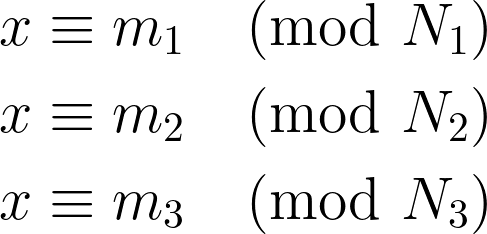

# Third Times the Charm

> This didn't work the first two times.
>
> `nc third-times-the-charm.ctf.umasscybersec.org 1337`

Solution:

We are given with a Python script:

```python
from Crypto.Util.number import getPrime

with open("flag.txt",'rb') as f:
    FLAG = f.read().decode()
    f.close()


def encrypt(plaintext, mod):
    plaintext_int = int.from_bytes(plaintext.encode(), 'big')
    return pow(plaintext_int, 3, mod)


while True:
    p = [getPrime(128) for _ in range(6)]
    if len(p) == len(set(p)):
        break

N1, N2, N3 = p[0] * p[1], p[2] * p[3], p[4] * p[5]
m1, m2, m3 = encrypt(FLAG, N1), encrypt(FLAG, N2), encrypt(FLAG, N3)

pairs = [(m1, N1), (m2, N2), (m3, N3)]
for i, pair in enumerate(pairs):
    print(f'm{i+1}: {pair[0]}\nN{i+1}: {pair[1]}\n')
```

Let's retrieve the challenge data...


```
m1: 6989549134652135822369609212510528642643507543816341002943513207771058883198
N1: 86717359374419714786002267755091099152683156076340567417137316205029726779151

m2: 54566894310078322371157752100225809790145743590847187154939053464890951326923
N2: 74872680826289483363149342442064254439498927445581455471439589080507648880553

m3: 12530678978143049224243282206203722648224953741577838204452538498235835094291
N3: 47400752880827027475986914815339514164344982696349660481619963937020979738661
```

To solve the challenge, we can leverage the fact that the same plaintext message is encrypted under three different RSA-like modulus values using the same encryption exponent (which is 3 in this case). This setup is vulnerable to the Chinese Remainder Theorem (CRT) attack.

The script essentially performs RSA encryption but with a fixed exponent of 3. Each pair (m, N) we have represents:
- `m`: The ciphertext, which is the plaintext cubed modulo `N`.
- `N`: The modulus, which is the product of two primes.

The vulnerability arises from using a low encryption exponent and encrypting the same message with different moduli, each of which is relatively small (since we have the values of `m` and `N`). When the encryption exponent is small and the same plaintext is encrypted under several moduli, we can apply the Chinese Remainder Theorem followed by integer cube root extraction to recover the original message.

---

So since we have the ciphertexts and moduli, let's use the Chinese Remainder Theorem (CRT) to combine these equations:



where `x` is `plaintext^3`. The result will give us the `x` modulo `N1*N2*N3`.

Then we extract the cube root of the result.

Since we know `x` is the cube of the plaintext (because of the encryption function `plaintext^3 mod N`), once we obtain `x` using CRT, we can compute the cube root of `x` to get the plaintext.

```python
import gmpy2

# Given values
m1 = 6989549134652135822369609212510528642643507543816341002943513207771058883198
N1 = 86717359374419714786002267755091099152683156076340567417137316205029726779151

m2 = 54566894310078322371157752100225809790145743590847187154939053464890951326923
N2 = 74872680826289483363149342442064254439498927445581455471439589080507648880553

m3 = 12530678978143049224243282206203722648224953741577838204452538498235835094291
N3 = 47400752880827027475986914815339514164344982696349660481619963937020979738661

# Chinese Remainder Theorem to find x such that x^3 is the plaintext
def crt(moduli, remainders):
    totalProd = 1
    for mod in moduli:
        totalProd *= mod
    result = 0
    for mod, rem in zip(moduli, remainders):
        p = totalProd // mod
        result += rem * gmpy2.invert(p, mod) * p
    return result % totalProd

# Use CRT to find x
moduli = [N1, N2, N3]
remainders = [m1, m2, m3]
x = crt(moduli, remainders)

# Cube root of x
plaintextCubeRoot = gmpy2.iroot(gmpy2.mpz(x), 3)[0]
plainTextBytes = int(plaintextCubeRoot).to_bytes((plaintextCubeRoot.bit_length() + 7) // 8, byteorder='big')

# Decode plaintext
plaintext = plainTextBytes.decode()
print(plaintext)
```

Flag: `UMASS{sunz1_su@nj1ng}`