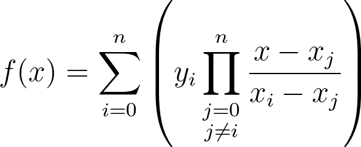

# 100 Degrees

> Mr. Krabs has been tinkering with the restaurant thermometer to see what makes his staff the most productive. He's been tracking the data in his journal, but some "Lagrange" guy just called saying Mr. Krabs already has all the info he needs. Can you help Mr. Krabs predict how his staff will fare?

Solution:

A file was given: `journal.txt`

It contains the following:
```
p = 137

DAY(0) = 81
DAY(1) = 67
DAY(2) = 110
DAY(3) = 116
DAY(4) = 49
DAY(5) = 111
DAY(6) = 74
DAY(7) = 53
DAY(8) = 93
DAY(9) = 83
DAY(10) = 55
DAY(11) = 122
DAY(12) = 67
DAY(13) = 47
DAY(14) = 85
DAY(15) = 91
DAY(16) = 88
DAY(17) = 84
DAY(18) = 63
DAY(19) = 96
DAY(20) = 59
DAY(21) = 87
DAY(22) = 46
DAY(23) = 99
DAY(24) = 93
DAY(25) = 126
DAY(26) = 62
DAY(27) = 65
DAY(28) = 76
DAY(29) = 55
DAY(30) = 48
DAY(31) = 116
DAY(32) = 79
DAY(33) = 106
DAY(34) = 45
DAY(35) = 54
DAY(36) = 102
DAY(37) = 100
DAY(38) = 65
DAY(39) = 93
DAY(40) = 122
DAY(41) = 84
DAY(42) = 118
DAY(43) = 64
DAY(44) = 103
DAY(45) = 76
DAY(46) = 65
DAY(47) = 109
DAY(48) = 90
DAY(49) = 99
DAY(50) = 69
DAY(51) = 50
DAY(52) = 64
DAY(53) = 61
DAY(54) = 115
DAY(55) = 111
DAY(56) = 64
DAY(57) = 80
DAY(58) = 60
DAY(59) = 68
DAY(60) = 105
DAY(61) = 113
DAY(62) = 84
DAY(63) = 119
DAY(64) = 55
DAY(65) = 77
DAY(66) = 124
DAY(67) = 55
DAY(68) = 115
DAY(69) = 21
DAY(70) = 112
DAY(71) = 41
DAY(72) = 88
DAY(73) = 136
DAY(74) = 66
DAY(75) = 43
DAY(76) = 48
DAY(77) = 55
DAY(78) = 60
DAY(79) = 41
DAY(80) = 43
DAY(81) = 103
DAY(82) = 118
DAY(83) = 19
DAY(84) = 99
DAY(85) = 34
DAY(86) = 118
DAY(87) = 73
DAY(88) = 97
DAY(89) = 74
DAY(90) = 7
DAY(91) = 78
DAY(92) = 60
DAY(93) = 48
DAY(94) = 123
DAY(95) = 125
DAY(96) = 119
DAY(97) = 0
DAY(98) = 36
DAY(99) = 123
DAY(100) = 22

----------------------------------------

DAY(101) = ???
DAY(102) = ???
DAY(103) = ???
DAY(104) = ???
DAY(105) = ???
DAY(106) = ???
DAY(107) = ???
DAY(108) = ???
DAY(109) = ???
DAY(110) = ???
DAY(111) = ???
DAY(112) = ???
DAY(113) = ???
DAY(114) = ???
DAY(115) = ???
DAY(116) = ???
DAY(117) = ???
DAY(118) = ???
DAY(119) = ???
DAY(120) = ???
DAY(121) = ???
DAY(122) = ???
DAY(123) = ???
DAY(124) = ???
DAY(125) = ???
DAY(126) = ???
DAY(127) = ???
DAY(128) = ???
DAY(129) = ???
DAY(130) = ???
DAY(131) = ???
DAY(132) = ???
```

Lagrange was mentioned in the description...

Lagrange interpolation is a method for polynomial interpolation that can be used to predict new data points based on a set of known data points. 

In the context of the given challenge, Lagrange interpolation can be used to estimate the values for "DAY(101)" to "DAY(132)" based on the data from "DAY(0)" to "DAY(100)" under modulo arithmetic with $p = 137$ (the given).

1. All calculations will be done modulo 137, meaning that all operations will wrap around at 137. This ensures that all values are within the range 0 to 136.

2. Lagrange interpolation involves using a formula that estimates new data points based on existing data points. The formula for a value $f(x)$ based on known points is given by:

where $x$ is the day we want to predict, $x_i$ and $y_i$ are known days and their corresponding values, and the product runs over all known points except $i$.

```python
from sympy import symbols, prod

# The variable and the prime modulus
x = symbols('x')
p = 137

# Given data points
dataPoints = {
    0: 81, 1: 67, 2: 110, 3: 116, 4: 49, 5: 111, 6: 74, 7: 53, 8: 93, 9: 83,
    10: 55, 11: 122, 12: 67, 13: 47, 14: 85, 15: 91, 16: 88, 17: 84, 18: 63, 19: 96,
    20: 59, 21: 87, 22: 46, 23: 99, 24: 93, 25: 126, 26: 62, 27: 65, 28: 76, 29: 55,
    30: 48, 31: 116, 32: 79, 33: 106, 34: 45, 35: 54, 36: 102, 37: 100, 38: 65, 39: 93,
    40: 122, 41: 84, 42: 118, 43: 64, 44: 103, 45: 76, 46: 65, 47: 109, 48: 90, 49: 99,
    50: 69, 51: 50, 52: 64, 53: 61, 54: 115, 55: 111, 56: 64, 57: 80, 58: 60, 59: 68,
    60: 105, 61: 113, 62: 84, 63: 119, 64: 55, 65: 77, 66: 124, 67: 55, 68: 115, 69: 21,
    70: 112, 71: 41, 72: 88, 73: 136, 74: 66, 75: 43, 76: 48, 77: 55, 78: 60, 79: 41,
    80: 43, 81: 103, 82: 118, 83: 19, 84: 99, 85: 34, 86: 118, 87: 73, 88: 97, 89: 74,
    90: 7, 91: 78, 92: 60, 93: 48, 94: 123, 95: 125, 96: 119, 97: 0, 98: 36, 99: 123, 100: 22
}

# Calculate the Lagrange interpolation polynomial
lagrangePolynomial = sum(
    dataPoints[i] * prod(
        (x - j) / (i - j) for j in dataPoints if j != i
    ) for i in dataPoints
)

values = []

for targetDay in range(101,133):
    print(f"Solving: {targetDay}")
    # Evaluate the polynomial at the target day modulo p
    predictedValue = lagrangePolynomial.subs(x, targetDay).simplify() % p
    values.append(predictedValue)

print(values)
print(''.join(chr(value) for value in values))
```

Flag: `UMASS{1nt3rpr3t_n0r_1nt3rp0l@t3}`